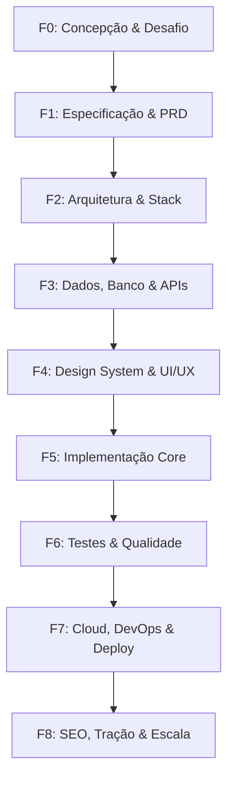

# 🧠 MANUAL OPERACIONAL: AGENTE MESTRE (SKILLS ORCHESTRATOR)

> **O Guia Definitivo de Orquestração, Metodologia em 9 Fases e Playbooks de Execução para as 511 Skills (541 Globais)**

---

## 🎯 1. VISÃO GERAL & MISSÃO

O **Agente Mestre (Skills Orchestrator)** é o comandante operacional do ecossistema de **511 Skills** no repositório (e **541 globais** no Antigravity) distribuídas nas **11 Categorias Especializadas**.

Em vez de se perder procurando manualmente qual skill utilizar entre centenas de opções, o Agente Mestre atua como um Diretor de Engenharia e Produto:
1. **Analisa o seu objetivo** ou a demanda técnica atual.
2. **Diagnostica a fase exata do projeto** (da ideação até o go-to-market).
3. **Prescreve o pipeline ordenado de skills** a serem ativadas.
4. **Fornece os prompts exatos e testados** para disparar cada skill.
5. **Aplica Quality Gates rigorosos** para garantir que uma etapa só seja considerada concluída quando os critérios de excelência forem atingidos.

> [!TIP]
> ### 🛡️ Parceria com o Agente de Git & GitHub (`git-master-agent`)
> Para todas as operações de segurança de versionamento, checkpoints preventivos de backup (`backup/checkpoint-...`), Conventional Commits padronizados, bootstrap de novos projetos (README, MIT License Henrique, .gitignore) e sincronização multi-máquina (PC Trabalho vs. PC Pessoal), o Agente Mestre conecta-se diretamente ao [**`git-master-agent` (`custom-agents/git-master-agent.md`)**](custom-agents/git-master-agent.md).

> [!IMPORTANT]
> ### 👑 Ponto Único de Comando: Agente Global Supremo (`global-master-agent`)
> Prefere não ter que escolher qual agente chamar? Ative simplesmente o [**`global-master-agent` (`custom-agents/global-master-agent.md`)**](custom-agents/global-master-agent.md). Ele comanda o `skills-orchestrator`, o `git-master-agent` e quaisquer novos agentes customizados automaticamente!

---

## 🧭 2. COMO ACIONAR O AGENTE MESTRE

### Opção A: Como Skill Nativa / Subagente no Antigravity / Gemini CLI
O agente está configurado como Skill nativa do Antigravity e também versionado como agente customizado:
- Skill Global no Antigravity: `~/.gemini/config/skills/skills-orchestrator/SKILL.md`
- Arquivo no repositório: [`custom-agents/skills-orchestrator.md`](custom-agents/skills-orchestrator.md)
- Nome para invocação: `skills-orchestrator`

Para invocá-lo em uma sessão, basta pedir:
```markdown
"Ative a skill skills-orchestrator para planejar e executar o meu novo projeto [Descreva o projeto]"
```

### Opção B: Prompt Universal de Inicialização (Zero-Shot)
Você pode colar este comando em qualquer sessão para que a IA assuma a postura do Agente Mestre:

```markdown
Você é o Agente Mestre (Skills Orchestrator) deste repositório de 511 skills (541 globais).
Quero construir o seguinte projeto: [DESCREVA SEU PROJETO OU DÚVIDA AQUI].

Por favor:
1. Classifique o arquétipo do meu projeto.
2. Diga em qual das 9 fases devemos começar.
3. Liste as 3 principais skills desta fase com seus caminhos relativos.
4. Forneça o prompt pronto para executar a primeira skill agora mesmo.
5. Defina o critério de aceite (Quality Gate) para passarmos para a próxima fase.
```

---

## 📐 3. O FRAMEWORK DECISÓRIO DE 9 FASES

Todo projeto de excelência segue este fluxo sequencial. Cada fase possui um propósito inegociável, gatilhos de entrada e saída, e um conjunto selecionado de skills especialistas:



---

### 🔹 FASE 0: CONCEPÇÃO, DESAFIO E VALIDAÇÃO DA IDEIA
- **Objetivo**: Questionar premissas, encontrar furos lógicos, validar a dor real do usuário e evitar escrever código desnecessário.
- **Quando usar**: Na centelha inicial, quando você tiver uma ideia ou receber uma demanda de novo produto.
- **Skills Essenciais**:
  - [`brainstorming`](development/brainstorming/SKILL.md) — Explora variações, soluções alternativas e requisitos implícitos.
  - [`grill-me`](documents-productivity/grill-me/SKILL.md) — Entrevista implacável para forçar clareza sobre decisões de design e negócio.
  - [`brief`](business-management/brief/SKILL.md) — Sintetiza a ideia em um documento executivo padronizado.
  - [`product-lens`](business-management/product-lens/SKILL.md) — Valida o "porquê" antes de qualquer compromisso de engenharia.
  - [`market-research`](business-management/market-research/SKILL.md) — Pesquisa de mercado e análise de competidores.
- **Prompt Recomendado**:
  ```markdown
  "Use a skill 'grill-me' e 'product-lens' para me entrevistar sobre a ideia de [PROJETO]. Faça perguntas difíceis sobre a dor do cliente, viabilidade e proposta de valor única antes de escrevermos qualquer especificação."
  ```
- **Quality Gate**: Briefing aprovado, proposta de valor única validada e riscos conhecidos documentados.

---

### 🔹 FASE 1: ESPECIFICAÇÃO TÉCNICA & PRD
- **Objetivo**: Transformar a visão aprovada em um documento técnico formal (PRD), com escopo fechado, fluxos de tela e regras de negócio.
- **Quando usar**: Com a Fase 0 aprovada.
- **Skills Essenciais**:
  - [`write-spec`](documents-productivity/write-spec/SKILL.md) — Redige o PRD técnico com critérios de aceite testáveis.
  - [`intent-driven-development`](development/intent-driven-development/SKILL.md) — Mapeia requisitos de negócio em contratos funcionais.
  - [`codebase-design`](development/codebase-design/SKILL.md) — Rascunha a estrutura de pastas e responsabilidades de cada módulo.
- **Prompt Recomendado**:
  ```markdown
  "Use a skill 'write-spec' para redigir a especificação funcional completa para o [PROJETO], incluindo fluxos de usuário, entidades de dados, endpoints necessários e critérios de aceite no formato Gherkin (Given-When-Then)."
  ```
- **Quality Gate**: PRD revisado e assinado, sem pontas soltas nos fluxos de usuário.

---

### 🔹 FASE 2: ARQUITETURA DE SISTEMAS & STACK
- **Objetivo**: Definir padrões estruturais (Clean Architecture, Hexagonal, Microserviços, Monolito Modular) e registrar as decisões técnicas.
- **Quando usar**: Antes de inicializar o repositório ou instalar dependências.
- **Skills Essenciais**:
  - [`architecture`](backend-database/architecture/SKILL.md) — Princípios de design de sistemas, baixo acoplamento e alta coesão.
  - [`architecture-decision-records`](backend-database/architecture-decision-records/SKILL.md) — Criação de ADRs para justificar a escolha de cada tecnologia.
  - [`hexagonal-architecture`](backend-database/hexagonal-architecture/SKILL.md) — Estrutura de Portas e Adaptadores para desacoplar regras de negócio do framework.
  - [`backend-patterns`](backend-database/backend-patterns/SKILL.md) — Camadas de serviço, injeção de dependência e tratamento de erros.
- **Prompt Recomendado**:
  ```markdown
  "Use a skill 'architecture-decision-records' para documentar a escolha da stack do [PROJETO] (Frontend, Backend, Banco de Dados, Autenticação e Hospedagem), destacando os trade-offs de custo, escalabilidade e velocidade de entrega."
  ```
- **Quality Gate**: Diagrama de arquitetura C4 / Mermaid criado e ADRs arquivados no repositório.

---

### 🔹 FASE 3: MODELAGEM DE DADOS, BANCO & APIS
- **Objetivo**: Projetar schemas de banco de dados, migrações idempotentes, políticas de segurança a nível de linha (RLS) e design de endpoints.
- **Quando usar**: Após a arquitetura e antes da criação das telas de interface.
- **Skills Essenciais**:
  - [`postgres-patterns`](backend-database/postgres-patterns/SKILL.md) / [`neon-postgres`](backend-database/neon-postgres/SKILL.md) / [`supabase`](backend-database/supabase/SKILL.md) — Modelagem relacional, índices e connection pooling.
  - [`database-migrations`](backend-database/database-migrations/SKILL.md) — Boas práticas de migrações seguras com rollback automático.
  - [`mongodb-schema-design`](backend-database/mongodb-schema-design/SKILL.md) — Modelagem NoSQL para dados semi-estruturados ou documentos.
  - [`redis-patterns`](backend-database/redis-patterns/SKILL.md) — Cache distribuído, rate-limiting e sessões de usuário.
  - [`api-design`](backend-database/api-design/SKILL.md) — Nomenclatura de rotas, códigos de status RESTful, paginação por cursor e payload schemas.
- **Prompt Recomendado**:
  ```markdown
  "Use as skills 'postgres-patterns' e 'api-design' para modelar as tabelas do [PROJETO] com índices de performance otimizados e definir o contrato OpenAPI dos endpoints principais."
  ```
- **Quality Gate**: Script de migração executa sem erro em banco limpo, seeds de teste carregam e endpoints mockados respondem aos contratos.

---

### 🔹 FASE 4: IDENTIDADE VISUAL, DESIGN SYSTEM & UI/UX
- **Objetivo**: Garantir que a interface do produto transmita confiança, profissionalismo, contraste estético de alto nível e navegação intuitiva.
- **Quando usar**: Paralelamente ou antes da codificação de componentes visuais.
- **Skills Essenciais**:
  - [`brandkit`](design/brandkit/SKILL.md) / [`brand-discovery`](marketing/brand-discovery/SKILL.md) — Guia de marca, tipografia, cores e tom.
  - [`design-taste-frontend`](design/design-taste-frontend/SKILL.md) — Elimina visual amador de templates genéricos; aplica paleta harmoniosa.
  - [`emil-design-eng`](design/emil-design-eng/SKILL.md) — Padrões refinados de microinterações, sensação física de clique e feedback visual.
  - [`minimalist-ui`](design/minimalist-ui/SKILL.md) — Grid limpo em estilo bento, tipografia contrastante e paleta monocromática elegante.
  - [`motion-ui`](design/motion-ui/SKILL.md) / [`motion-patterns`](design/motion-patterns/SKILL.md) — Animações com Framer Motion baseadas em física.
  - [`web-design-guidelines`](design/web-design-guidelines/SKILL.md) — Checklist de ergonomia, legibilidade e usabilidade.
- **Prompt Recomendado**:
  ```markdown
  "Use a skill 'design-taste-frontend' combinada com 'emil-design-eng' para desenhar os componentes da tela de [DASHBOARD/LANDING PAGE], aplicando tokens de design elegantes, contraste perfeito e microinterações de clique táteis."
  ```
- **Quality Gate**: Tokens de design centralizados em CSS/Tailwind, guia de estilo consistente e layout responsivo testado em mobile e desktop.

---

### 🔹 FASE 5: IMPLEMENTAÇÃO (FRONTEND, MOBILE, BACKEND OU IA)
- **Objetivo**: Codificar os recursos do projeto seguindo os padrões idiomáticos de ponta de cada linguagem ou framework.
- **Quando usar**: Com a arquitetura, dados e design validados.
- **Skills Especializadas por Stack**:
  - **Ecossistema Web Moderno**:
    - [`next-best-practices`](development/next-best-practices/SKILL.md) — Server Components, rotas paralelas, otimização de imagens e streaming.
    - [`react-patterns`](development/react-patterns/SKILL.md) / [`react-performance`](development/react-performance/SKILL.md) — Gerenciamento de estado, memoização e custom hooks.
    - [`vue-patterns`](development/vue-patterns/SKILL.md) / [`nuxt4-patterns`](development/nuxt4-patterns/SKILL.md) — Composition API, script setup e SSR seguro.
    - [`vite-patterns`](development/vite-patterns/SKILL.md) — Setup de builds rápidos e plugins HMR.
  - **Ecossistema Mobile**:
    - [`swiftui-patterns`](development/swiftui-patterns/SKILL.md) / [`write-swift`](development/write-swift/SKILL.md) — Views declarativas com @Observable no iOS.
    - [`compose-multiplatform-patterns`](development/compose-multiplatform-patterns/SKILL.md) — UI compartilhada Android e Desktop.
    - [`react-native-patterns`](development/react-native-patterns/SKILL.md) — Performance nativa com Expo e React Native.
  - **Ecossistema Backend**:
    - [`fastapi-patterns`](backend-database/fastapi-patterns/SKILL.md) — Pydantic v2, injeção de dependência e rotas assíncronas.
    - [`django-patterns`](backend-database/django-patterns/SKILL.md) — DRF, middleware, sinais e segurança integrada.
    - [`nestjs-patterns`](backend-database/nestjs-patterns/SKILL.md) — Módulos escaláveis em TypeScript empresarial.
    - [`springboot-patterns`](backend-database/springboot-patterns/SKILL.md) / [`quarkus-patterns`](backend-database/quarkus-patterns/SKILL.md) — Microserviços Java/Kotlin de alta performance.
    - [`golang-patterns`](backend-database/golang-patterns/SKILL.md) — Concorrência idiomática com goroutines e canais.
  - **Engenharia de IA & Agentes**:
    - [`agentic-engineering`](ai-agents/agentic-engineering/SKILL.md) — Decomposição de tarefas complexas e loops de raciocínio.
    - [`typesafe-ai`](ai-agents/typesafe-ai/SKILL.md) — Validação de tipos estritos, schemas de entrada/saída e segurança de tipagem para agentes de IA.
    - [`cost-aware-llm-pipeline`](ai-agents/cost-aware-llm-pipeline/SKILL.md) — Roteamento inteligente de modelos (Flash vs Pro) e cache de prompt.
    - [`continuous-agent-loop`](ai-agents/continuous-agent-loop/SKILL.md) — Loops autônomos resilientes com contenção de falhas.
    - [`eval-harness`](ai-agents/eval-harness/SKILL.md) — Avaliação formal e métricas para pipelines e agentes.
  - **Criação de Vídeo Programático**:
    - [`remotion-best-practices`](design/remotion-best-practices/SKILL.md) / [`remotion-video-creation`](design/remotion-video-creation/SKILL.md) / [`remotion-saas`](design/remotion-saas/SKILL.md) — Vídeos gerados via React.
- **Prompt Recomendado**:
  ```markdown
  "Use a skill '[STACK]-patterns' para implementar o módulo [NOME DO MÓDULO], garantindo tipagem estrita, tratamento idiomático de erros e separação entre controller e camada de serviço."
  ```
- **Quality Gate**: Build compila sem erros, linter passa com 0 warnings e tipos TypeScript/Python estão estritos.

---

### 🔹 FASE 6: TESTES, SEGURANÇA E AUDITORIA DE QUALIDADE
- **Objetivo**: Proteger o sistema contra regressões, vazamento de credenciais, vulnerabilidades de segurança e barreiras de acessibilidade.
- **Quando usar**: Concomitante ao desenvolvimento (TDD) e obrigatoriamente antes de qualquer deploy em homologação/produção.
- **Skills Essenciais**:
  - [`tdd-workflow`](development/tdd-workflow/SKILL.md) / [`tdd`](development/tdd/SKILL.md) — Ciclo Red-Green-Refactor com meta de 80%+ de cobertura.
  - [`code-review`](development/code-review/SKILL.md) — Auditoria crítica de legibilidade, DRY, SOLID e conformidade.
  - [`security-review`](utilities/security-review/SKILL.md) — Varredura contra OWASP Top 10, injeção de SQL, vazamento de secrets e CSRF.
  - [`accessibility`](development/accessibility/SKILL.md) / [`frontend-a11y`](development/frontend-a11y/SKILL.md) — Validação de navegação por teclado, contraste e leitores de tela (WCAG 2.2).
  - [`browser-qa`](development/browser-qa/SKILL.md) / [`webapp-testing`](development/webapp-testing/SKILL.md) / [`e2e-testing`](development/e2e-testing/SKILL.md) — Testes automatizados de ponta a ponta com Playwright.
  - [`verification-loop`](ai-agents/verification-loop/SKILL.md) — Verificação holística automatizada antes de merges.
- **Prompt Recomendado**:
  ```markdown
  "Execute a skill 'security-review' combinada com 'accessibility' e 'verification-loop' em todo o código alterado. Identifique vulnerabilidades de autorização, problemas de contraste e garanta que todos os testes passem."
  ```
- **Quality Gate**: Suite de testes 100% verde, nota máxima de acessibilidade e zero alertas de segurança críticos ou médios.

---

### 🔹 FASE 7: CLOUD, DEVOPS, INFRAESTRUTURA & DEPLOY
- **Objetivo**: Conteinerizar, configurar orquestração, validar variáveis de ambiente e realizar o deploy seguro com rollback automatizado.
- **Quando usar**: Com a Fase 6 totalmente aprovada.
- **Skills Essenciais**:
  - [`docker-patterns`](devops-cloud/docker-patterns/SKILL.md) — Dockerfiles multi-stage leves e imagens de produção sem privilégios de root.
  - [`kubernetes-patterns`](devops-cloud/kubernetes-patterns/SKILL.md) — Pods, Services, Ingress, Readiness/Liveness Probes e HPA.
  - [`deploy-to-vercel`](devops-cloud/deploy-to-vercel/SKILL.md) / [`cloudflare-deploy`](devops-cloud/cloudflare-deploy/SKILL.md) / [`netlify-deploy`](devops-cloud/netlify-deploy/SKILL.md) — Deploys serverless com links de preview.
  - [`azure-deploy`](devops-cloud/azure-deploy/SKILL.md) / [`azure-prepare`](devops-cloud/azure-prepare/SKILL.md) — Provisionamento na nuvem corporativa Microsoft Azure.
  - [`deploy-checklist`](devops-cloud/deploy-checklist/SKILL.md) — Lista de verificação obrigatória pré-deploy.
  - [`production-audit`](devops-cloud/production-audit/SKILL.md) — Auditoria local para garantir que nada quebrará em produção.
- **Prompt Recomendado**:
  ```markdown
  "Use a skill 'deploy-checklist' seguida de 'production-audit' para inspecionar nosso pacote de deploy. Verifique variáveis de ambiente, cabeçalhos de segurança HTTP e execute a publicação com [PROVEDOR]."
  ```
- **Quality Gate**: Deploy concluído com sucesso, certificado SSL/TLS ativo, monitoramento/logs conectados e endpoint de `/health` respondendo 200 OK.

---

### 🔹 FASE 8: LANÇAMENTO, SEO, MARKETING & ESCALA
- **Objetivo**: Posicionar o produto nos motores de busca, otimizar métricas de performance (Core Web Vitals), captar os primeiros clientes e retroalimentar o roadmap.
- **Quando usar**: Com o produto ativo no ar em produção.
- **Skills Essenciais**:
  - [`seo-audit`](seo/seo-audit/SKILL.md) / [`seo`](seo/seo/SKILL.md) / [`click-path-audit`](seo/click-path-audit/SKILL.md) — Auditoria on-page, robots.txt, sitemap XML, OpenGraph e metadados estruturados JSON-LD.
  - [`performance`](development/performance/SKILL.md) / [`lighthouse`](seo/lighthouse/SKILL.md) — Otimização de LCP (< 2.5s), INP e CLS (< 0.1).
  - [`email-sequence`](marketing/email-sequence/SKILL.md) / [`cold-email-writer`](career/cold-email-writer/SKILL.md) — Sequências de onboarding, ativação e retenção de leads.
  - [`linkedin-post-writer`](marketing/linkedin-post-writer/SKILL.md) / [`linkedin-hook-extractor`](marketing/linkedin-hook-extractor/SKILL.md) / [`linkedin-content-planner`](marketing/linkedin-content-planner/SKILL.md) — Divulgação B2B e autoridade técnica.
  - [`growth-log`](ai-agents/growth-log/SKILL.md) — Registro estruturado de aprendizados, experimentos e métricas semanais.
- **Prompt Recomendado**:
  ```markdown
  "Use a skill 'seo-audit' e 'lighthouse' para auditar nossa URL em produção [LINK]. Gere o relatório de correções para atingirmos nota 95+ em Performance e SEO."
  ```
- **Quality Gate**: Pontuação Lighthouse > 90 em todas as métricas, domínio indexável e pipeline de aquisição ativo.

---

## 🚀 4. PLAYBOOKS PRONTOS POR ARQUÉTIPO DE PROJETO

### 📦 Playbook 1: SaaS Web Full-Stack (Next.js + Supabase + Tailwind + Vercel)
Este é o fluxo padrão para startups e produtos digitais modernos:
1. **F0**: `brainstorming` + `grill-me` (Validar a dor e o modelo de negócio).
2. **F1**: `write-spec` (PRD com modelo de permissões RBAC e fluxo de checkout) + bootstrap de repositório via [`git-master-agent`](custom-agents/git-master-agent.md).
3. **F2**: `architecture` + `architecture-decision-records` (Decisão: Next.js App Router + Server Actions).
4. **F3**: `supabase` + `postgres-patterns` + `database-migrations` (Tabelas de usuários, tenants, planos com RLS).
5. **F4**: `brandkit` + `design-taste-frontend` + `emil-design-eng` (UI moderna e fluida).
6. **F5**: `next-best-practices` + `react-patterns` (Implementação dos componentes e rotas).
7. **F6**: `tdd-workflow` + `security-review` + `webapp-testing` (Testes automatizados e OWASP).
8. **F7**: `deploy-checklist` + `deploy-to-vercel` + commit seguro e push via [`git-master-agent`](custom-agents/git-master-agent.md).
9. **F8**: `seo-audit` + `lighthouse` + `linkedin-content-planner` (Otimização e distribuição).

---

### 📱 Playbook 2: Aplicativo Mobile Moderno (iOS / Android / KMP)
Fluxo focado em ergonomia touch, offline-first e alta taxa de quadros (60/120fps):
1. **F0**: `brief` + `product-lens` (Mapear a jornada essencial de uso em uma mão).
2. **F1**: `write-spec` (Especificar permissões de sistema, câmera, biometria e armazenamento local).
3. **F2**: `android-clean-architecture` ou `swiftui-patterns` (Arquitetura reativa).
4. **F3**: `api-design` + `error-handling` (Backend leve com paginação eficiente).
5. **F4**: `liquid-glass-design` ou `minimalist-ui` (Interface moderna e limpa).
6. **F5**: `swift-concurrency-6-2` ou `kotlin-coroutines-flows` (Lógica assíncrona não bloqueante).
7. **F6**: `swift-protocol-di-testing` ou `kotlin-testing` + `accessibility` (A11y e testes de UI).
8. **F7**: `deployment-patterns` (Configuração de Fastlane, TestFlight e Google Play).
9. **F8**: `growth-log` (Análise de retenção de D1, D7 e D30).

---

### 🤖 Playbook 3: Aplicação de IA & Agentes Autônomos
Para sistemas baseados em LLMs, RAG ou execução autônoma com orçamentos e guardrails:
1. **F0**: `intent-driven-development` + `brainstorming` (Definir tolerância a alucinação e escopo).
2. **F1**: `agent-harness-construction` + `write-spec` (Desenho do espaço de ação e ferramentas do agente).
3. **F2**: `cost-aware-llm-pipeline` (Roteamento entre modelos rápidos e profundos, cache de contexto).
4. **F3**: `iterative-retrieval` + `mcp-server-patterns` (Fontes de dados e conectores MCP).
5. **F4**: `minimalist-ui` (Interface conversacional sem distrações).
6. **F5**: `agentic-engineering` + `typesafe-ai` + `continuous-agent-loop` (Loops autônomos com execução tipada e recuperação).
7. **F6**: `eval-harness` + `santa-method` + `llm-trading-agent-security` (Testes adversariais e guardrails).
8. **F7**: `enterprise-agent-ops` + `docker-patterns` (Isolamento e observabilidade).
9. **F8**: `token-budget-advisor` + `growth-log` (Controle de custo por token e métricas de acerto).

---

### 🛠️ Playbook 4: Refatoração, Modernização ou Correção de Defeitos Críticos
Quando o sistema já existe e precisa de evolução segura sem quebrar funcionalidades:
1. **Ponto de Restauração**: Use o [`git-master-agent`](custom-agents/git-master-agent.md) para gerar um checkpoint preventivo (`backup/checkpoint-...`) ou safety stash antes de tocar no código.
2. **Identificação**: Use [`orch-fix-defect`](ai-agents/orch-fix-defect/SKILL.md) para bugs ou [`orch-refine-code`](ai-agents/orch-refine-code/SKILL.md) para refatoração.
3. **Reprodução**: Use [`tdd`](development/tdd/SKILL.md) para escrever um teste unitário que reproduz a falha (teste vermelho).
4. **Alteração Segura**: Aplique a modificação cirúrgica no código.
5. **Verificação**: Execute [`verification-loop`](ai-agents/verification-loop/SKILL.md) para garantir que toda a suíte de testes fique verde.
6. **Revisão**: Use [`code-review`](development/code-review/SKILL.md) e [`security-review`](utilities/security-review/SKILL.md) para auditar efeitos colaterais.
7. **Commit & Push**: Use o [`git-master-agent`](custom-agents/git-master-agent.md) ou [`git-workflow`](development/git-workflow/SKILL.md) para gerar commit semântico padronizado e push seguro.

---

## ⚡ 5. MATRIZ DE RESOLUÇÃO RÁPIDA DE PROBLEMAS

Quando você se deparar com um obstáculo específico, consulte esta tabela direta:

| Sintoma / Desafio | O que fazer | Skills Imediatas |
| :--- | :--- | :--- |
| **"Minha interface parece um template genérico e amador"** | Aplique tokens de design modernos, contraste intencional e microinterações de clique. | [`design-taste-frontend`](design/design-taste-frontend/SKILL.md), [`emil-design-eng`](design/emil-design-eng/SKILL.md), [`minimalist-ui`](design/minimalist-ui/SKILL.md) |
| **"O site está lento e demorando para carregar no celular"** | Meça métricas vitais, comprima assets e otimize consultas de banco. | [`performance`](development/performance/SKILL.md), [`lighthouse`](seo/lighthouse/SKILL.md), [`react-performance`](development/react-performance/SKILL.md) |
| **"Consultas no banco de dados estão travando o servidor"** | Analise planos de execução (`EXPLAIN ANALYZE`), crie índices e configure connection pool. | [`postgres-patterns`](backend-database/postgres-patterns/SKILL.md), [`redis-patterns`](backend-database/redis-patterns/SKILL.md), [`clickhouse-io`](backend-database/clickhouse-io/SKILL.md) |
| **"Estou com medo de quebrar coisas ao fazer mudanças"** | Crie uma rede de segurança com testes unitários e de integração antes de mexer. | [`tdd-workflow`](development/tdd-workflow/SKILL.md), [`verification-loop`](ai-agents/verification-loop/SKILL.md) |
| **"Preciso de backup preventivo, commit seguro ou sincronizar PC trabalho vs pessoal"** | Acione o Agente Mestre de Git para criar checkpoints automáticos, Conventional Commits e diagnosticar branches remotas. | [`git-master-agent`](custom-agents/git-master-agent.md), [`git-workflow`](development/git-workflow/SKILL.md) |
| **"Preciso lançar o produto, mas não sei como divulgar"** | Audite o SEO da página e crie uma campanha estruturada no LinkedIn e e-mail. | [`seo-audit`](seo/seo-audit/SKILL.md), [`linkedin-content-planner`](marketing/linkedin-content-planner/SKILL.md), [`email-sequence`](marketing/email-sequence/SKILL.md) |
| **"Minha API consome tokens demais e a conta de IA está cara"** | Implemente roteamento dinâmico de modelos e cache de contexto de prompt. | [`cost-aware-llm-pipeline`](ai-agents/cost-aware-llm-pipeline/SKILL.md), [`token-budget-advisor`](ai-agents/token-budget-advisor/SKILL.md) |
| **"Quero criar vídeos explicativos em código para o meu SaaS"** | Use o ecossistema Remotion em React para gerar vídeos programáticos. | [`remotion-best-practices`](design/remotion-best-practices/SKILL.md), [`remotion-video-creation`](design/remotion-video-creation/SKILL.md) |

---

## 📊 6. ESTRUTURA DO ECOSSISTEMA: 511 SKILLS EM 11 CATEGORIAS

Todas as 511 skills estão rigorosamente catalogadas e espelhadas tanto no repositório global quanto nas configurações locais do Gemini Antigravity (com 541 skills globais indexadas):

| Categoria | Total Skills | Foco Principal | Link para o Diretório |
| :--- | :---: | :--- | :--- |
| 🤖 **AI Agents** | **95** | Autonomia, RAG, Eval Loops, Segurança de Agentes | [`ai-agents/`](ai-agents/) |
| 💻 **Development** | **88** | Frameworks Web, Mobile, Linguagens, Boas Práticas | [`development/`](development/) |
| 🎨 **Design** | **65** | UI/UX, Design Systems, Animação, Vídeo (Remotion) | [`design/`](design/) |
| 🗄️ **Backend & Database** | **61** | Bancos SQL/NoSQL, ORMs, Cache, Microsserviços | [`backend-database/`](backend-database/) |
| ☁️ **DevOps & Cloud** | **44** | Docker, K8s, Nuvem, Azure, Vercel, Homelab | [`devops-cloud/`](devops-cloud/) |
| 💼 **Business Management** | **43** | PRDs, Métricas, Análise de Produto, Estratégia | [`business-management/`](business-management/) |
| 🛠️ **Utilities** | **31** | Automações, Scraping, Formatação, Suporte | [`utilities/`](utilities/) |
| 📢 **Marketing** | **27** | LinkedIn, Copywriting, E-mail Marketing, Campanhas | [`marketing/`](marketing/) |
| 📄 **Documents & Productivity** | **26** | PDFs, DOCX, Apresentações, Obsidian, Pesquisa | [`documents-productivity/`](documents-productivity/) |
| 🎯 **Career** | **23** | Resumos, Preparação para Entrevistas, Portfólios | [`career/`](career/) |
| 🔍 **SEO** | **8** | Auditorias SEO, Indexação, Core Web Vitals | [`seo/`](seo/) |
| **TOTAL** | **511** | **Ecossistema Completo de Desenvolvimento e Negócios** | — |

---

> 💡 **Para consultar o índice completo e descritivo de cada uma das 511 skills com exemplos de uso e comandos, consulte o [CEREBRO.md](CEREBRO.md).**
