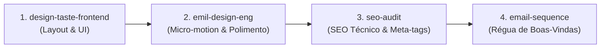
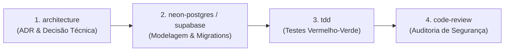
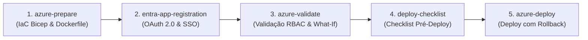
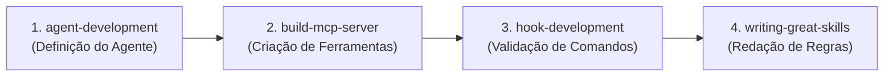
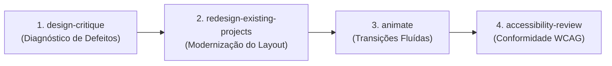
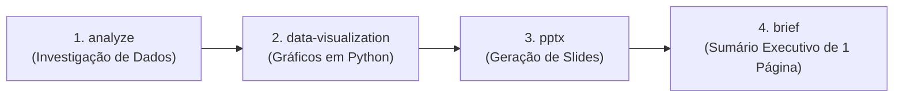

# 🧠 O Cérebro das Skills (`CEREBRO.md`)
### Manual Mestre de Ativação, Casos de Uso, Engenharia de Prompt e Workflows Multi-Skill

> Este documento é o **mapa cognitivo central** do repositório [`SkiilsToIAs`](https://github.com/Henrique1601/SkiilsToIAs). Aqui você encontrará não apenas o que cada uma das **128 skills** faz, mas exatamente **quando usar**, **como invocar** e **quais prompts copiar e colar** para extrair a máxima inteligência dos seus agentes de IA.

---

## 📌 Sumário Rápido

1. [🧠 Como a IA Pensa e Ativa as Skills](#-1-como-a-ia-pensa-e-ativa-as-skills)
   - [Anatomia de uma Skill](#anatomia-de-uma-skill)
   - [Os 3 Modos de Invocação](#os-3-modos-de-invocação)
   - [A Fórmula do Prompt Perfeito](#a-fórmula-do-prompt-perfeito)
2. [⚡ Power Combos: Workflows Multi-Skill de Alto Impacto](#-2-power-combos-workflows-multi-skill)
   - [Combo 1: Lançamento de Landing Page de Alta Conversão](#combo-1-lançamento-de-landing-page-de-alta-conversão)
   - [Combo 2: Desenvolvimento Fullstack Production-Ready](#combo-2-desenvolvimento-fullstack-production-ready)
   - [Combo 3: Infraestrutura Cloud Empresarial no Azure](#combo-3-infraestrutura-cloud-empresarial-no-azure)
   - [Combo 4: Criação de Novo Agente & Servidor MCP](#combo-4-criação-de-novo-agente--servidor-mcp)
   - [Combo 5: Redesign & Polimento Obsessivo de UI](#combo-5-redesign--polimento-obsessivo-de-ui)
   - [Combo 6: Apresentação Executiva para Diretoria](#combo-6-apresentação-executiva-para-diretoria)
3. [🎯 Cheat Sheet: O que você quer fazer hoje?](#-3-cheat-sheet-o-que-você-quer-fazer-hoje)
4. [📚 Guia Completo das 128 Skills por Categoria](#-4-guia-completo-das-128-skills-por-categoria)
   - [🎨 Design & UI/UX (34 skills)](#-design--uiux)
   - [🔍 SEO & Mecanismos de Busca (3 skills)](#-seo--mecanismos-de-busca)
   - [📣 Marketing & Vendas (6 skills)](#-marketing--vendas)
   - [💻 Desenvolvimento & Testes (17 skills)](#-desenvolvimento--testes)
   - [☁️ Cloud & DevOps (9 skills)](#-cloud--devops)
   - [🗄️ Backend & Bancos de Dados (4 skills)](#-backend--bancos-de-dados)
   - [🤖 Agentes de IA & Metaprogramação (22 skills)](#-agentes-de-ia--metaprogramação)
   - [📄 Documentos & Produtividade (14 skills)](#-documentos--produtividade)
   - [📊 Gestão & Negócios (14 skills)](#-gestão--negócios)
   - [🛠️ Utilitários & Otimização (5 skills)](#-utilitários--otimização)
5. [⚙️ Como Instalar e Sincronizar as Skills](#-5-como-instalar-e-sincronizar-as-skills)

---

## 🧠 1. Como a IA Pensa e Ativa as Skills

### Anatomia de uma Skill
Cada pasta no repositório contém um arquivo [`SKILL.md`](design/animate/SKILL.md) estruturado com um cabeçalho **YAML Frontmatter**:

```yaml
---
name: nome-da-skill
description: "Explica exatamente o que a skill faz e quais palavras-chave ativam o seu uso."
user-invocable: true
allowed-tools: [Read, Write, Bash]
---
```

Quando um agente de IA (como **Antigravity**, **Claude Code** ou **Cursor**) é iniciado, ele carrega em sua memória de sistema uma lista indexada com o `name` e a `description` de todas as skills disponíveis. O modelo calcula a similaridade semântica entre o que você digitou e a descrição da skill.

---

### Os 3 Modos de Invocação

#### Modo 1: Invocação Explícita Direta (Recomendado quando você quer precisão total)
Você cita expressamente o nome da skill no seu prompt:
> *"Use a skill `design-taste-frontend` para construir a página de preços do meu produto."*

#### Modo 2: Invocação por Comando Slash (`/`)
Quando suportado pelo ambiente de execução:
> *`/caveman explique como funciona o algoritmo Raft`*  
> *`/caveman-commit gere a mensagem de commit para estas alterações`*

#### Modo 3: Invocação Implícita Autônoma (Via Gatilhos Naturais)
Você descreve o problema usando termos-chave contidos na descrição da skill:
> *"Faça uma auditoria de acessibilidade WCAG 2.1 AA nesta tela..."* ➔ O agente ativa automaticamente `accessibility-review`.  
> *"Faça uma auditoria de SEO técnico checando canonical e meta-tags..."* ➔ O agente ativa automaticamente `seo-audit`.

---

### A Fórmula do Prompt Perfeito
Para extrair 100% da inteligência das skills, use a estrutura de 4 blocos:

```text
[CONTEXTO]   -> "Estou construindo um SaaS B2B de gestão de fretes em Next.js 15."
[OBJETIVO]   -> "Preciso criar a tabela de histórico de cotações com filtros de data."
[SKILL/TOM]  -> "Aplique os padrões da skill `design-taste-frontend` e `emil-design-eng`."
[RESTRIÇÕES] -> "Não use cards genéricos com sombras pesadas. Use micro-motion abaixo de 200ms."
```

---

## ⚡ 2. Power Combos: Workflows Multi-Skill

Nenhuma skill trabalha sozinha no mundo real. Os maiores ganhos de produtividade acontecem quando você encadeia skills em pipelines contínuos:

### Combo 1: Lançamento de Landing Page de Alta Conversão

- **Prompt do Combo**:
  > *"Vamos criar a landing page do nosso novo produto em 4 etapas: primeiro, estruture o layout com `design-taste-frontend`. Depois, aplique micro-animações calibradas com `emil-design-eng`. Em seguida, audite meta-tags e Core Web Vitals com `seo-audit`. Por fim, redija a sequência de email de onboarding com `email-sequence`."*

---

### Combo 2: Desenvolvimento Fullstack Production-Ready

- **Prompt do Combo**:
  > *"Vamos implementar o checkout de assinaturas: inicie com um ADR via `architecture` decidindo a modelagem de recorrência. Crie o schema no `supabase` com políticas RLS. Desenvolva as regras de negócio usando `tdd` estrito e, ao final, rode um `code-review` rigoroso procurando vulnerabilidades OWASP."*

---

### Combo 3: Infraestrutura Cloud Empresarial no Azure

- **Prompt do Combo**:
  > *"Prepare a migração do nosso serviço para a nuvem: use `azure-prepare` para gerar os templates Bicep, configure autenticação corporativa com `entra-app-registration`, valide permissões com `azure-validate`, passe pelo `deploy-checklist` e execute a subida em produção com `azure-deploy`."*

---

### Combo 4: Criação de Novo Agente & Servidor MCP

- **Prompt do Combo**:
  > *"Vou criar um assistente interno para nosso time de infraestrutura: estruture o subagente com `agent-development`, programe o servidor MCP em Python com `build-mcp-server` para consultar servidores, implemente hooks de segurança com `hook-development` para bloquear comandos perigosos e refine as instruções com `writing-great-skills`."*

---

### Combo 5: Redesign & Polimento Obsessivo de UI

- **Prompt do Combo**:
  > *"Nosso painel administrativo está antiquado: execute um `design-critique` apontando falhas visuais, aplique `redesign-existing-projects` para reestruturar as tabelas e cards, adicione transições suaves com `animate` e garanta contraste e foco por teclado com `accessibility-review`."*

---

### Combo 6: Apresentação Executiva para Diretoria

- **Prompt do Combo**:
  > *"Analise os dados financeiros do trimestre usando `analyze`, gere gráficos minimalistas de tendência com `data-visualization`, compile a apresentação no PowerPoint com `pptx` e sintetize os principais pontos em um briefing executivo com `brief`."*

---

## 🎯 3. Cheat Sheet: O que você quer fazer hoje?

| Se o seu objetivo for... | Use esta Skill Principal | Exemplo de Prompt Rápido |
|---|---|---|
| **Criar tela sem cara de IA** | [`design-taste-frontend`](design/design-taste-frontend/SKILL.md) | *"Crie a home page do meu produto com design-taste-frontend sem templates clichês."* |
| **Auditar SEO do site** | [`seo-audit`](seo/seo-audit/SKILL.md) | *"Faça uma auditoria de SEO completa no index.html checando meta-tags e Core Web Vitals."* |
| **Criar réguas de email** | [`email-sequence`](marketing/email-sequence/SKILL.md) | *"Escreva uma sequência de onboarding de 4 emails para usuários recém-cadastrados."* |
| **Testar com navegador real** | [`agent-browser`](development/agent-browser/SKILL.md) | *"Abra localhost:3000 com agent-browser, faça login e tire um screenshot do dashboard."* |
| **Desenvolver guiado por testes** | [`tdd`](development/tdd/SKILL.md) | *"Vamos implementar o cálculo de frete usando TDD: escreva os testes antes do código."* |
| **Revisar código e segurança** | [`code-review`](development/code-review/SKILL.md) | *"Faça um code review deste diff procurando vulnerabilidades OWASP e queries N+1."* |
| **Deploy seguro no Azure** | [`azure-deploy`](devops-cloud/azure-deploy/SKILL.md) | *"Execute a publicação dos recursos na minha assinatura do Azure via azd up."* |
| **Bancos serverless rápidos** | [`neon-postgres`](backend-database/neon-postgres/SKILL.md) | *"Configure o connection pooling do Neon Postgres no meu projeto Next.js."* |
| **Criar servidor MCP** | [`build-mcp-server`](ai-agents/build-mcp-server/SKILL.md) | *"Crie um servidor MCP em Python com FastMCP para conectar nossa API interna."* |
| **Criar relatório Word (.docx)** | [`docx`](documents-productivity/docx/SKILL.md) | *"Gere um documento Word (.docx) formatado profissionalmente para esta proposta."* |
| **Criar slides executivos** | [`pptx`](documents-productivity/pptx/SKILL.md) | *"Crie uma apresentação PowerPoint com 6 slides resumindo os resultados anuais."* |
| **Desafiar minha ideia de negócio** | [`grill-me`](documents-productivity/grill-me/SKILL.md) | *"Vou lançar um novo SaaS. Use grill-me para me entrevistar e achar todos os furos."* |
| **Economizar tokens no chat** | [`caveman`](utilities/caveman/SKILL.md) | *"/caveman explique a diferença entre mutex e semáforo em sistemas concorrentes."* |
| **Mensagem de commit perfeita** | [`caveman-commit`](utilities/caveman-commit/SKILL.md) | *"/caveman-commit gere a mensagem de commit para estas alterações que acabei de fazer."* |

---

## 📚 4. Guia Completo das 128 Skills por Categoria


### 🎨 Design & UI/UX (34 skills)

> **Foco:** Criação de interfaces premium, animações fluidas, design systems e estética anti-genérica.

**Diretório:** [`design/`](design/)

#### 🔹 [`accessibility-review`](design/accessibility-review/SKILL.md)
- **🎯 O que faz:** Executa auditoria de acessibilidade baseada em WCAG 2.1 AA em designs ou páginas web.
- **💡 No que usar:** Revisar contraste de cores, navegação por teclado, tamanhos de alvos de toque e leitor de tela antes de publicar ou entregar para produção.
- **💬 Prompts Prontos:**
  - `"Faça um audit de acessibilidade (WCAG 2.1 AA) nesta página de checkout e liste todos os problemas de contraste e foco de teclado."`
  - `"Analise este componente Modal: os leitores de tela conseguem identificar o foco e fechamento corretamente?"`

#### 🔹 [`animate`](design/animate/SKILL.md)
- **🎯 O que faz:** Cria animações web do zero com decisões de motion design de nível sênior (timing, curvas bezier, interrupções).
- **💡 No que usar:** Adicionar dinamismo a botões, transições de tela, micro-interações de hover e saídas suaves de elementos na web.
- **💬 Prompts Prontos:**
  - `"Crie uma animação suave para este menu dropdown usando Tailwind e Framer Motion com curva ease-out."`
  - `"Adicione uma transição fluida e interruptível quando o usuário arrasta um card de tarefa nesta lista Kanban."`

#### 🔹 [`animate-expo`](design/animate-expo/SKILL.md)
- **🎯 O que faz:** Desenvolve animações fluidas e nativas para React Native e Expo usando Reanimated, Gesture Handler e haptics.
- **💡 No que usar:** Criar bottom sheets, transições entre telas mobile, feedback tátil ou corrigir animações que travam em dispositivos móveis.
- **💬 Prompts Prontos:**
  - `"Implemente um bottom sheet interativo no Expo usando react-native-reanimated com snapping points e feedback de vibração tátil."`
  - `"Melhore a fluidez da animação de scroll do feed para rodar 100% na thread nativa do React Native."`

#### 🔹 [`animation-vocabulary`](design/animation-vocabulary/SKILL.md)
- **🎯 O que faz:** Dicionário reverso de termos de animação que traduz descrições leigas no termo técnico exato da indústria.
- **💡 No que usar:** Você tem em mente um efeito visual ou transição mas não sabe o nome técnico exato para pedir à IA ou ao designer.
- **💬 Prompts Prontos:**
  - `"Qual é o termo exato para aquele efeito onde o menu abre quicando levemente no final?"`
  - `"Como se chama o efeito de scroll estilo iOS onde o conteúdo estica e volta com efeito elástico?"`

#### 🔹 [`apple-design`](design/apple-design/SKILL.md)
- **🎯 O que faz:** Traduz a filosofia e o rigor estético da Apple (motion físico com molas, materiais translúcidos, tipografia óptica) para a web.
- **💡 No que usar:** Construir interfaces refinadas com toque 'Apple-like': blur translúcido, gestos físicos, molas calibradas e contenção visual.
- **💬 Prompts Prontos:**
  - `"Refatore o cabeçalho e a barra de navegação da aplicação para seguir o design language da Apple (blur de vidro fosco, tipografia San Francisco e física de molas)."`
  - `"Crie uma gaveta lateral com física de mola interruptível no padrão iOS para a versão web."`

#### 🔹 [`ask-sonner`](design/ask-sonner/SKILL.md)
- **🎯 O que faz:** Guia e implementação da biblioteca de toasts Sonner para React (posicionamento, estados de loading, dark mode).
- **💡 No que usar:** Instalar ou solucionar problemas de notificações toast: toasts que não somem, conflitos com Tailwind ou problemas de z-index com modais.
- **💬 Prompts Prontos:**
  - `"Configure o Sonner no meu projeto Next.js com suporte a promessas assíncronas (loading, success, error) e tema escuro automático."`
  - `"Corrija os toasts do Sonner que estão ficando atrás do Modal aberto por causa do z-index."`

#### 🔹 [`brandkit`](design/brandkit/SKILL.md)
- **🎯 O que faz:** Geração de kits de marca e identidade visual de alto padrão (logos conceituais, paleta de cores e tipografia de luxo).
- **💡 No que usar:** Criar a identidade visual de uma nova startup, produto SaaS de luxo, fintech ou produto técnico dark-mode.
- **💬 Prompts Prontos:**
  - `"Crie um brand kit completo para uma fintech de investimentos sustentáveis: paleta de cores minimalista, escala tipográfica e conceito de logo."`
  - `"Desenvolva as diretrizes visuais para uma ferramenta de desenvolvedores estilo dark-tech, com tokens de cores e contrastes."`

#### 🔹 [`canvas-design`](design/canvas-design/SKILL.md)
- **🎯 O que faz:** Criação de arte visual e peças de design em canvas (.png e .pdf) aplicando fundamentos de composição e teoria das cores.
- **💡 No que usar:** Desenvolver pôsteres promocionais, infográficos artísticos, capas visuais ou composições estáticas para download.
- **💬 Prompts Prontos:**
  - `"Desenhe um pôster visualmente marcante sobre 'A Era dos Agentes de IA' com tipografia suíça e grid limpo."`
  - `"Crie a capa de um e-book em PDF usando uma composição geométrica elegante."`

#### 🔹 [`design-critique`](design/design-critique/SKILL.md)
- **🎯 O que faz:** Fornece feedback estruturado e crítico sobre usabilidade, hierarquia visual e coerência estética de telas.
- **💡 No que usar:** Submeter um layout, print ou wireframe para uma avaliação de design antes de enviar para validação com clientes.
- **💬 Prompts Prontos:**
  - `"Faça um critique rigoroso desta tela de dashboard: avalie contraste, densidade de informação e hierarquia dos títulos."`
  - `"Avalie este fluxo de onboarding: onde o usuário pode ficar confuso ou sobrecarregado visualmente?"`

#### 🔹 [`design-system`](design/design-system/SKILL.md)
- **🎯 O que faz:** Auditoria, documentação e expansão de Design Systems (tokens de cor, componentes modulares, estados e acessibilidade).
- **💡 No que usar:** Padronizar componentes inconsistentes, eliminar valores de cores 'hardcoded' e criar documentação de variantes.
- **💬 Prompts Prontos:**
  - `"Audite os componentes Button e Input do meu projeto e unifique as variantes (primary, secondary, destructive) em um design system consistente."`
  - `"Documente os tokens de espaçamento, tipografia e cores da nossa biblioteca de UI."`

#### 🔹 [`design-taste-frontend`](design/design-taste-frontend/SKILL.md)
- **🎯 O que faz:** Skill 'anti-slop' que impede que páginas geradas por IA pareçam templates genéricos, aplicando bom gosto e direção de arte real.
- **💡 No que usar:** Construir landing pages, portfólios ou reformular sites existentes para que tenham personalidade única e toque humano autêntico.
- **💬 Prompts Prontos:**
  - `"Crie uma landing page para o meu produto de IA usando design-taste-frontend, evitando componentes clichês e usando assimetria e tipografia expressiva."`
  - `"Reformule a home page do meu site para tirar a cara de template genérico do Bootstrap/Tailwind padrão."`

#### 🔹 [`design-taste-frontend-v1`](design/design-taste-frontend-v1/SKILL.md)
- **🎯 O que faz:** Versão original da skill de bom gosto visual para projetos com dependência de comportamento estrito da v1.
- **💡 No que usar:** Manter retrocompatibilidade de design em codebases que já usavam as regras e convenções da versão 1.
- **💬 Prompts Prontos:**
  - `"Aplique o design-taste-frontend-v1 na reestruturação visual do card de preços."`
  - `"Atualize esta página respeitando os padrões e tokens do design-taste-frontend v1."`

#### 🔹 [`emil-design-eng`](design/emil-design-eng/SKILL.md)
- **🎯 O que faz:** Codifica a filosofia de design de Emil Kowalski: polimento obsessivo de UI, física de movimento e detalhes invisíveis.
- **💡 No que usar:** Fazer ajustes finos de micro-interações: hover com delay calculado, botões com feedback tátil visual, spring easing perfeito.
- **💬 Prompts Prontos:**
  - `"Aplique os princípios de design engineer do Emil Kowalski neste componente de dropdown (entradas abaixo de 200ms, transform-origin correto, feedback de clique)."`
  - `"Polir a interação do botão de salvar com animação de loading imperceptível e estado de sucesso com mola."`

#### 🔹 [`find-animation-opportunities`](design/find-animation-opportunities/SKILL.md)
- **🎯 O que faz:** Examina o código ou interface em busca de lugares estáticos que deveriam ter animação e descarta motion desnecessário.
- **💡 No que usar:** Auditar uma interface já pronta para identificar onde adicionar pequenos toques de animação para torná-la mais responsiva e viva.
- **💬 Prompts Prontos:**
  - `"Analise esta página de perfil e aponte 3 oportunidades onde animações sutis aumentariam a percepção de polimento do produto."`
  - `"Revise os componentes deste formulário: onde poderíamos adicionar micro-motion para melhorar a resposta visual ao usuário?"`

#### 🔹 [`frontend-design`](design/frontend-design/SKILL.md)
- **🎯 O que faz:** Direcionamento estético e escolhas tipográficas intencionais para novas interfaces web.
- **💡 No que usar:** Iniciar o design de um novo produto digital sem cair em escolhas padrão e desinteressantes.
- **💬 Prompts Prontos:**
  - `"Defina a direção visual para uma plataforma educacional de ponta: selecione famílias de fontes, contrastes e layout moderno."`
  - `"Proponha uma paleta de cores primária e secundária para um SaaS de produtividade focado em foco e calma."`

#### 🔹 [`gpt-taste`](design/gpt-taste/SKILL.md)
- **🎯 O que faz:** Engenharia de layout com alta variação e animações avançadas em GSAP (ScrollTrigger, pinning, scrub, bento grids sem gaps).
- **💡 No que usar:** Criar experiências visuais imersivas com scroll storytelling, elementos travados na tela e grades assimétricas dinâmicas.
- **💬 Prompts Prontos:**
  - `"Crie uma seção hero com efeito de pin no scroll usando GSAP ScrollTrigger e revelação sequencial de textos."`
  - `"Monte uma bento grid com espaçamentos perfeitos e transições de hover em 3D leve para exibir os recursos do SaaS."`

#### 🔹 [`high-end-visual-design`](design/high-end-visual-design/SKILL.md)
- **🎯 O que faz:** Ensina a IA a projetar interfaces com o nível de acabamento de uma agência de design internacional de alta classe.
- **💡 No que usar:** Garantir que a página transmita autoridade, requinte e sofisticação (fontes premium, sombras volumétricas sutis, grids arejados).
- **💬 Prompts Prontos:**
  - `"Redesenhe a seção de depoimentos da nossa landing page usando os princípios de high-end-visual-design."`
  - `"Ajuste os cards de preços para passarem a sensação de produto premium de luxo, trabalhando sombras suaves e contraste refinado."`

#### 🔹 [`image-to-code`](design/image-to-code/SKILL.md)
- **🎯 O que faz:** Converte designs visuais em código frontend pixel-perfect de alta fidelidade.
- **💡 No que usar:** Transformar um mockup em imagem, screenshot ou wireframe em código React/Tailwind idêntico.
- **💬 Prompts Prontos:**
  - `"Converta este screenshot do painel de controle em um componente React modular com Tailwind CSS."`
  - `"Pegue a imagem desta página de captura e gere o HTML e CSS responsivo exato."`

#### 🔹 [`imagegen-frontend-mobile`](design/imagegen-frontend-mobile/SKILL.md)
- **🎯 O que faz:** Diretrizes e prompts para geração de referências visuais conceituais de aplicativos mobile (iOS e Android).
- **💡 No que usar:** Gerar conceitos visuais e mockups de alta qualidade para aplicativos móveis antes de codificar.
- **💬 Prompts Prontos:**
  - `"Gere uma imagem conceitual de alta qualidade da tela de checkout de um app de delivery estilo iOS 18."`
  - `"Crie um mockup visual de 3 telas conectadas para um aplicativo de meditação minimalista."`

#### 🔹 [`imagegen-frontend-web`](design/imagegen-frontend-web/SKILL.md)
- **🎯 O que faz:** Geração de imagens de referência e direção de arte para landing pages seção por seção.
- **💡 No que usar:** Criar referências visuais ricas de cada seção do seu site para inspirar o desenvolvimento frontend.
- **💬 Prompts Prontos:**
  - `"Gere a imagem de referência conceitual para a seção hero de um software de cibersegurança empresarial."`
  - `"Crie uma imagem de referência para a seção de funcionalidades com tema dark-tech e iluminação neon sutil."`

#### 🔹 [`improve-animations`](design/improve-animations/SKILL.md)
- **🎯 O que faz:** Auditoria e plano de melhoria técnica de animações existentes em um codebase inteiro.
- **💡 No que usar:** Animações estão travando, sem cadência natural, ou poluindo a experiência de uso da aplicação.
- **💬 Prompts Prontos:**
  - `"Faça um levantamento das animações CSS e Framer Motion do nosso projeto e apresente um plano de otimização de performance."`
  - `"Revise o arquivo de animações globais e corrija os tempos e curvas bezier para deixar as transições mais ágeis."`

#### 🔹 [`industrial-brutalist-ui`](design/industrial-brutalist-ui/SKILL.md)
- **🎯 O que faz:** Estilo visual brutalista industrial: tipografia helvética rígida, grids mecânicos, estética de terminal militar e alto contraste.
- **💡 No que usar:** Desenvolver interfaces utilitárias, dashboards de monitoramento densos, sites de desenvolvedores ou marcas que fogem do comum.
- **💬 Prompts Prontos:**
  - `"Crie um painel de telemetria de servidores com estética industrial brutalista: fonte monoespaçada, linhas de grade pretas e toques de amarelo alerta."`
  - `"Construa a página de documentação da API em estilo brutalista suíço de alto contraste."`

#### 🔹 [`minimalist-ui`](design/minimalist-ui/SKILL.md)
- **🎯 O que faz:** Design editorial ultra-limpo: paleta monocromática acolhedora, sem gradientes pesados, foco total em conteúdo e legibilidade.
- **💡 No que usar:** Construir blogs, portfólios, aplicativos de notas, leitores e ferramentas de escrita focadas em produtividade serena.
- **💬 Prompts Prontos:**
  - `"Crie o layout do leitor de artigos no estilo minimalist-ui: espaçamento generoso, tipografia serifada elegante e zero poluição visual."`
  - `"Redesenhe a lista de tarefas da aplicação com foco em minimalismo caloroso, sem sombras pesadas."`

#### 🔹 [`mobile-native`](design/mobile-native/SKILL.md)
- **🎯 O que faz:** Ajustes de CSS e meta-tags para fazer web apps (PWA) parecerem apps nativos em smartphones.
- **💡 No que usar:** Eliminar o atraso de toque de 300ms, efeito de flash no clique, zoom indesejado em inputs e resolver a área de notch do iPhone.
- **💬 Prompts Prontos:**
  - `"Aplique as regras de mobile-native no nosso web app: remova o highlight azul de toque, trave o viewport contra zoom acidental em inputs e respeite o safe-area-inset do iPhone."`
  - `"Otimize este carrossel de imagens para suportar gestos nativos de swipe e inércia em dispositivos móveis."`

#### 🔹 [`pick-ui-library`](design/pick-ui-library/SKILL.md)
- **🎯 O que faz:** Consultor opinativo para escolher a biblioteca de UI ideal para o seu projeto frontend.
- **💡 No que usar:** Decidir qual stack ou biblioteca usar (shadcn/ui, Radix, Chakra, Mantine, Headless UI, Tamagui, etc.).
- **💬 Prompts Prontos:**
  - `"Estou criando um painel de administração em Next.js 15: qual biblioteca de UI você recomenda e por quê?"`
  - `"Compare shadcn/ui com Mantine para um projeto onde precisamos de prototipação rápida e customização total."`

#### 🔹 [`prototype`](design/prototype/SKILL.md)
- **🎯 O que faz:** Constrói protótipos de interface rápidos com múltiplas variantes reais e seletor (picker) embutido.
- **💡 No que usar:** Explorar 3 direções visuais ou comportamentais distintas de um mesmo componente antes de bater o martelo.
- **💬 Prompts Prontos:**
  - `"Construa 3 variantes completamente diferentes para o card de checkout do produto usando o harness de protótipo."`
  - `"Prototipar um modal de confirmação de exclusão em duas opções: uma minimalista e outra com aviso de alto impacto."`

#### 🔹 [`redesign-existing-projects`](design/redesign-existing-projects/SKILL.md)
- **🎯 O que faz:** Atualiza websites e aplicações legadas para um padrão de qualidade visual de alto nível sem quebrar regras de negócio.
- **💡 No que usar:** Modernizar sistemas antigos, interfaces corporativas datadas ou protótipos que ficaram feios com o tempo.
- **💬 Prompts Prontos:**
  - `"Redesenhe esta tabela legada de pedidos mantendo todos os dados, mas aplicando hierarquia moderna, paginação limpa e estados de hover."`
  - `"Modernize a tela de login existente substituindo o formulário quadrado por um layout moderno de split-screen com arte lateral."`

#### 🔹 [`review-animations`](design/review-animations/SKILL.md)
- **🎯 O que faz:** Revisão e crítica técnica de motion design e código de animações em Pull Requests e diffs.
- **💡 No que usar:** Garantir que animações novas não introduzam lag, não quebrem regras de acessibilidade e sigam curvas naturais.
- **💬 Prompts Prontos:**
  - `"Revise esta PR com alterações de animações em Framer Motion e aponte problemas de easing ou duração excessiva."`
  - `"Avalie se a animação de entrada deste modal respeita as preferências de prefers-reduced-motion do usuário."`

#### 🔹 [`slack-gif-creator`](design/slack-gif-creator/SKILL.md)
- **🎯 O que faz:** Criação de GIFs animados e stickers otimizados para dimensões e limites de peso do Slack.
- **💡 No que usar:** Criar comemorações internas, reações customizadas de time ou tutoriais curtos em GIF para canais do Slack.
- **💬 Prompts Prontos:**
  - `"Crie um GIF animado de 'Deploy com Sucesso' com menos de 2MB e dimensões ideais para usar como reação no Slack."`
  - `"Gere uma animação em loop de um foguete decolando para comemorar metas alcançadas no canal de vendas."`

#### 🔹 [`stitch-design-taste`](design/stitch-design-taste/SKILL.md)
- **🎯 O que faz:** Gera arquivos semânticos DESIGN.md para agentes de IA seguirem rigorosamente o design system do projeto.
- **💡 No que usar:** Criar a constituição visual do seu repositório para que outros agentes e desenvolvedores gerem telas sempre alinhadas.
- **💬 Prompts Prontos:**
  - `"Gere o arquivo DESIGN.md para este repositório contendo todas as diretrizes de cores, tipografia, espaçamento e componentes."`
  - `"Atualize o arquivo de regras de design semântico após a inclusão da nova paleta de cores escuras."`

#### 🔹 [`theme-factory`](design/theme-factory/SKILL.md)
- **🎯 O que faz:** Motor de temas com 10 presets profissionais e geração de novos esquemas de cores on-the-fly.
- **💡 No que usar:** Aplicar temas consistentes (dark mode, light mode, pastel, cyberpunk, corporate) em slides, dashboards ou páginas web.
- **💬 Prompts Prontos:**
  - `"Aplique o tema 'Warm Editorial' em toda a folha de estilos deste projeto."`
  - `"Gere um esquema de cores para dark mode com contraste AAA baseado na nossa cor primária #3B82F6."`

#### 🔹 [`ui-toolkit-web`](design/ui-toolkit-web/SKILL.md)
- **🎯 O que faz:** Integração do kit de ferramentas de vídeo e conferência do Zoom Video SDK com React.
- **💡 No que usar:** Construir salas de aula virtuais, telemedicina ou videoconferências personalizadas dentro da sua aplicação web.
- **💬 Prompts Prontos:**
  - `"Configure o componente de sala de vídeo do Zoom Video SDK no meu app React com controles de microfone e câmera."`
  - `"Adicione o recurso de compartilhamento de tela na sala de teleconferência usando o UI Toolkit."`

#### 🔹 [`ux-copy`](design/ux-copy/SKILL.md)
- **🎯 O que faz:** Redação e polimento de microcopy: textos de botões, mensagens de erro empáticas, estados vazios e modais de confirmação.
- **💡 No que usar:** Escrever textos na interface que orientam o usuário com clareza, diminuem o atrito e aumentam a conversão.
- **💬 Prompts Prontos:**
  - `"Escreva mensagens de erro humanas e resolutivas para este formulário de cadastro (senha fraca, email já em uso, timeout)."`
  - `"Crie o texto de boas-vindas do estado vazio (empty state) da lista de relatórios, incentivando a criação do primeiro relatório."`

#### 🔹 [`web-design-guidelines`](design/web-design-guidelines/SKILL.md)
- **🎯 O que faz:** Revisão e auditoria de código UI em conformidade com as Web Interface Guidelines oficiais.
- **💡 No que usar:** Verificar se o código de frontend segue as melhores práticas da indústria antes de submeter para homologação.
- **💬 Prompts Prontos:**
  - `"Audite os componentes da home page de acordo com as Web Interface Guidelines e liste desvios de usabilidade."`
  - `"Verifique se o formulário de login está em conformidade com as diretrizes de foco, labels acessíveis e preenchimento automático."`

---


### 🔍 SEO & Mecanismos de Busca (3 skills)

> **Foco:** Auditorias técnicas de indexação, Core Web Vitals, inteligência competitiva e ranqueamento no Google.

**Diretório:** [`seo/`](seo/)

#### 🔹 [`competitive-brief`](seo/competitive-brief/SKILL.md)
- **🎯 O que faz:** Pesquisa concorrentes de mercado e identifica gaps de conteúdo, diferenciais competitivos e ângulos de posicionamento.
- **💡 No que usar:** Um concorrente lançou um produto novo, ao planejar pautas editoriais ou criar páginas de comparação (Ex: 'Nós vs Concorrente').
- **💬 Prompts Prontos:**
  - `"Crie um relatório comparativo detalhando as fraquezas de posicionamento do concorrente X e onde podemos superá-lo com nosso SaaS."`
  - `"Mapeie os tópicos de busca que os 3 maiores competidores do meu nicho estão ranqueando e nós ainda não cobrimos."`

#### 🔹 [`competitive-intelligence`](seo/competitive-intelligence/SKILL.md)
- **🎯 O que faz:** Gera battlecards interativos e matrizes de comparação detalhadas contra concorrentes para a equipe comercial.
- **💡 No que usar:** Treinar vendedores para quebrar objeções de clientes que citam os concorrentes e comparar features lado a lado.
- **💬 Prompts Prontos:**
  - `"Crie um battlecard comercial completo comparando nosso software com a ferramenta líder de mercado para nosso time de vendas usar em reuniões."`
  - `"Gere uma matriz comparativa de recursos e preços destacando nossos 3 principais diferenciais competitivos."`

#### 🔹 [`seo-audit`](seo/seo-audit/SKILL.md)
- **🎯 O que faz:** Auditoria aprofundada de SEO técnico: meta-tags, canonicals, robots.txt, sitemaps, Core Web Vitals e dados estruturados Schema.org.
- **💡 No que usar:** O site perdeu tráfego, novas páginas não indexam ou antes de lançar um novo produto no ar.
- **💬 Prompts Prontos:**
  - `"Faça uma auditoria de SEO completa do arquivo index.html e aponte falhas de meta-tags, OpenGraph e dados estruturados."`
  - `"Analise por que nossa página de preços está demorando para ranquear e sugira otimizações de Core Web Vitals e palavras-chave."`

---


### 📣 Marketing & Vendas (6 skills)

> **Foco:** Automação de campanhas, redação no tom de voz da marca, réguas de e-mail e prospecção comercial.

**Diretório:** [`marketing/`](marketing/)

#### 🔹 [`account-research`](marketing/account-research/SKILL.md)
- **🎯 O que faz:** Pesquisa aprofundada de empresas e decisores para inteligência comercial e prospecção B2B de alto ticket.
- **💡 No que usar:** Antes de uma reunião comercial decisiva, ou ao montar uma lista de contas estratégicas para abordar.
- **💬 Prompts Prontos:**
  - `"Pesquise sobre a empresa X: qual é o modelo de negócio deles, quem é o CTO atual e quais dores de tecnologia eles enfrentam hoje?"`
  - `"Prepare um dossiê executivo sobre o prospect Y antes da nossa call de demonstração de amanhã."`

#### 🔹 [`brand-review`](marketing/brand-review/SKILL.md)
- **🎯 O que faz:** Revisão e triagem de conteúdos e copies para garantir que respeitam o guia de estilo e o tom de voz da marca.
- **💡 No que usar:** Antes de publicar anúncios, newsletters ou artigos de blog, checando consistência de linguagem e claims não comprovados.
- **💬 Prompts Prontos:**
  - `"Revise esta postagem de blog para garantir que ela adote nosso tom de voz: direto, confiável e sem jargões corporativos vazios."`
  - `"Identifique frases neste artigo que parecem agressivas ou fora das diretrizes da nossa marca."`

#### 🔹 [`brand-voice-enforcement`](marketing/brand-voice-enforcement/SKILL.md)
- **🎯 O que faz:** Aplica o tom de voz e estilo da marca diretamente na criação de novos conteúdos (posts de LinkedIn, pitches, emails).
- **💡 No que usar:** Redigir propostas, emails para clientes ou posts para redes sociais que soem exatamente como a sua empresa.
- **💬 Prompts Prontos:**
  - `"Escreva um post para o LinkedIn anunciando nosso novo recurso, aplicando rigorosamente nosso guia de tom de voz minimalista e técnico."`
  - `"Reescreva este email de vendas para que ele soe consultivo, empático e sofisticado."`

#### 🔹 [`canva-creator`](marketing/canva-creator/SKILL.md)
- **🎯 O que faz:** Executa campanhas de redes sociais de ponta a ponta: cria cronograma de postagens, designs no Canva e copy de legenda.
- **💡 No que usar:** Transformar um briefing em uma campanha visual completa para Instagram, LinkedIn e Twitter com artes e legendas prontas.
- **💬 Prompts Prontos:**
  - `"Crie uma campanha de 5 posts de lançamento do nosso curso no Instagram, com orientações visuais para o Canva e as copies completas das legendas."`
  - `"Gere o plano de conteúdo da semana para o LinkedIn, incluindo texto, gancho visual e chamada para ação."`

#### 🔹 [`email-sequence`](marketing/email-sequence/SKILL.md)
- **🎯 O que faz:** Desenha e redige fluxos de email marketing completos: onboarding, nutrição, recuperação de carrinho e pós-venda com testes A/B.
- **💡 No que usar:** Criar uma régua de emails de boas-vindas para novos usuários que convertem cadastros gratuitos em assinantes pagos.
- **💬 Prompts Prontos:**
  - `"Escreva uma sequência de onboarding de 4 emails para usuários recém-cadastrados no nosso software de gestão financeira."`
  - `"Crie uma régua de recuperação de clientes inativos (win-back) com ofertas progressivas e gatilhos de urgência honestos."`

#### 🔹 [`performance-report`](marketing/performance-report/SKILL.md)
- **🎯 O que faz:** Compila relatórios executivos de marketing com métricas-chave (CAC, LTV, ROAS), análise de canais e recomendações de otimização.
- **💡 No que usar:** Fechamento de mês ou trimestre para apresentar resultados para diretores, clientes de agência ou investidores.
- **💬 Prompts Prontos:**
  - `"Compile este resumo de métricas do Google Ads e Meta Ads em um relatório executivo destacando os canais mais rentáveis."`
  - `"Analise a queda de conversão do último trimestre e apresente 3 ações imediatas para recuperar o ROI."`

---


### 💻 Desenvolvimento & Testes (17 skills)

> **Foco:** Engenharia de software moderna, automação de navegadores com Playwright, TDD, frameworks modernos e Swift.

**Diretório:** [`development/`](development/)

#### 🔹 [`agent-browser`](development/agent-browser/SKILL.md)
- **🎯 O que faz:** Automação e interação direta com o navegador para agentes (clicar em botões, preencher formulários, testes end-to-end e scraping).
- **💡 No que usar:** Testar fluxos de checkout, autenticação em sites, caçar bugs visuais em produção ou extrair dados de plataformas web.
- **💬 Prompts Prontos:**
  - `"Abra o site localhost:3000 com o agent-browser, faça login com o usuário teste e tire um screenshot do dashboard."`
  - `"Automatize a verificação do fluxo de cadastro verificando se os campos de validação de CPF e senha disparam os erros corretos."`

#### 🔹 [`build-dashboard`](development/build-dashboard/SKILL.md)
- **🎯 O que faz:** Cria dashboards interativos completos em arquivo HTML único com gráficos dinâmicos, filtros de data e tabelas paginadas.
- **💡 No que usar:** Transformar dados brutos de uma consulta SQL ou CSV em um relatório visual navegável sem precisar subir um servidor.
- **💬 Prompts Prontos:**
  - `"Crie um dashboard em HTML único interativo para visualizar estes dados de vendas mensais com gráficos de linha e filtros por categoria."`
  - `"Gere um painel de métricas operacionais com cards de KPI e gráfico de pizza interativo usando Chart.js."`

#### 🔹 [`build-zoom-bot`](development/build-zoom-bot/SKILL.md)
- **🎯 O que faz:** Desenvolve bots para Zoom, gravadores de reuniões e processadores de transcrição e áudio em tempo real.
- **💡 No que usar:** Criar aplicações de resumo de reuniões, bots que entram automaticamente em chamadas ou análise de sentimentos ao vivo.
- **💬 Prompts Prontos:**
  - `"Implemente a arquitetura de um bot em Node.js usando o Zoom Meeting SDK para capturar a transcrição de reuniões em tempo real."`
  - `"Configure a autenticação OAuth para criar uma integração de gravação automática de reuniões no Zoom."`

#### 🔹 [`code-review`](development/code-review/SKILL.md)
- **🎯 O que faz:** Revisão técnica rigorosa de código em busca de falhas de segurança (OWASP), problemas de performance (N+1) e edge cases.
- **💡 No que usar:** Antes de aprovar e fazer merge de um Pull Request no repositório de produção.
- **💬 Prompts Prontos:**
  - `"Revise o diff desta PR: verifique se há vulnerabilidades de injeção SQL, memory leaks ou problemas de concorrência."`
  - `"Analise esta função de processamento de pagamentos e aponte falhas no tratamento de erros assíncronos."`

#### 🔹 [`context7-cli`](development/context7-cli/SKILL.md)
- **🎯 O que faz:** Gerenciamento da ferramenta Context7 CLI para baixar documentação atualizada de bibliotecas diretamente para a IA.
- **💡 No que usar:** Você está usando uma biblioteca nova ou versão recente que a IA não conhece no seu treinamento básico.
- **💬 Prompts Prontos:**
  - `"Use o context7-cli para buscar a documentação oficial da versão mais recente do Drizzle ORM e explicar como fazer migrations."`
  - `"Baixe as referências da API do TanStack Query v5 para resolver este problema de mutação assíncrona."`

#### 🔹 [`debug`](development/debug/SKILL.md)
- **🎯 O que faz:** Sessão metódica de depuração: reproduzir o erro, isolar a causa raiz, diagnosticar o motivo e aplicar a correção cirúrgica.
- **💡 No que usar:** Erros bizarros, bugs intermitentes, comportamento que 'funciona na minha máquina mas quebra em prod'.
- **💬 Prompts Prontos:**
  - `"Aqui está o stack trace do erro de OutOfMemory: execute uma sessão de debug para rastrear onde está o vazamento de memória."`
  - `"O usuário não consegue finalizar a compra quando usa cupom de desconto: isole o bug no arquivo de checkout e sugira a correção."`

#### 🔹 [`find-docs`](development/find-docs/SKILL.md)
- **🎯 O que faz:** Pesquisa e localização eficiente de trechos de documentação técnica em projetos grandes.
- **💡 No que usar:** Descobrir rapidamente como usar uma função ou endpoint interno em uma base de código com centenas de arquivos.
- **💬 Prompts Prontos:**
  - `"Encontre na documentação interna do projeto como funciona o middleware de autorização por roles."`
  - `"Localize os exemplos de uso da classe de conexão com o banco de dados dentro do repositório."`

#### 🔹 [`hyperframes`](development/hyperframes/SKILL.md)
- **🎯 O que faz:** Framework programático para criação e renderização de vídeos e animações com código.
- **💡 No que usar:** Gerar vídeos em lote, vinhetas programáticas ou transformar dados em animações de vídeo.
- **💬 Prompts Prontos:**
  - `"Crie uma composição no HyperFrames que gere um vídeo com o gráfico de faturamento anual animado."`
  - `"Renderize uma vinheta animada de abertura com a logo da empresa usando o HyperFrames."`

#### 🔹 [`hyperframes-cli`](development/hyperframes-cli/SKILL.md)
- **🎯 O que faz:** Interface de linha de comando para ciclo de desenvolvimento, renderização na nuvem (Lambda/Cloud Run) e validação do HyperFrames.
- **💡 No que usar:** Renderizar vídeos programáticos via terminal ou configurar pipelines de CI/CD para geração de conteúdo em vídeo.
- **💬 Prompts Prontos:**
  - `"Execute o comando hyperframes check para validar se os assets e keyframes da composição estão íntegros."`
  - `"Configure o render do vídeo no Google Cloud Run usando o hyperframes-cli."`

#### 🔹 [`hyperframes-registry`](development/hyperframes-registry/SKILL.md)
- **🎯 O que faz:** Gerenciador de blocos e componentes pré-construídos para compor animações no HyperFrames.
- **💡 No que usar:** Instalar transições, terços inferiores (lower thirds) ou templates de texto animados no seu projeto de vídeo.
- **💬 Prompts Prontos:**
  - `"Instale o bloco de lower-third do registro do HyperFrames e conecte-o ao index.html da composição."`
  - `"Pesquise no registry um componente de gráfico de barras animado para HyperFrames."`

#### 🔹 [`tdd`](development/tdd/SKILL.md)
- **🎯 O que faz:** Desenvolvimento guiado por testes com ciclo estrito: Vermelho (teste falha) ➔ Verde (código passa) ➔ Refatoração.
- **💡 No que usar:** Criar regras de negócio críticas onde nenhum bug pode escapar (cálculo de impostos, transações bancárias, lógica de permissões).
- **💬 Prompts Prontos:**
  - `"Vamos implementar o módulo de cálculo de juros usando TDD estrito: comece escrevendo os testes unitários que falham."`
  - `"Refatore esta função de ordenação mantendo a cobertura de 100% dos testes que já passaram no ciclo verde."`

#### 🔹 [`vercel-composition-patterns`](development/vercel-composition-patterns/SKILL.md)
- **🎯 O que faz:** Padrões avançados de arquitetura de componentes React (Compound Components, Render Props, Context modular) da engenharia da Vercel.
- **💡 No que usar:** Refatorar componentes que têm dezenas de props booleanas (boolean prop antipattern) em componentes limpos e reutilizáveis.
- **💬 Prompts Prontos:**
  - `"Refatore este componente monolítico Select que tem 15 props usando o padrão Compound Components (Select, Select.Option, Select.Trigger)."`
  - `"Elimine a proliferação de boolean props neste card de produto tornando-o componível via slots."`

#### 🔹 [`vercel-react-best-practices`](development/vercel-react-best-practices/SKILL.md)
- **🎯 O que faz:** Guia de ouro de performance e otimização de React e Next.js validado pela equipe de engenharia da Vercel.
- **💡 No que usar:** Reduzir bundle size, otimizar Server Components vs Client Components, eliminar re-renders e acelerar o carregamento da página.
- **💬 Prompts Prontos:**
  - `"Analise esta página em Next.js App Router e aponte o que deve ser Server Component e o que precisa ser isolado como Client Component."`
  - `"Otimize este hook useEffect que está provocando renderizações em cascata infinitas."`

#### 🔹 [`vercel-react-native-skills`](development/vercel-react-native-skills/SKILL.md)
- **🎯 O que faz:** Melhores práticas de performance, otimização de FlatLists e arquitetura para React Native e Expo.
- **💡 No que usar:** O aplicativo móvel está com listas travando no scroll, consumo excessivo de bateria ou inicialização lenta.
- **💬 Prompts Prontos:**
  - `"Otimize esta FlatList com 2000 itens usando getItemLayout, memoização de itens e windowSize adequado para não perder frames a 60fps."`
  - `"Melhore o tempo de inicialização (cold start) do nosso app Expo aplicando lazy loading de rotas."`

#### 🔹 [`web-artifacts-builder`](development/web-artifacts-builder/SKILL.md)
- **🎯 O que faz:** Criação de artefatos web complexos com múltiplos componentes, shadcn/ui, Tailwind CSS e gerenciamento de estado.
- **💡 No que usar:** Construir mini-aplicativos completos, simuladores interativos e calculadoras ricas que rodam diretamente na conversa.
- **💬 Prompts Prontos:**
  - `"Crie um artefato web interativo com React e Tailwind simulando um gerenciador financeiro pessoal com gráficos e formulário de transações."`
  - `"Construa uma calculadora de precificação de frete como um artefato interativo com shadcn/ui."`

#### 🔹 [`webapp-testing`](development/webapp-testing/SKILL.md)
- **🎯 O que faz:** Conjunto de automação de testes com Playwright (testes E2E, inspeção de console, captura de screenshots e logs).
- **💡 No que usar:** Validar se o frontend está funcionando perfeitamente em múltiplos navegadores antes de liberar uma release.
- **💬 Prompts Prontos:**
  - `"Escreva um teste end-to-end com Playwright que valide o login, navegação até o perfil e edição do nome do usuário."`
  - `"Tire screenshots das resoluções desktop, tablet e mobile para verificar se há quebras no layout responsivo."`

#### 🔹 [`write-swift`](development/write-swift/SKILL.md)
- **🎯 O que faz:** Desenvolvimento em Swift moderno: Swift 6 data-race safety, concorrência moderna (actors, tasks), tipagem por valor e Swift Testing.
- **💡 No que usar:** Criar ou refatorar aplicativos iOS, iPadOS ou macOS nativos com a máxima performance e segurança de concorrência.
- **💬 Prompts Prontos:**
  - `"Refatore este serviço de rede em Swift para usar o novo modelo de concorrência com async/await e actors do Swift 6."`
  - `"Escreva testes unitários usando o framework nativo Swift Testing para validar o ViewModel de autenticação."`

---


### ☁️ Cloud & DevOps (9 skills)

> **Foco:** Infraestrutura como código (IaC), deploy automatizado no Microsoft Azure, segurança Entra ID e checklists.

**Diretório:** [`devops-cloud/`](devops-cloud/)

#### 🔹 [`azure-cloud-migrate`](devops-cloud/azure-cloud-migrate/SKILL.md)
- **🎯 O que faz:** Avaliação e migração de cargas de trabalho de outras nuvens (AWS Lambda, Heroku, Google Cloud Run) para o Azure.
- **💡 No que usar:** Migrar uma aplicação Node/Python/Java de outra nuvem para Azure Container Apps ou Azure Functions.
- **💬 Prompts Prontos:**
  - `"Analise esta função AWS Lambda em Python e crie o plano de migração para Azure Functions com trigger HTTP."`
  - `"Converta a configuração deste app no Heroku com Procfile para rodar no Azure App Service com deploy automatizado."`

#### 🔹 [`azure-deploy`](devops-cloud/azure-deploy/SKILL.md)
- **🎯 O que faz:** Execução automatizada de deployments no Azure usando azd (Azure Developer CLI), Terraform e Bicep com recuperação de erros.
- **💡 No que usar:** Quando os arquivos de infraestrutura já estão prontos e você quer subir a aplicação para produção no Azure.
- **💬 Prompts Prontos:**
  - `"Execute o comando azd up para provisionar os recursos na minha assinatura do Azure e publicar a aplicação."`
  - `"Faça o deploy da nova versão da imagem Docker no Azure Container Apps usando a CLI az."`

#### 🔹 [`azure-diagnostics`](devops-cloud/azure-diagnostics/SKILL.md)
- **🎯 O que faz:** Depuração e diagnóstico de problemas em produção no Azure (App Service com CPU alto, falhas de pods no AKS, logs KQL).
- **💡 No que usar:** A aplicação no Azure caiu, está lenta, não conecta no banco ou os containers estão em CrashLoopBackOff.
- **💬 Prompts Prontos:**
  - `"Minha aplicação no Azure App Service está retornando HTTP 502: investigue os logs do AppLens e me mostre a causa raiz."`
  - `"Analise esta query KQL no Azure Monitor para descobrir por que a latência dos endpoints da API subiu repentinamente."`

#### 🔹 [`azure-prepare`](devops-cloud/azure-prepare/SKILL.md)
- **🎯 O que faz:** Prepara projetos para a nuvem Azure com azd: gera azure.yaml, arquivos Bicep/Terraform e Dockerfiles.
- **💡 No que usar:** Você tem o código de um app e quer criar toda a infraestrutura em nuvem necessária para hospedá-lo.
- **💬 Prompts Prontos:**
  - `"Prepare meu projeto Next.js com backend em Node.js para rodar no Azure Container Apps gerando o azure.yaml e os scripts Bicep."`
  - `"Configure o provisionamento de um Azure PostgreSQL Serverless e um Storage Account usando Terraform."`

#### 🔹 [`azure-storage`](devops-cloud/azure-storage/SKILL.md)
- **🎯 O que faz:** Guia de uso e integração com Azure Storage (Blob Storage, File Shares, Queues, Tables) e políticas de ciclo de vida.
- **💡 No que usar:** Fazer upload/download de arquivos, configurar acesso seguro com SAS tokens ou otimizar custos de armazenamento (tiers Hot/Cool/Archive).
- **💬 Prompts Prontos:**
  - `"Escreva o código em Python para fazer upload de imagens de usuários no Azure Blob Storage com geração de link temporário SAS."`
  - `"Configure uma política de lifecycle management no Azure Storage para mover arquivos com mais de 30 dias para a camada Cool."`

#### 🔹 [`azure-validate`](devops-cloud/azure-validate/SKILL.md)
- **🎯 O que faz:** Validação pré-deployment de infraestrutura no Azure: checagem de permissões RBAC, identidades gerenciadas e sintaxe Bicep.
- **💡 No que usar:** Antes de rodar o deploy, para garantir que não haverá erros de permissão ou falha de sintaxe em tempo de execução.
- **💬 Prompts Prontos:**
  - `"Execute uma validação what-if no template Bicep para verificar o que será modificado no Azure antes de aplicar."`
  - `"Verifique se a Managed Identity configurada tem permissão de leitura no Azure Key Vault."`

#### 🔹 [`deploy-checklist`](devops-cloud/deploy-checklist/SKILL.md)
- **🎯 O que faz:** Checklist rigoroso de verificação pré e pós deploy (migrações de banco, feature flags, rollback triggers e alertas).
- **💡 No que usar:** Sexta-feira à tarde ou antes de qualquer lançamento crítico em produção que envolva alteração de banco de dados.
- **💬 Prompts Prontos:**
  - `"Gere o checklist pré-deploy para uma release que inclui alteração de schema no banco de dados e atualização de variáveis de ambiente."`
  - `"Defina os critérios e gatilhos para acionar um rollback automático em caso de alta taxa de erro pós-deploy."`

#### 🔹 [`entra-app-registration`](devops-cloud/entra-app-registration/SKILL.md)
- **🎯 O que faz:** Registro de aplicativos no Microsoft Entra ID (antigo Azure AD), configuração de OAuth 2.0, permissões de API e MSAL.
- **💡 No que usar:** Implementar Single Sign-On (SSO) corporativo da Microsoft ou autenticar serviços de backend com Client Credentials.
- **💬 Prompts Prontos:**
  - `"Guie o registro de um app no Entra ID para permitir login com contas corporativas da Microsoft usando a biblioteca MSAL em React."`
  - `"Configure as permissões de API e o Client Secret para que nossa aplicação possa ler o calendário via Microsoft Graph API."`

#### 🔹 [`microsoft-foundry`](devops-cloud/microsoft-foundry/SKILL.md)
- **🎯 O que faz:** Deploy, avaliação, fine-tuning e governança de agentes de IA empresariais no Microsoft Foundry.
- **💡 No que usar:** Publicar agentes de IA em infraestrutura corporativa gerenciada pela Microsoft com monitoramento de alucinações e custos.
- **💬 Prompts Prontos:**
  - `"Configure o pipeline de deploy de um agente conversacional no Microsoft Foundry com avaliação de segurança e grounding."`
  - `"Monitore a taxa de resposta e o alinhamento de respostas do agente usando o framework de avaliação do Foundry."`

---


### 🗄️ Backend & Bancos de Dados (4 skills)

> **Foco:** Bancos de dados serverless modernos, Supabase, Neon Postgres e decisões de arquitetura de software.

**Diretório:** [`backend-database/`](backend-database/)

#### 🔹 [`architecture`](backend-database/architecture/SKILL.md)
- **🎯 O que faz:** Criação e avaliação de Architecture Decision Records (ADRs) com prós, contras, impactos e alternativas técnicas.
- **💡 No que usar:** Escolher entre tecnologias críticas (ex: RabbitMQ vs Kafka, REST vs gRPC, Monólito vs Microsserviços) e registrar a decisão.
- **💬 Prompts Prontos:**
  - `"Crie um ADR detalhado avaliando a escolha entre PostgreSQL gerenciado e Supabase para nosso novo SaaS com autenticação."`
  - `"Analise a proposta de migração de arquitetura síncrona para event-driven com Apache Kafka e aponte os maiores riscos."`

#### 🔹 [`improve-codebase-architecture`](backend-database/improve-codebase-architecture/SKILL.md)
- **🎯 O que faz:** Escaneia o repositório em busca de acoplamento excessivo, violações de camadas e gera relatório visual com plano de desacoplamento.
- **💡 No que usar:** A base de código cresceu sem controle, arquivos têm milhares de linhas ou mudanças em um módulo quebram outros.
- **💬 Prompts Prontos:**
  - `"Analise a arquitetura deste projeto e aponte onde há forte acoplamento entre a camada de apresentação e a de dados."`
  - `"Proponha um plano de refatoração para aplicar Clean Architecture neste backend Node.js que está virando um monólito desorganizado."`

#### 🔹 [`neon-postgres`](backend-database/neon-postgres/SKILL.md)
- **🎯 O que faz:** Especialista em Neon Serverless Postgres: branching de banco instantâneo, autoscaling, scale-to-zero e connection pooling.
- **💡 No que usar:** Configurar banco serverless para Next.js/Serverless, criar ambientes de staging isolados por branch git ou otimizar pooling.
- **💬 Prompts Prontos:**
  - `"Configure a conexão do meu app Next.js com Neon Postgres usando connection pooling para evitar estourar o limite de conexões."`
  - `"Crie uma nova branch de banco de dados no Neon para testar uma migration complexa sem afetar os dados de produção."`

#### 🔹 [`supabase`](backend-database/supabase/SKILL.md)
- **🎯 O que faz:** Guia definitivo para todo o ecossistema Supabase: Database Postgres, Auth (JWT, RLS, cookies), Edge Functions, Storage e Realtime.
- **💡 No que usar:** Configurar autenticação com SSR em Next.js, escrever políticas de segurança de linha (RLS) impenetráveis ou rodar migrations.
- **💬 Prompts Prontos:**
  - `"Escreva as políticas de Row Level Security (RLS) no Supabase para que usuários só possam ver e editar seus próprios documentos."`
  - `"Configure a autenticação do Supabase com Next.js App Router usando @supabase/ssr com sincronização de cookies."`

---


### 🤖 Agentes de IA & Metaprogramação (22 skills)

> **Foco:** Criação de novos subagentes, servidores Model Context Protocol (MCP), plugins, hooks e engenharia de skills.

**Diretório:** [`ai-agents/`](ai-agents/)

#### 🔹 [`agent-development`](ai-agents/agent-development/SKILL.md)
- **🎯 O que faz:** Criação e engenharia de subagentes especializados: system prompts, definição de ferramentas e critérios de acionamento.
- **💡 No que usar:** Criar um agente autônomo para uma função específica (ex: Code Reviewer, Database Migrator, Security Auditor).
- **💬 Prompts Prontos:**
  - `"Crie um subagente especializado em caçar vulnerabilidades de segurança no código com as ferramentas e prompts necessários."`
  - `"Estruture o arquivo de definição de um agente autônomo para documentação de APIs."`

#### 🔹 [`build-mcp-app`](ai-agents/build-mcp-app/SKILL.md)
- **🎯 O que faz:** Construção de aplicações interativas e widgets de UI inline que rodam dentro do chat com servidores MCP.
- **💡 No que usar:** Criar ferramentas MCP que renderizam formulários, seletores interativos ou dashboards visuais na conversa.
- **💬 Prompts Prontos:**
  - `"Crie um widget de formulário interativo usando MCP Apps para que o usuário aprove ou edite dados diretamente no chat."`
  - `"Desenvolva um visualizador de status de deploy como recurso de UI de um servidor MCP."`

#### 🔹 [`build-mcp-server`](ai-agents/build-mcp-server/SKILL.md)
- **🎯 O que faz:** Criação de servidores Model Context Protocol (MCP) completos em Python (FastMCP) ou TypeScript para expor ferramentas e recursos para IAs.
- **💡 No que usar:** Conectar a IA ao seu banco interno, API proprietária ou sistema legada através de ferramentas padronizadas.
- **💬 Prompts Prontos:**
  - `"Crie um servidor MCP em Python usando FastMCP que exponha endpoints para consultar e atualizar tarefas no nosso banco de dados."`
  - `"Desenvolva um servidor MCP em TypeScript que conecte o Claude Code à API do Jira para abrir e consultar tickets."`

#### 🔹 [`claude-automation-recommender`](ai-agents/claude-automation-recommender/SKILL.md)
- **🎯 O que faz:** Analisa o seu repositório e recomenda as melhores automações do Claude Code (hooks, subagentes, skills e MCPs).
- **💡 No que usar:** Ao configurar o Claude Code pela primeira vez em um projeto ou para otimizar fluxos de desenvolvimento da equipe.
- **💬 Prompts Prontos:**
  - `"Analise esta base de código e me diga quais automações, hooks e subagentes do Claude Code trariam mais ganho de produtividade."`
  - `"Recomende uma lista de skills essenciais para configurar neste projeto de e-commerce."`

#### 🔹 [`claude-md-improver`](ai-agents/claude-md-improver/SKILL.md)
- **🎯 O que faz:** Audita, enxuga e aprimora arquivos de memória CLAUDE.md para que a IA nunca esqueça regras cruciais do projeto.
- **💡 No que usar:** O arquivo CLAUDE.md está desatualizado, grande demais consumindo tokens à toa ou sendo ignorado pelo modelo.
- **💬 Prompts Prontos:**
  - `"Audite o arquivo CLAUDE.md deste repositório e remova redundâncias, mantendo apenas comandos úteis e regras arquiteturais críticas."`
  - `"Crie um arquivo CLAUDE.md do zero para este projeto contendo convenções de commit, comandos de build e regras de estilo."`

#### 🔹 [`claude-opus-4-5-migration`](ai-agents/claude-opus-4-5-migration/SKILL.md)
- **🎯 O que faz:** Migração de código e prompts para a arquitetura do Claude 3.7 Sonnet / Opus 4.5.
- **💡 No que usar:** Atualizar chamadas de API, strings de modelos e ajustar prompts que tinham comportamentos divergentes em versões antigas.
- **💬 Prompts Prontos:**
  - `"Atualize este script de integração para usar a API do modelo Claude mais moderno com suporte a thinking budget."`
  - `"Ajuste este prompt para evitar prolixidade na nova versão do modelo."`

#### 🔹 [`command-development`](ai-agents/command-development/SKILL.md)
- **🎯 O que faz:** Criação de comandos slash customizados (ex: /deploy, /test, /review) com argumentos dinâmicos e frontmatter YAML.
- **💡 No que usar:** Automatizar rotinas repetitivas que você ou sua equipe executam frequentemente com a IA.
- **💬 Prompts Prontos:**
  - `"Crie um comando slash /audit-security que receba como argumento o caminho de um arquivo e execute uma bateria de testes estáticos."`
  - `"Desenvolva um comando /changelog que analise os últimos 10 commits e gere as notas de atualização formatadas."`

#### 🔹 [`design-mcp-workflow`](ai-agents/design-mcp-workflow/SKILL.md)
- **🎯 O que faz:** Arquitetura e desenho de fluxos de trabalho avançados utilizando ferramentas MCP integradas a APIs REST.
- **💡 No que usar:** Planejar integrações complexas de IA onde ferramentas de terceiros precisam operar de forma coordenada.
- **💬 Prompts Prontos:**
  - `"Desenhe um fluxo de trabalho seguro com MCP onde a IA pode consultar clientes mas exige confirmação humana antes de disparar cobranças."`
  - `"Modele a separação de responsabilidades entre um servidor MCP de leitura e as chamadas de mutação via API REST."`

#### 🔹 [`find-skills`](ai-agents/find-skills/SKILL.md)
- **🎯 O que faz:** Buscador e recomendador inteligente de skills para agentes de IA de acordo com a sua necessidade.
- **💡 No que usar:** Você tem uma tarefa específica e quer saber se já existe uma skill pronta para resolver aquele problema.
- **💬 Prompts Prontos:**
  - `"Existe alguma skill para manipulação de planilhas Excel ou geração de relatórios contábeis?"`
  - `"Quais skills deste repositório eu devo usar se quiser lançar um app mobile em React Native?"`

#### 🔹 [`full-output-enforcement`](ai-agents/full-output-enforcement/SKILL.md)
- **🎯 O que faz:** Garante que a IA nunca corte código pela metade, proíbe placeholders tipo '// restante do código aqui' e gera saídas integrais.
- **💡 No que usar:** Ao pedir refatorações de arquivos grandes onde você precisa do arquivo 100% completo sem partes omitidas.
- **💬 Prompts Prontos:**
  - `"Gere o arquivo completo de configuração sem nenhum comentário de omissão ou código resumido usando full-output-enforcement."`
  - `"Reescreva esta classe inteira incluindo todos os métodos sem deixar placeholders."`

#### 🔹 [`handoff`](ai-agents/handoff/SKILL.md)
- **🎯 O que faz:** Compacta o contexto e o progresso da conversa atual em um documento de transição perfeito para outro agente ou sessão continuar.
- **💡 No que usar:** A janela de contexto está ficando pesada, você vai fechar a sessão ou quer passar o trabalho para outro colega/IA.
- **💬 Prompts Prontos:**
  - `"Gere um documento de handoff com o status atual do desenvolvimento, decisões tomadas e os próximos 3 passos para o próximo agente continuar."`
  - `"Resuma o que fizemos nesta sessão em um artefato de transição limpo."`

#### 🔹 [`hook-development`](ai-agents/hook-development/SKILL.md)
- **🎯 O que faz:** Desenvolvimento de hooks de ciclo de vida (PreToolUse, PostToolUse, Stop, SessionStart) para automação e validação de comandos perigosos.
- **💡 No que usar:** Bloquear comandos destrutivos (como 'rm -rf /' ou 'git push --force'), rodar linters automaticamente ou formatar saídas.
- **💬 Prompts Prontos:**
  - `"Crie um hook PreToolUse que impeça a execução acidental de comandos git push com a flag --force na branch main."`
  - `"Implemente um hook que rode o Prettier automaticamente sempre que um arquivo .ts for editado pela IA."`

#### 🔹 [`mcp-builder`](ai-agents/mcp-builder/SKILL.md)
- **🎯 O que faz:** Guia de melhores práticas para desenvolvimento de servidores MCP de alto desempenho em Python ou Node.js.
- **💡 No que usar:** Estruturar schemas JSON de ferramentas com descrições semânticas perfeitas que evitam que a IA alucine parâmetros.
- **💬 Prompts Prontos:**
  - `"Ajude a escrever os schemas das ferramentas do meu servidor MCP com validação Zod para garantir que a IA passe os tipos certos."`
  - `"Como estruturar um servidor MCP de leitura de logs com paginação e rate limiting?"`

#### 🔹 [`mcp-integration`](ai-agents/mcp-integration/SKILL.md)
- **🎯 O que faz:** Configuração e integração de servidores MCP em plugins e clientes através de stdio, HTTP ou SSE.
- **💡 No que usar:** Adicionar um servidor MCP ao seu arquivo de configuração (.mcp.json) e testar a comunicação.
- **💬 Prompts Prontos:**
  - `"Configure a integração de um servidor MCP remoto via SSE no arquivo de configuração do projeto."`
  - `"Como passar variáveis de ambiente secretas para um servidor MCP rodando localmente via stdio?"`

#### 🔹 [`plugin-settings`](ai-agents/plugin-settings/SKILL.md)
- **🎯 O que faz:** Padrão de armazenamento e persistência de configurações de plugins e preferências do usuário em arquivos .local.md.
- **💡 No que usar:** Criar plugins que lembram de configurações por projeto sem precisar de banco de dados.
- **💬 Prompts Prontos:**
  - `"Implemente a persistência de configurações do plugin usando o padrão frontmatter YAML no arquivo .claude/config.local.md."`
  - `"Leia as configurações customizadas do usuário antes de executar a rotina do plugin."`

#### 🔹 [`plugin-structure`](ai-agents/plugin-structure/SKILL.md)
- **🎯 O que faz:** Guia e scaffolding de plugins para Claude Code: manifesto plugin.json, diretórios de commands, agents e skills.
- **💡 No que usar:** Criar um novo plugin reutilizável para compartilhar com o time ou publicar na comunidade.
- **💬 Prompts Prontos:**
  - `"Crie a estrutura completa de pastas e o manifesto plugin.json para um novo plugin chamado 'code-quality-pack'."`
  - `"Como organizar comandos slash e subagentes dentro de um único plugin?"`

#### 🔹 [`session-report`](ai-agents/session-report/SKILL.md)
- **🎯 O que faz:** Gera relatório visual e estatístico de uso de tokens, chamadas de subagentes e prompts mais caros da sessão.
- **💡 No que usar:** Analisar onde seus tokens estão sendo gastos e otimizar custos de consumo de API de IA.
- **💬 Prompts Prontos:**
  - `"Gere um relatório visual da nossa sessão mostrando quantos tokens consumimos e quais prompts foram mais pesados."`
  - `"Identifique quais subagentes foram acionados e o tempo de execução de cada um."`

#### 🔹 [`setup-matt-pocock-skills`](ai-agents/setup-matt-pocock-skills/SKILL.md)
- **🎯 O que faz:** Configuração inicial do repositório para padrões de engenharia: issue tracker, labels de triagem e fluxo de contribuição.
- **💡 No que usar:** Padronizar um repositório open-source recém-criado com as melhores práticas de colaboração.
- **💬 Prompts Prontos:**
  - `"Configure o repositório com o conjunto padrão de labels de triagem de bugs, features e prioridades."`
  - `"Monte os templates de abertura de Issue e Pull Request para este projeto."`

#### 🔹 [`skill-creator`](ai-agents/skill-creator/SKILL.md)
- **🎯 O que faz:** Criação, medição e teste automatizado de novas skills do zero com análise de precisão de acionamento.
- **💡 No que usar:** Desenvolver uma nova skill e garantir que ela seja acionada somente quando deve (evitando falsos positivos).
- **💬 Prompts Prontos:**
  - `"Crie uma nova skill chamada 'docker-optimizer' com frontmatter, descrição e corpo detalhado."`
  - `"Teste a descrição desta skill para garantir que ela seja chamada quando o usuário falar de Docker e Dockerfile."`

#### 🔹 [`skill-development`](ai-agents/skill-development/SKILL.md)
- **🎯 O que faz:** Diretrizes de arquitetura para redação de skills: divulgação progressiva de contexto e formatação limpa de instruções.
- **💡 No que usar:** Refinar uma skill existente para torná-la mais eficiente, clara e de leitura rápida para modelos de linguagem.
- **💬 Prompts Prontos:**
  - `"Refatore o arquivo SKILL.md desta skill aplicando o padrão de progressive disclosure para economizar tokens de contexto."`
  - `"Melhore os exemplos e restrições desta skill para orientar a IA com maior precisão."`

#### 🔹 [`writing-great-skills`](ai-agents/writing-great-skills/SKILL.md)
- **🎯 O que faz:** Manual aprofundado dos princípios de escrita que tornam uma skill altamente eficaz para qualquer modelo de IA.
- **💡 No que usar:** Escrever regras que a IA realmente obedece sem desvios, com exemplos do que fazer e do que NÃO fazer.
- **💬 Prompts Prontos:**
  - `"Revise o texto desta skill aplicando os princípios de writing-great-skills (verbos de ação, regras inegociáveis e exemplos claros)."`
  - `"Como formular regras de bloqueio rígidas para uma skill sem deixar margem para alucinação?"`

#### 🔹 [`writing-hookify-rules`](ai-agents/writing-hookify-rules/SKILL.md)
- **🎯 O que faz:** Criação e sintaxe de regras para o Hookify: interceptação de comandos de terminal e proteção de integridade.
- **💡 No que usar:** Escrever regras declarativas para impedir que comandos errados sejam executados sem querer.
- **💬 Prompts Prontos:**
  - `"Escreva uma regra Hookify que alerte o usuário sempre que ele tentar fazer commit direto na branch main."`
  - `"Crie uma regra para impedir o uso de yarn quando o repositório estiver configurado para pnpm."`

---


### 📄 Documentos & Produtividade (14 skills)

> **Foco:** Geração e edição automatizada de documentos Word, planilhas Excel, slides PowerPoint, PDFs e Obsidian.

**Diretório:** [`documents-productivity/`](documents-productivity/)

#### 🔹 [`doc-coauthoring`](documents-productivity/doc-coauthoring/SKILL.md)
- **🎯 O que faz:** Fluxo estruturado de co-autoria de documentos: alinhamento de escopo, refinamento interativo e revisão de leitura.
- **💡 No que usar:** Escrever documentos técnicos importantes, propostas e memoriais descritivos sem perder tempo com retrabalho.
- **💬 Prompts Prontos:**
  - `"Vamos co-autorar o documento de especificação técnica do novo sistema de pagamentos: comece me fazendo as perguntas de escopo."`
  - `"Revise este capítulo do manual de arquitetura e sugira pontos que ainda estão vagos para os leitores."`

#### 🔹 [`documentation`](documents-productivity/documentation/SKILL.md)
- **🎯 O que faz:** Criação e manutenção de documentação técnica: READMEs profissionais, guias de onboarding e runbooks operacionais.
- **💡 No que usar:** Documentar uma API recém-criada, criar instruções de instalação para novos desenvolvedores ou manuais de emergência.
- **💬 Prompts Prontos:**
  - `"Escreva um README.md completo para este projeto com badges, guia de instalação passo a passo, variáveis de ambiente e exemplos de uso."`
  - `"Crie um runbook operacional para o time de suporte saber como agir em caso de queda do banco de dados."`

#### 🔹 [`docx`](documents-productivity/docx/SKILL.md)
- **🎯 O que faz:** Criação, leitura, edição e manipulação programática de arquivos Word (.docx) com formatação profissional.
- **💡 No que usar:** Gerar relatórios corporativos, contratos, cartas ou propostas comerciais em formato Word com sumário, cabeçalhos e tabelas.
- **💬 Prompts Prontos:**
  - `"Crie um documento Word (.docx) com formatação executiva, sumário automático e tabela de preços para este contrato de prestação de serviços."`
  - `"Extraia o texto e as tabelas deste relatório .docx e converta para markdown."`

#### 🔹 [`grill-me`](documents-productivity/grill-me/SKILL.md)
- **🎯 O que faz:** Entrevista implacável para desafiar e amadurecer ideias, projetos e planos antes de você gastar tempo codificando.
- **💡 No que usar:** Você teve uma ideia de negócio ou funcionalidade e precisa de um parceiro crítico para encontrar furos lógicos e riscos ocultos.
- **💬 Prompts Prontos:**
  - `"Quero criar um SaaS de automação jurídica. Use o grill-me para me entrevistar e encontrar todos os pontos fracos da minha ideia."`
  - `"Desafie meu plano de migração para microsserviços com perguntas duras sobre escala, custos e latência."`

#### 🔹 [`grill-with-docs`](documents-productivity/grill-with-docs/SKILL.md)
- **🎯 O que faz:** Entrevista de alinhamento crítico que, simultaneamente ao debate, documenta as decisões em ADRs e glossários.
- **💡 No que usar:** Planejar um projeto enquanto gera a documentação formal de arquitetura ao vivo.
- **💬 Prompts Prontos:**
  - `"Faça uma sessão de grill-with-docs sobre a arquitetura do nosso novo app e gere os arquivos de ADR correspondentes."`
  - `"Conduza uma entrevista para mapear os requisitos deste projeto e crie o documento de especificações ao final."`

#### 🔹 [`humanizer`](documents-productivity/humanizer/SKILL.md)
- **🎯 O que faz:** Elimina padrões robóticos e clichês de textos gerados por inteligência artificial, conferindo cadência e voz humana natural.
- **💡 No que usar:** Polir artigos, e-mails, comunicados ou posts para que não pareçam terem sido gerados por ChatGPT.
- **💬 Prompts Prontos:**
  - `"Humanize este artigo de tecnologia: remova introduções clichês ('no mundo dinâmico de hoje'), varie o tamanho das frases e deixe a leitura natural."`
  - `"Reescreva esta mensagem de desculpas aos clientes com sinceridade e tom humano autêntico."`

#### 🔹 [`obsidian-vault`](documents-productivity/obsidian-vault/SKILL.md)
- **🎯 O que faz:** Gerenciamento de notas no Obsidian: criação de links bidirecionais ([[wikilinks]]), notas de índice e organização por tags.
- **💡 No que usar:** Construir um segundo cérebro digital, documentar conhecimento pessoal ou organizar resumos de pesquisa interligados.
- **💬 Prompts Prontos:**
  - `"Crie uma nova nota sobre 'Algoritmos de Consenso' no meu vault do Obsidian com wikilinks para [[Blockchain]] e [[Sistemas Distribuídos]]."`
  - `"Gere uma nota de índice (MOC - Map of Content) agrupando todas as anotações sobre Inteligência Artificial."`

#### 🔹 [`pdf`](documents-productivity/pdf/SKILL.md)
- **🎯 O que faz:** Manipulação completa de PDFs: leitura de texto, extração de tabelas, fusão de múltiplos arquivos, rotação, divisão e OCR.
- **💡 No que usar:** Trabalhar com relatórios em PDF, extrair dados financeiros de extratos ou mesclar vários PDFs em um só.
- **💬 Prompts Prontos:**
  - `"Extraia todas as tabelas deste relatório financeiro em PDF e converta os valores para uma tabela markdown."`
  - `"Junte os três arquivos PDF desta pasta em um único documento consolidado."`

#### 🔹 [`pptx`](documents-productivity/pptx/SKILL.md)
- **🎯 O que faz:** Criação, edição e formatação profissional de apresentações de slides PowerPoint (.pptx) para reuniões e pitch decks.
- **💡 No que usar:** Criar uma apresentação de slides para investidores, diretoria ou aulas com layout moderno e anotações do orador.
- **💬 Prompts Prontos:**
  - `"Crie uma apresentação no PowerPoint (.pptx) com 6 slides apresentando os resultados trimestrais da empresa com design limpo e notas de apresentação."`
  - `"Edite este arquivo .pptx alterando as cores principais para azul escuro e inserindo o novo slide de conclusão."`

#### 🔹 [`project-artifact`](documents-productivity/project-artifact/SKILL.md)
- **🎯 O que faz:** Gera uma página de status do projeto moderna, com abas interativas, roadmap, riscos e acompanhamento de tarefas.
- **💡 No que usar:** Apresentar o andamento de um projeto para clientes ou stakeholders em um formato visual muito superior a emails chatos.
- **💬 Prompts Prontos:**
  - `"Gere um project-artifact com o status atual do desenvolvimento do nosso aplicativo, mostrando o roadmap com progresso percentual e riscos mapeados."`
  - `"Atualize o status page do projeto após a conclusão da fase de testes beta."`

#### 🔹 [`proposal-writer`](documents-productivity/proposal-writer/SKILL.md)
- **🎯 O que faz:** Redação de propostas comerciais persuasivas que vencem concorrências, fecham contratos e detalham escopo com clareza.
- **💡 No que usar:** Montar uma proposta de prestação de serviços de consultoria, desenvolvimento de software ou design para fechar vendas.
- **💬 Prompts Prontos:**
  - `"Escreva uma proposta comercial irresistível para um cliente que precisa de um aplicativo mobile, estruturando em: problema, solução, cronograma e 3 opções de investimento."`
  - `"Crie o texto de uma proposta de redesign de e-commerce focada em aumento de taxa de conversão."`

#### 🔹 [`view-pdf`](documents-productivity/view-pdf/SKILL.md)
- **🎯 O que faz:** Visualizador e anotador de arquivos PDF para colaboração visual (destaques, anotações e conferência lado a lado).
- **💡 No que usar:** Revisar um documento PDF com a IA apontando exatamente em qual página e parágrafo estão os ajustes.
- **💬 Prompts Prontos:**
  - `"Abra este contrato em PDF e destaque as cláusulas de rescisão e multas contratuais."`
  - `"Revise o layout deste documento PDF e anote os locais onde os parágrafos ficaram órfãos ou cortados."`

#### 🔹 [`write-spec`](documents-productivity/write-spec/SKILL.md)
- **🎯 O que faz:** Redação de especificações funcionais e PRDs (Product Requirement Documents) a partir de uma ideia ou problema.
- **💡 No que usar:** Transformar um pedido informal em um documento de engenharia estruturado com requisitos funcionais, critérios de aceite e non-goals.
- **💬 Prompts Prontos:**
  - `"Escreva a especificação funcional (PRD) para um novo recurso de 'Login sem Senha com Magic Link', incluindo casos de borda e critérios de aceite."`
  - `"Transforme esta conversa com o cliente em um documento de escopo técnico claro para o time de desenvolvimento."`

#### 🔹 [`xlsx`](documents-productivity/xlsx/SKILL.md)
- **🎯 O que faz:** Manipulação avançada de planilhas Excel (.xlsx): fórmulas complexas, formatação condicional, tabelas dinâmicas e validação de dados.
- **💡 No que usar:** Automatizar modelos financeiros, conciliações contábeis, cálculo de comissões ou relatórios analíticos em Excel.
- **💬 Prompts Prontos:**
  - `"Crie uma planilha Excel (.xlsx) com aba de controle de despesas contendo fórmulas de SOMA, MÉDIA, formatação condicional e validação de dados."`
  - `"Analise esta planilha de vendas em Excel e gere uma aba com resumo consolidado por vendedor e ticket médio."`

---


### 📊 Gestão & Negócios (14 skills)

> **Foco:** Análise de métricas e dados, conformidade SOX 404, auditoria, calibração de RH, briefings e triagem de demandas.

**Diretório:** [`business-management/`](business-management/)

#### 🔹 [`access`](business-management/access/SKILL.md)
- **🎯 O que faz:** Gerenciamento de políticas de acesso e canais de comunicação seguros no Discord e ecossistemas de agentes.
- **💡 No que usar:** Aprovar pareamentos de usuários, gerenciar listas de permissões (allowlists) e controlar quem pode acionar comandos.
- **💬 Prompts Prontos:**
  - `"Verifique quais usuários estão autorizados no canal de suporte do Discord e adicione o usuário @henrique à allowlist."`
  - `"Configure a política de mensagens diretas para exigir aprovação de pareamento antes de responder a novos usuários."`

#### 🔹 [`analyze`](business-management/analyze/SKILL.md)
- **🎯 O que faz:** Análise aprofundada de dados: de consultas rápidas a investigações complexas de causas de tendências, quedas e correlações.
- **💡 No que usar:** Entender o que causou uma queda repentina nas vendas ou comparar a retenção de diferentes segmentos de usuários.
- **💬 Prompts Prontos:**
  - `"Analise estes dados de churn dos últimos 6 meses e identifique qual perfil de cliente tem maior probabilidade de cancelar a assinatura."`
  - `"Investigue o que causou o pico de acessos no site na última terça-feira com base nos logs de tráfego."`

#### 🔹 [`audit-support`](business-management/audit-support/SKILL.md)
- **🎯 O que faz:** Apoio à conformidade com a lei SOX 404: metodologia de teste de controles, seleção de amostras estatísticas e trabalho de auditoria.
- **💡 No que usar:** Preparar evidências e papéis de trabalho para auditorias internas ou externas de controles de tecnologia da informação (ITGC).
- **💬 Prompts Prontos:**
  - `"Gere a documentação de teste de controle SOX para o processo de concessão e revogação de acessos a sistemas financeiros."`
  - `"Selecione uma amostra estatística de 25 alterações em produção no último ano para teste de evidência de homologação."`

#### 🔹 [`brief`](business-management/brief/SKILL.md)
- **🎯 O que faz:** Geração de briefings contextuais rápidos para assuntos jurídicos, incidentes de segurança ou início do dia de trabalho.
- **💡 No que usar:** Começar o dia sabendo o que é urgente em emails e contratos, ou obter um raio-X rápido em uma crise de vazamento de dados.
- **💬 Prompts Prontos:**
  - `"Gere um briefing executivo de 1 página sobre a notificação judicial que recebemos da empresa parceira."`
  - `"Monte um resumo da situação do incidente de segurança com impactos potenciais, ações imediatas tomadas e próximos passos."`

#### 🔹 [`capacity-plan`](business-management/capacity-plan/SKILL.md)
- **🎯 O que faz:** Planejamento e análise de capacidade da equipe: horas disponíveis vs demanda de projetos futuros, prevendo gargalos.
- **💡 No que usar:** Planejar o próximo trimestre (QBR), decidir se precisa contratar novos devs ou se a equipe está sobrecarregada.
- **💬 Prompts Prontos:**
  - `"Com base nesta lista de 5 projetos previstos para o Q3 e uma equipe de 4 desenvolvedores, faça um plano de capacidade detalhado."`
  - `"Identifique quais membros do time estão com alocação acima de 100% nas próximas 4 semanas e sugira redistribuição de tarefas."`

#### 🔹 [`clinical-trial-protocol-skill`](business-management/clinical-trial-protocol-skill/SKILL.md)
- **🎯 O que faz:** Geração de protocolos de estudos clínicos para dispositivos médicos ou medicamentos em conformidade com agências regulatórias (FDA/Anvisa).
- **💡 No que usar:** Desenvolver a documentação formal de ensaios clínicos, critérios de inclusão/exclusão e desenho de estudo médico.
- **💬 Prompts Prontos:**
  - `"Crie a estrutura de um protocolo de ensaio clínico para um novo software médico de diagnóstico por imagem por IA."`
  - `"Defina os critérios de elegibilidade (inclusão e exclusão) e os endpoints primários de eficácia para este estudo clínico."`

#### 🔹 [`comp-analysis`](business-management/comp-analysis/SKILL.md)
- **🎯 O que faz:** Análise e modelagem de remuneração: benchmarking de mercado, faixas salariais e simulação de concessão de equity/stock options.
- **💡 No que usar:** Fazer uma proposta de contratação competitiva, revisar a política salarial do time ou modelar vesting de ações para sócios.
- **💬 Prompts Prontos:**
  - `"Qual é a faixa salarial de mercado e pacote de equity recomendado para contratar um Engenheiro de IA Sênior no Brasil e nos EUA?"`
  - `"Modele a diluição de uma nova rodada de investimento com a criação de um pool de opções (ESOP) de 10% para os colaboradores."`

#### 🔹 [`configure`](business-management/configure/SKILL.md)
- **🎯 O que faz:** Configuração inicial de canais de comunicação com bots (Discord, Slack), salvando tokens e definindo políticas de canal.
- **💡 No que usar:** Salvar tokens de bot com segurança em arquivos .env e orientar os administradores sobre a governança de acesso.
- **💬 Prompts Prontos:**
  - `"Configure o token do bot do Discord no arquivo de ambiente seguro e valide se as permissões de canal estão ativas."`
  - `"Verifique o status de conexão do canal e me mostre a política de moderação atual."`

#### 🔹 [`daily-briefing`](business-management/daily-briefing/SKILL.md)
- **🎯 O que faz:** Briefing matinal priorizado: mapeia reuniões do dia, tarefas mais críticas, alertas de negócios e pendências a destravar.
- **💡 No que usar:** Começar o expediente com foco total nas prioridades certas sem se perder no excesso de emails.
- **💬 Prompts Prontos:**
  - `"Aqui estão minhas reuniões de hoje e minhas anotações: monte meu daily briefing priorizado com o que devo resolver primeiro."`
  - `"Prepare um plano de ação para meu dia focando nas 3 reuniões comerciais mais importantes."`

#### 🔹 [`data-context-extractor`](business-management/data-context-extractor/SKILL.md)
- **🎯 O que faz:** Extração e síntese de contexto relevante a partir de grandes volumes de dados brutos para alimentar prompts de IA.
- **💡 No que usar:** Você tem centenas de linhas de logs ou dados desestruturados e precisa resumir apenas as variáveis que importam.
- **💬 Prompts Prontos:**
  - `"Extraia apenas as informações relevantes sobre reclamações de clientes destes 50 feedbacks brutos."`
  - `"Sintetize os dados operacionais deste arquivo CSV em um resumo limpo com médias e pontos fora da curva."`

#### 🔹 [`data-visualization`](business-management/data-visualization/SKILL.md)
- **🎯 O que faz:** Criação de gráficos e visualizações de dados profissionais com Python (Matplotlib, Seaborn, Plotly) aplicando teoria de design.
- **💡 No que usar:** Gerar gráficos de publicação para relatórios, artigos científicos ou apresentações de conselho.
- **💬 Prompts Prontos:**
  - `"Escreva o código em Python usando Plotly para gerar um gráfico interativo de calor (heatmap) mostrando o horário de pico de acessos."`
  - `"Crie um gráfico de barras com paleta minimalista e rótulos diretos no topo das barras usando Seaborn."`

#### 🔹 [`performance-review`](business-management/performance-review/SKILL.md)
- **🎯 O que faz:** Estruturação de avaliações de desempenho: autoavaliação, avaliação do gestor e preparação de casos para comitê de calibração.
- **💡 No que usar:** Ciclo de avaliação de fim de ano ou trimestre: escrever feedbacks objetivos, justificar promoções ou estruturar a autoavaliação.
- **💬 Prompts Prontos:**
  - `"Ajude-me a estruturar minha autoavaliação de desempenho destacando minhas 3 maiores entregas do ano com métricas concretas de impacto."`
  - `"Escreva o feedback de desempenho de um desenvolvedor pleno que se destacou na resolução de bugs mas precisa melhorar a comunicação em reuniões."`

#### 🔹 [`pipeline-review`](business-management/pipeline-review/SKILL.md)
- **🎯 O que faz:** Análise da saúde do pipeline de vendas: identifica negócios travados, risco de fechamento e plano de ação semanal para vendedores.
- **💡 No que usar:** Reunião semanal de pipeline com a equipe comercial para priorizar em quais oportunidades concentrar esforços.
- **💬 Prompts Prontos:**
  - `"Analise esta lista de 15 oportunidades abertas no CRM e aponte quais estão travadas há mais de 20 dias e têm risco de perda."`
  - `"Crie o plano de ação semanal para um executivo de contas focar nos 3 negócios com maior probabilidade de fechamento este mês."`

#### 🔹 [`triage`](business-management/triage/SKILL.md)
- **🎯 O que faz:** Triagem e categorização sistemática de novas issues, solicitações de clientes e Pull Requests em uma máquina de estados.
- **💡 No que usar:** Organizar uma fila caótica de suporte ou um repositório com dezenas de bugs reportados sem classificação.
- **💬 Prompts Prontos:**
  - `"Faça a triagem destas 10 issues recentes: classifique por severidade (crítico, alto, médio, baixo), adicione labels e sugira o responsável."`
  - `"Analise os chamados de suporte desta manhã e identifique se há um incidente comum afetando múltiplos clientes ao mesmo tempo."`

---


### 🛠️ Utilitários & Otimização (5 skills)

> **Foco:** Modos ultra-concisos para economia de até 65% de tokens de contexto e playgrounds visuais.

**Diretório:** [`utilities/`](utilities/)

#### 🔹 [`caveman`](utilities/caveman/SKILL.md)
- **🎯 O que faz:** Modo de comunicação ultra-compacto estilo homem das cavernas: corta 65% dos tokens sem perder o rigor técnico.
- **💡 No que usar:** Você está fazendo tarefas longas onde a janela de contexto está acabando ou você só quer respostas ultrarrápidas e diretas ao ponto.
- **💬 Prompts Prontos:**
  - `"/caveman explique como funciona o algoritmo de busca em largura"`
  - `"Modo caveman ativado: me mostre o comando curl exato para autenticar nesta API."`

#### 🔹 [`caveman-commit`](utilities/caveman-commit/SKILL.md)
- **🎯 O que faz:** Gerador de mensagens de commit ultra-concisas seguindo rigorosamente o padrão Conventional Commits (máx 50 caracteres).
- **💡 No que usar:** Escrever mensagens de commit limpas, diretas e sem enrolação para o histórico do Git.
- **💬 Prompts Prontos:**
  - `"/caveman-commit gere a mensagem para estas alterações no formulário de login"`
  - `"Escreva a mensagem de commit convencional curta para a correção do bug de estouro de memória no cache."`

#### 🔹 [`caveman-help`](utilities/caveman-help/SKILL.md)
- **🎯 O que faz:** Cartão de referência rápida com os comandos e intensidades do modo Caveman (lite, full, ultra).
- **💡 No que usar:** Consultar rapidamente como ativar os níveis de compressão de resposta do Caveman.
- **💬 Prompts Prontos:**
  - `"/caveman-help"`
  - `"Como uso o modo caveman no nível ultra?"`

#### 🔹 [`caveman-review`](utilities/caveman-review/SKILL.md)
- **🎯 O que faz:** Revisão de código em formato ultracompacto: uma única linha por apontamento (localização, problema e correção sugerida).
- **💡 No que usar:** Fazer code review sem ler parágrafos de texto desnecessários, apenas os pontos de ação diretos.
- **💬 Prompts Prontos:**
  - `"/caveman-review revise este diff"`
  - `"Revise esta função em modo caveman-review destacando apenas erros críticos em uma linha cada."`

#### 🔹 [`playground`](utilities/playground/SKILL.md)
- **🎯 O que faz:** Cria playgrounds interativos em HTML único com controles visuais, preview em tempo real e cópia de prompts.
- **💡 No que usar:** Construir uma ferramenta visual para testar parâmetros de design, ajustar sliders de configurações ou experimentar prompts.
- **💬 Prompts Prontos:**
  - `"Crie um playground HTML interativo para testar diferentes combinações de sombras CSS com sliders e código pronto para copiar."`
  - `"Construa um simulador interativo de taxas de juros com controles de valor, prazo e taxa com gráfico ao vivo."`

---

## ⚙️ 5. Como Instalar e Sincronizar as Skills

### No Antigravity / Gemini CLI:
Para que o Antigravity reconheça automaticamente as skills globalmente:
```bash
# Copiar uma categoria inteira
cp -r design/* ~/.gemini/config/skills/

# Ou copiar uma skill específica
cp -r design/design-taste-frontend ~/.gemini/config/skills/
```

### No Claude Code:
Você pode configurar as skills em nível de usuário ou projeto local:
```bash
# Global para todas as conversas do usuário:
cp -r <categoria>/<skill-desejada> ~/.claude/skills/

# No repositório de trabalho local:
mkdir -p .claude/skills
cp -r <categoria>/<skill-desejada> .claude/skills/
```

### No Cursor / Windsurf / Copilot:
Adicione uma referência no arquivo `.cursorrules` ou prompt de sistema:
```markdown
Sempre que o usuário solicitar tarefas de design, consulte e siga rigorosamente as diretrizes contidas em:
- ./design/design-taste-frontend/SKILL.md
- ./design/emil-design-eng/SKILL.md
```

---

<div align="center">
  <sub>Criado e mantido por <a href="https://github.com/Henrique1601">Henrique1601</a> • Coleção de Skills para IAs Autônomas</sub>
</div>
