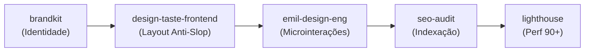
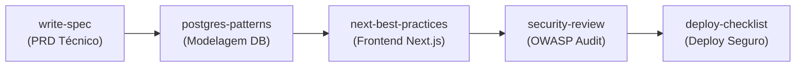
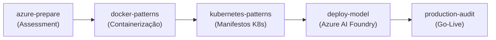
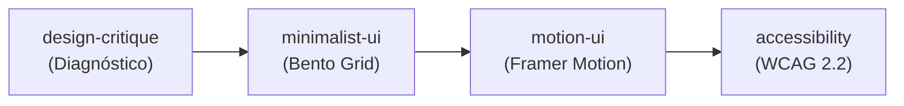

# 🧠 O Cérebro das Skills (`CEREBRO.md`)
### Manual Mestre de Ativação, Casos de Uso, Engenharia de Prompt e Catálogo de 509 Skills

> Este documento é o **mapa cognitivo central** do repositório [`SkiilsToIAs`](https://github.com/Henrique1601/SkiilsToIAs). Aqui você encontrará não apenas o que cada uma das **509 skills** faz, mas exatamente **quando usar**, **como invocar** e **quais prompts copiar e colar** para extrair a máxima inteligência dos seus agentes de IA.

---

> [!IMPORTANT]
> ### 🤖 Conheça o Agente Mestre (Skills Orchestrator)
> Precisa saber **o que fazer**, **quando fazer** e **qual skill usar** em cada fase do seu projeto?
> 👉 Consulte o [**Manual Operacional do Agente Mestre (`AGENTE_MESTRE.md`)**](AGENTE_MESTRE.md) — o framework decisório em 9 fases (da ideação ao go-to-market), com playbooks por tipo de projeto (SaaS, Mobile, IA, E-commerce, Refactor) e árvore de resolução imediata de problemas!

---

## 📌 Sumário Rápido

1. [🧠 Como a IA Pensa e Ativa as Skills](#-1-como-a-ia-pensa-e-ativa-as-skills)
   - [Anatomia de uma Skill](#anatomia-de-uma-skill)
   - [Os 3 Modos de Invocação](#os-3-modos-de-invocação)
   - [A Fórmula do Prompt Perfeito](#a-fórmula-do-prompt-perfeito)
2. [⚡ Power Combos: Workflows Multi-Skill de Alto Impacto](#-2-power-combos-workflows-multi-skill)
   - [Combo 1: Lançamento de Landing Page de Alta Conversão](#combo-1-lançamento-de-landing-page-de-alta-conversão)
   - [Combo 2: Desenvolvimento Fullstack Production-Ready](#combo-2-desenvolvimento-fullstack-production-ready)
   - [Combo 3: Infraestrutura Cloud Empresarial no Azure & Vercel](#combo-3-infraestrutura-cloud-empresarial)
   - [Combo 4: Criação de Novo Agente & Servidor MCP](#combo-4-criação-de-novo-agente--servidor-mcp)
   - [Combo 5: Redesign & Polimento Obsessivo de UI](#combo-5-redesign--polimento-obsessivo-de-ui)
   - [Combo 6: Apresentação Executiva para Diretoria](#combo-6-apresentação-executiva-para-diretoria)
3. [🎯 Cheat Sheet: O que você quer fazer hoje?](#-3-cheat-sheet-o-que-você-quer-fazer-hoje)
4. [📚 Catálogo Completo das 509 Skills por Categoria](#-4-catálogo-completo-das-skills-por-categoria)

   - [🎨 Design & UI/UX (65 skills)](#design)
   - [🔍 SEO & Mecanismos de Busca (8 skills)](#seo)
   - [📣 Marketing & Vendas (27 skills)](#marketing)
   - [🎯 Carreira & Empregabilidade (23 skills)](#career)
   - [💻 Desenvolvimento & Testes (88 skills)](#development)
   - [☁️ Cloud & DevOps (44 skills)](#devops-cloud)
   - [🗄️ Backend & Bancos de Dados (61 skills)](#backend-database)
   - [🤖 Agentes de IA & Metaprogramação (94 skills)](#ai-agents)
   - [📄 Documentos & Produtividade (26 skills)](#documents-productivity)
   - [📊 Gestão & Negócios (43 skills)](#business-management)
   - [🛠️ Utilitários & Otimização (30 skills)](#utilities)
5. [⚙️ Como Instalar e Sincronizar as Skills](#-5-como-instalar-e-sincronizar-as-skills)

---

## 🧠 1. Como a IA Pensa e Ativa as Skills

### Anatomia de uma Skill
Cada pasta no repositório contém um arquivo `SKILL.md` estruturado com um cabeçalho **YAML Frontmatter**:

```yaml
---
name: nome-da-skill
description: "Explica exatamente o que a skill faz e quais palavras-chave ativam o seu uso."
---
```

Quando um agente de IA (como **Antigravity**, **Claude Code** ou **Cursor**) é iniciado, ele carrega em sua memória de sistema uma lista indexada com o `name` e a `description` de todas as skills disponíveis. O modelo calcula a similaridade semântica entre o que você digitou e a descrição da skill.

---

### Os 3 Modos de Invocação

#### Modo 1: Invocação Explícita Direta (Recomendado quando você quer precisão total)
Você cita expressamente o nome da skill no seu prompt:
> *"Use a skill `design-taste-frontend` para construir a página de preços do meu produto."*

#### Modo 2: Invocação por Comando Slash (`/`)
Quando suportado pelo ambiente de execução:
> *`/caveman explique como funciona o algoritmo Raft`*  
> *`/caveman-commit gere a mensagem de commit para estas alterações`*

#### Modo 3: Invocação Implícita Autônoma (Via Gatilhos Naturais)
Você descreve o problema usando termos-chave contidos na descrição da skill:
> *"Faça uma auditoria de acessibilidade WCAG 2.1 AA nesta tela..."* ➔ O agente ativa automaticamente `accessibility-review`.  
> *"Faça uma auditoria de SEO técnico checando canonical e meta-tags..."* ➔ O agente ativa automaticamente `seo-audit`.

---

### A Fórmula do Prompt Perfeito
Para extrair 100% da inteligência das skills, use a estrutura de 4 blocos:

```text
[CONTEXTO]   -> "Estou construindo um SaaS B2B de gestão de fretes em Next.js 15."
[OBJETIVO]   -> "Preciso criar a tabela de histórico de cotações com filtros de data."
[SKILL/TOM]  -> "Aplique os padrões da skill `design-taste-frontend` e `emil-design-eng`."
[RESTRIÇÕES] -> "Não use cards genéricos com sombras pesadas. Use micro-motion abaixo de 200ms."
```

---

## ⚡ 2. Power Combos: Workflows Multi-Skill

Nenhuma skill trabalha sozinha no mundo real. Os maiores ganhos de produtividade acontecem quando você encadeia skills em pipelines contínuos:

### Combo 1: Lançamento de Landing Page de Alta Conversão

```mermaid
flowchart LR
    A["brandkit<br/>(Identidade)"] --> B["design-taste-frontend<br/>(Layout Anti-Slop)"]
    B --> C["emil-design-eng<br/>(Microinterações)"]
    C --> D["seo-audit<br/>(Indexação)"]
    D --> E["lighthouse<br/>(Perf 90+)"]
```
**Prompt Mestre para Ativar o Combo:**
```markdown
"Vamos construir a Landing Page do produto X. 
Passo 1: Gere a identidade e paleta com 'brandkit'.
Passo 2: Monte o layout moderno com 'design-taste-frontend' em Tailwind CSS.
Passo 3: Refine as microinterações e sensação tátil com 'emil-design-eng'.
Passo 4: Audite SEO com 'seo-audit' e garanta nota 95+ no 'lighthouse'."
```

---

### Combo 2: Desenvolvimento Fullstack Production-Ready

```mermaid
flowchart LR
    A["write-spec<br/>(PRD Técnico)"] --> B["postgres-patterns<br/>(Modelagem DB)"]
    B --> C["next-best-practices<br/>(Frontend Next.js)"]
    C --> D["security-review<br/>(OWASP Audit)"]
    D --> E["deploy-checklist<br/>(Deploy Seguro)"]
```
**Prompt Mestre para Ativar o Combo:**
```markdown
"Vamos criar a feature de assinaturas do usuário:
1. 'write-spec': Crie o PRD técnico e critérios de aceite.
2. 'postgres-patterns': Modele as tabelas de planos e cobrança no Supabase com RLS.
3. 'next-best-practices': Implemente as Server Actions e telas em Next.js.
4. 'security-review': Verifique injeção, CSRF e validação com Zod.
5. 'deploy-checklist': Faça a auditoria pré-deploy antes de subir para a Vercel."
```

---

### Combo 3: Infraestrutura Cloud Empresarial

```mermaid
flowchart LR
    A["azure-prepare<br/>(Assessment)"] --> B["docker-patterns<br/>(Containerização)"]
    B --> C["kubernetes-patterns<br/>(Manifestos K8s)"]
    C --> D["deploy-model<br/>(Azure AI Foundry)"]
    D --> E["production-audit<br/>(Go-Live)"]
```

---

### Combo 4: Criação de Novo Agente & Servidor MCP

```mermaid
flowchart LR
    A["agent-harness-construction<br/>(Action Space)"] --> B["mcp-server-patterns<br/>(Servidor MCP)"]
    B --> C["agentic-engineering<br/>(Loop de Raciocínio)"]
    C --> D["eval-harness<br/>(Avaliação EDD)"]
```

---

### Combo 5: Redesign & Polimento Obsessivo de UI

```mermaid
flowchart LR
    A["design-critique<br/>(Diagnóstico)"] --> B["minimalist-ui<br/>(Bento Grid)"]
    B --> C["motion-ui<br/>(Framer Motion)"]
    C --> D["accessibility<br/>(WCAG 2.2)"]
```

---

### Combo 6: Apresentação Executiva para Diretoria

```mermaid
flowchart LR
    A["analyze<br/>(Mineração de Dados)"] --> B["brief<br/>(Síntese Executiva)"]
    B --> C["frontend-slides<br/>(Slides Interativos)"]
    C --> D["canvas-design<br/>(Infográficos)"]
```

---

## 🎯 3. Cheat Sheet: O que você quer fazer hoje?

| Desejo / Necessidade | Categoria Recomendada | Skills Principais a Usar |
|---|---|---|
| Criar uma Landing Page que pareça de agência premiada | `design` | `design-taste-frontend`, `brandkit`, `emil-design-eng` |
| Criar vídeos explicativos em código para SaaS | `design` | `remotion-best-practices`, `remotion-video-creation`, `remotion-saas` |
| Modelar banco de dados serverless ou NoSQL | `backend-database` | `supabase`, `neon-postgres`, `mongodb-schema-design`, `postgres-patterns` |
| Auditar e melhorar o ranqueamento no Google | `seo` | `seo-audit`, `lighthouse`, `click-path-audit` |
| Fazer deploy automatizado e seguro | `devops-cloud` | `deploy-to-vercel`, `cloudflare-deploy`, `deploy-checklist`, `docker-patterns` |
| Provisionar e calibrar modelos de IA na nuvem | `devops-cloud` | `deploy-model`, `capacity`, `customize`, `finetuning`, `preset` |
| Escrever código com cobertura e sem bugs | `development` | `tdd-workflow`, `code-review`, `security-review`, `verification-loop` |
| Criar um aplicativo mobile fluido (iOS/Android) | `development` | `swiftui-patterns`, `compose-multiplatform-patterns`, `react-native-patterns` |
| Construir um sistema de agentes autônomos com RAG | `ai-agents` | `agentic-engineering`, `cost-aware-llm-pipeline`, `continuous-agent-loop` |
| Otimizar currículo para passar em robôs ATS | `career` | `resume-ats-optimizer`, `tech-resume-optimizer`, `job-description-analyzer` |
| Produzir conteúdo e autoridade no LinkedIn | `marketing` | `linkedin-post-writer`, `linkedin-content-planner`, `linkedin-hook-extractor` |
| Economizar tokens de contexto em tarefas longas | `utilities` | `caveman`, `caveman-commit`, `caveman-review` |

---

## 📚 4. Catálogo Completo das Skills por Categoria

<a id="design"></a>
### 🎨 Design & UI/UX (65 skills)
> *Criação de interfaces premium, animações fluidas, design systems e estética anti-genérica.*

| Skill | O que faz | Quando usar | Exemplo de Prompt | Link |
|---|---|---|---|:---:|
| **`accessibility-review`** | Executa auditoria de acessibilidade baseada em WCAG 2.1 AA em designs ou páginas web. | Revisar contraste de cores, navegação por teclado, tamanhos de alvos de toque e leitor de tela antes de publicar ou entregar para produção. | *"Faça um audit de acessibilidade (WCAG 2.1 AA) nesta página de checkout e liste todos os problemas de contraste e foco de teclado."* | [`SKILL.md`](design/accessibility-review/SKILL.md) |
| **`animate`** | Cria animações web do zero com decisões de motion design de nível sênior (timing, curvas bezier, interrupções). | Adicionar dinamismo a botões, transições de tela, micro-interações de hover e saídas suaves de elementos na web. | *"Crie uma animação suave para este menu dropdown usando Tailwind e Framer Motion com curva ease-out."* | [`SKILL.md`](design/animate/SKILL.md) |
| **`animate-expo`** | Desenvolve animações fluidas e nativas para React Native e Expo usando Reanimated, Gesture Handler e haptics. | Criar bottom sheets, transições entre telas mobile, feedback tátil ou corrigir animações que travam em dispositivos móveis. | *"Implemente um bottom sheet interativo no Expo usando react-native-reanimated com snapping points e feedback de vibração tátil."* | [`SKILL.md`](design/animate-expo/SKILL.md) |
| **`animation-vocabulary`** | Dicionário reverso de termos de animação que traduz descrições leigas no termo técnico exato da indústria. | Você tem em mente um efeito visual ou transição mas não sabe o nome técnico exato para pedir à IA ou ao designer. | *"Qual é o termo exato para aquele efeito onde o menu abre quicando levemente no final?"* | [`SKILL.md`](design/animation-vocabulary/SKILL.md) |
| **`apple-design`** | Traduz a filosofia e o rigor estético da Apple (motion físico com molas, materiais translúcidos, tipografia óptica) para a web. | Construir interfaces refinadas com toque 'Apple-like': blur translúcido, gestos físicos, molas calibradas e contenção visual. | *"Refatore o cabeçalho e a barra de navegação da aplicação para seguir o design language da Apple (blur de vidro fosco, tipografia San Francisco e física de molas)."* | [`SKILL.md`](design/apple-design/SKILL.md) |
| **`ask-sonner`** | Guia e implementação da biblioteca de toasts Sonner para React (posicionamento, estados de loading, dark mode). | Instalar ou solucionar problemas de notificações toast: toasts que não somem, conflitos com Tailwind ou problemas de z-index com modais. | *"Configure o Sonner no meu projeto Next.js com suporte a promessas assíncronas (loading, success, error) e tema escuro automático."* | [`SKILL.md`](design/ask-sonner/SKILL.md) |
| **`blender-motion-state-inspection`** | Use this skill when inspecting Blender characters, rigs, poses, animation retargeting, ground contact, facing direction, or model-vs-motion alignment where s... | Necessidade específica envolvendo blender-motion-state-inspection. | *"Aplique as diretrizes da skill `blender-motion-state-inspection` nesta implementação."* | [`SKILL.md`](design/blender-motion-state-inspection/SKILL.md) |
| **`brandkit`** | Geração de kits de marca e identidade visual de alto padrão (logos conceituais, paleta de cores e tipografia de luxo). | Criar a identidade visual de uma nova startup, produto SaaS de luxo, fintech ou produto técnico dark-mode. | *"Crie um brand kit completo para uma fintech de investimentos sustentáveis: paleta de cores minimalista, escala tipográfica e conceito de logo."* | [`SKILL.md`](design/brandkit/SKILL.md) |
| **`canvas-design`** | Criação de arte visual e peças de design em canvas (.png e .pdf) aplicando fundamentos de composição e teoria das cores. | Desenvolver pôsteres promocionais, infográficos artísticos, capas visuais ou composições estáticas para download. | *"Desenhe um pôster visualmente marcante sobre 'A Era dos Agentes de IA' com tipografia suíça e grid limpo."* | [`SKILL.md`](design/canvas-design/SKILL.md) |
| **`design-critique`** | Fornece feedback estruturado e crítico sobre usabilidade, hierarquia visual e coerência estética de telas. | Submeter um layout, print ou wireframe para uma avaliação de design antes de enviar para validação com clientes. | *"Faça um critique rigoroso desta tela de dashboard: avalie contraste, densidade de informação e hierarquia dos títulos."* | [`SKILL.md`](design/design-critique/SKILL.md) |
| **`design-system`** | Auditoria, documentação e expansão de Design Systems (tokens de cor, componentes modulares, estados e acessibilidade). | Padronizar componentes inconsistentes, eliminar valores de cores 'hardcoded' e criar documentação de variantes. | *"Audite os componentes Button e Input do meu projeto e unifique as variantes (primary, secondary, destructive) em um design system consistente."* | [`SKILL.md`](design/design-system/SKILL.md) |
| **`design-taste-frontend`** | Skill 'anti-slop' que impede que páginas geradas por IA pareçam templates genéricos, aplicando bom gosto e direção de arte real. | Construir landing pages, portfólios ou reformular sites existentes para que tenham personalidade única e toque humano autêntico. | *"Crie uma landing page para o meu produto de IA usando design-taste-frontend, evitando componentes clichês e usando assimetria e tipografia expressiva."* | [`SKILL.md`](design/design-taste-frontend/SKILL.md) |
| **`design-taste-frontend-v1`** | Versão original da skill de bom gosto visual para projetos com dependência de comportamento estrito da v1. | Manter retrocompatibilidade de design em codebases que já usavam as regras e convenções da versão 1. | *"Aplique o design-taste-frontend-v1 na reestruturação visual do card de preços."* | [`SKILL.md`](design/design-taste-frontend-v1/SKILL.md) |
| **`emil-design-eng`** | Codifica a filosofia de design de Emil Kowalski: polimento obsessivo de UI, física de movimento e detalhes invisíveis. | Fazer ajustes finos de micro-interações: hover com delay calculado, botões com feedback tátil visual, spring easing perfeito. | *"Aplique os princípios de design engineer do Emil Kowalski neste componente de dropdown (entradas abaixo de 200ms, transform-origin correto, feedback de clique)."* | [`SKILL.md`](design/emil-design-eng/SKILL.md) |
| **`find-animation-opportunities`** | Examina o código ou interface em busca de lugares estáticos que deveriam ter animação e descarta motion desnecessário. | Auditar uma interface já pronta para identificar onde adicionar pequenos toques de animação para torná-la mais responsiva e viva. | *"Analise esta página de perfil e aponte 3 oportunidades onde animações sutis aumentariam a percepção de polimento do produto."* | [`SKILL.md`](design/find-animation-opportunities/SKILL.md) |
| **`fixing-motion-performance`** | Audit and fix animation performance issues including layout thrashing, compositor properties, scroll-linked motion, and blur effects. | Necessidade específica envolvendo fixing-motion-performance. | *"Aplique as diretrizes da skill `fixing-motion-performance` nesta implementação."* | [`SKILL.md`](design/fixing-motion-performance/SKILL.md) |
| **`frontend-design`** | Direcionamento estético e escolhas tipográficas intencionais para novas interfaces web. | Iniciar o design de um novo produto digital sem cair em escolhas padrão e desinteressantes. | *"Defina a direção visual para uma plataforma educacional de ponta: selecione famílias de fontes, contrastes e layout moderno."* | [`SKILL.md`](design/frontend-design/SKILL.md) |
| **`frontend-design-direction`** | Set an ECC-specific frontend design direction for production UI work. | Necessidade específica envolvendo frontend-design-direction. | *"Aplique as diretrizes da skill `frontend-design-direction` nesta implementação."* | [`SKILL.md`](design/frontend-design-direction/SKILL.md) |
| **`frontend-slides`** | Create stunning, animation-rich HTML presentations from scratch or by converting PowerPoint files. | Necessidade específica envolvendo frontend-slides. | *"Aplique as diretrizes da skill `frontend-slides` nesta implementação."* | [`SKILL.md`](design/frontend-slides/SKILL.md) |
| **`gpt-taste`** | Engenharia de layout com alta variação e animações avançadas em GSAP (ScrollTrigger, pinning, scrub, bento grids sem gaps). | Criar experiências visuais imersivas com scroll storytelling, elementos travados na tela e grades assimétricas dinâmicas. | *"Crie uma seção hero com efeito de pin no scroll usando GSAP ScrollTrigger e revelação sequencial de textos."* | [`SKILL.md`](design/gpt-taste/SKILL.md) |
| **`gsap`** | GSAP animation reference for HyperFrames. Covers gsap.to(), from(), fromTo(), easing, stagger, defaults, timelines (gsap.timeline(), position parameter, labe... | Necessidade específica envolvendo gsap. | *"Aplique as diretrizes da skill `gsap` nesta implementação."* | [`SKILL.md`](design/gsap/SKILL.md) |
| **`high-end-visual-design`** | Ensina a IA a projetar interfaces com o nível de acabamento de uma agência de design internacional de alta classe. | Garantir que a página transmita autoridade, requinte e sofisticação (fontes premium, sombras volumétricas sutis, grids arejados). | *"Redesenhe a seção de depoimentos da nossa landing page usando os princípios de high-end-visual-design."* | [`SKILL.md`](design/high-end-visual-design/SKILL.md) |
| **`image-to-code`** | Converte designs visuais em código frontend pixel-perfect de alta fidelidade. | Transformar um mockup em imagem, screenshot ou wireframe em código React/Tailwind idêntico. | *"Converta este screenshot do painel de controle em um componente React modular com Tailwind CSS."* | [`SKILL.md`](design/image-to-code/SKILL.md) |
| **`imagegen-frontend-mobile`** | Diretrizes e prompts para geração de referências visuais conceituais de aplicativos mobile (iOS e Android). | Gerar conceitos visuais e mockups de alta qualidade para aplicativos móveis antes de codificar. | *"Gere uma imagem conceitual de alta qualidade da tela de checkout de um app de delivery estilo iOS 18."* | [`SKILL.md`](design/imagegen-frontend-mobile/SKILL.md) |
| **`imagegen-frontend-web`** | Geração de imagens de referência e direção de arte para landing pages seção por seção. | Criar referências visuais ricas de cada seção do seu site para inspirar o desenvolvimento frontend. | *"Gere a imagem de referência conceitual para a seção hero de um software de cibersegurança empresarial."* | [`SKILL.md`](design/imagegen-frontend-web/SKILL.md) |
| **`improve-animations`** | Auditoria e plano de melhoria técnica de animações existentes em um codebase inteiro. | Animações estão travando, sem cadência natural, ou poluindo a experiência de uso da aplicação. | *"Faça um levantamento das animações CSS e Framer Motion do nosso projeto e apresente um plano de otimização de performance."* | [`SKILL.md`](design/improve-animations/SKILL.md) |
| **`industrial-brutalist-ui`** | Estilo visual brutalista industrial: tipografia helvética rígida, grids mecânicos, estética de terminal militar e alto contraste. | Desenvolver interfaces utilitárias, dashboards de monitoramento densos, sites de desenvolvedores ou marcas que fogem do comum. | *"Crie um painel de telemetria de servidores com estética industrial brutalista: fonte monoespaçada, linhas de grade pretas e toques de amarelo alerta."* | [`SKILL.md`](design/industrial-brutalist-ui/SKILL.md) |
| **`liquid-glass-design`** | iOS 26 Liquid Glass design system — dynamic glass material with blur, reflection, and interactive morphing for SwiftUI, UIKit, and WidgetKit. | Necessidade específica envolvendo liquid-glass-design. | *"Aplique as diretrizes da skill `liquid-glass-design` nesta implementação."* | [`SKILL.md`](design/liquid-glass-design/SKILL.md) |
| **`make-interfaces-feel-better`** | Apply concrete design-engineering details that make interfaces feel polished. | Necessidade específica envolvendo make-interfaces-feel-better. | *"Aplique as diretrizes da skill `make-interfaces-feel-better` nesta implementação."* | [`SKILL.md`](design/make-interfaces-feel-better/SKILL.md) |
| **`manim-video`** | Build reusable Manim explainers for technical concepts, graphs, system diagrams, and product walkthroughs, then hand off to the wider ECC video stack if needed. | Necessidade específica envolvendo manim-video. | *"Aplique as diretrizes da skill `manim-video` nesta implementação."* | [`SKILL.md`](design/manim-video/SKILL.md) |
| **`minimalist-ui`** | Design editorial ultra-limpo: paleta monocromática acolhedora, sem gradientes pesados, foco total em conteúdo e legibilidade. | Construir blogs, portfólios, aplicativos de notas, leitores e ferramentas de escrita focadas em produtividade serena. | *"Crie o layout do leitor de artigos no estilo minimalist-ui: espaçamento generoso, tipografia serifada elegante e zero poluição visual."* | [`SKILL.md`](design/minimalist-ui/SKILL.md) |
| **`mobile-native`** | Ajustes de CSS e meta-tags para fazer web apps (PWA) parecerem apps nativos em smartphones. | Eliminar o atraso de toque de 300ms, efeito de flash no clique, zoom indesejado em inputs e resolver a área de notch do iPhone. | *"Aplique as regras de mobile-native no nosso web app: remova o highlight azul de toque, trave o viewport contra zoom acidental em inputs e respeite o safe-area-inset do iPhone."* | [`SKILL.md`](design/mobile-native/SKILL.md) |
| **`motion-advanced`** | Advanced motion patterns for React / Next.js — drag & drop, gestures, text animations, SVG path drawing, custom hooks, imperative sequences (useAnimate), loa... | Necessidade específica envolvendo motion-advanced. | *"Aplique as diretrizes da skill `motion-advanced` nesta implementação."* | [`SKILL.md`](design/motion-advanced/SKILL.md) |
| **`motion-foundations`** | Motion tokens, spring presets, performance rules, device adaptation, accessibility enforcement, and SSR safety for React / Next.js using motion/react. | Necessidade específica envolvendo motion-foundations. | *"Aplique as diretrizes da skill `motion-foundations` nesta implementação."* | [`SKILL.md`](design/motion-foundations/SKILL.md) |
| **`motion-graphics`** | > | Necessidade específica envolvendo motion-graphics. | *"Aplique as diretrizes da skill `motion-graphics` nesta implementação."* | [`SKILL.md`](design/motion-graphics/SKILL.md) |
| **`motion-patterns`** | Production-ready animation patterns for React / Next.js — button, modal, toast, stagger, page transitions, exit animations, scroll, and layout — built on mot... | Necessidade específica envolvendo motion-patterns. | *"Aplique as diretrizes da skill `motion-patterns` nesta implementação."* | [`SKILL.md`](design/motion-patterns/SKILL.md) |
| **`motion-ui`** | Production-ready UI motion system for React/Next.js. Use when implementing animations, transitions, or motion patterns. | Necessidade específica envolvendo motion-ui. | *"Aplique as diretrizes da skill `motion-ui` nesta implementação."* | [`SKILL.md`](design/motion-ui/SKILL.md) |
| **`pick-ui-library`** | Consultor opinativo para escolher a biblioteca de UI ideal para o seu projeto frontend. | Decidir qual stack ou biblioteca usar (shadcn/ui, Radix, Chakra, Mantine, Headless UI, Tamagui, etc.). | *"Estou criando um painel de administração em Next.js 15: qual biblioteca de UI você recomenda e por quê?"* | [`SKILL.md`](design/pick-ui-library/SKILL.md) |
| **`prototype`** | Constrói protótipos de interface rápidos com múltiplas variantes reais e seletor (picker) embutido. | Explorar 3 direções visuais ou comportamentais distintas de um mesmo componente antes de bater o martelo. | *"Construa 3 variantes completamente diferentes para o card de checkout do produto usando o harness de protótipo."* | [`SKILL.md`](design/prototype/SKILL.md) |
| **`redesign-existing-projects`** | Atualiza websites e aplicações legadas para um padrão de qualidade visual de alto nível sem quebrar regras de negócio. | Modernizar sistemas antigos, interfaces corporativas datadas ou protótipos que ficaram feios com o tempo. | *"Redesenhe esta tabela legada de pedidos mantendo todos os dados, mas aplicando hierarquia moderna, paginação limpa e estados de hover."* | [`SKILL.md`](design/redesign-existing-projects/SKILL.md) |
| **`remotion-best-practices`** | Best practices for Remotion | Necessidade específica envolvendo remotion-best-practices. | *"Aplique as diretrizes da skill `remotion-best-practices` nesta implementação."* | [`SKILL.md`](design/remotion-best-practices/SKILL.md) |
| **`remotion-captions`** | Dealing with captions in Remotion | Necessidade específica envolvendo remotion-captions. | *"Aplique as diretrizes da skill `remotion-captions` nesta implementação."* | [`SKILL.md`](design/remotion-captions/SKILL.md) |
| **`remotion-create`** | Creating a new Remotion video | Necessidade específica envolvendo remotion-create. | *"Aplique as diretrizes da skill `remotion-create` nesta implementação."* | [`SKILL.md`](design/remotion-create/SKILL.md) |
| **`remotion-docs`** | Search and fetch Remotion documentation pages | Necessidade específica envolvendo remotion-docs. | *"Aplique as diretrizes da skill `remotion-docs` nesta implementação."* | [`SKILL.md`](design/remotion-docs/SKILL.md) |
| **`remotion-interactivity`** | Best practices for writing Remotion animations that stay intuitive for agents and editable in Remotion Studio Visual Mode. | Necessidade específica envolvendo remotion-interactivity. | *"Aplique as diretrizes da skill `remotion-interactivity` nesta implementação."* | [`SKILL.md`](design/remotion-interactivity/SKILL.md) |
| **`remotion-markup`** | Best practices for writing Remotion React Markup | Necessidade específica envolvendo remotion-markup. | *"Aplique as diretrizes da skill `remotion-markup` nesta implementação."* | [`SKILL.md`](design/remotion-markup/SKILL.md) |
| **`remotion-render`** | Best practices for rendering videos | Necessidade específica envolvendo remotion-render. | *"Aplique as diretrizes da skill `remotion-render` nesta implementação."* | [`SKILL.md`](design/remotion-render/SKILL.md) |
| **`remotion-saas`** | Building video apps with Remotion - framework, rendering and Player advice | Necessidade específica envolvendo remotion-saas. | *"Aplique as diretrizes da skill `remotion-saas` nesta implementação."* | [`SKILL.md`](design/remotion-saas/SKILL.md) |
| **`remotion-to-hyperframes`** | Port an existing Remotion (React) composition''s source to HyperFrames HTML. | Necessidade específica envolvendo remotion-to-hyperframes. | *"Aplique as diretrizes da skill `remotion-to-hyperframes` nesta implementação."* | [`SKILL.md`](design/remotion-to-hyperframes/SKILL.md) |
| **`remotion-video-creation`** | Best practices for Remotion - Video creation in React. 29 domain-specific rules covering 3D, animations, audio, captions, charts, transitions, and more. | Necessidade específica envolvendo remotion-video-creation. | *"Aplique as diretrizes da skill `remotion-video-creation` nesta implementação."* | [`SKILL.md`](design/remotion-video-creation/SKILL.md) |
| **`review-animations`** | Revisão e crítica técnica de motion design e código de animações em Pull Requests e diffs. | Garantir que animações novas não introduzam lag, não quebrem regras de acessibilidade e sigam curvas naturais. | *"Revise esta PR com alterações de animações em Framer Motion e aponte problemas de easing ou duração excessiva."* | [`SKILL.md`](design/review-animations/SKILL.md) |
| **`shadcn`** | Manages shadcn components and projects — adding, searching, fixing, debugging, styling, and composing UI. | Necessidade específica envolvendo shadcn. | *"Aplique as diretrizes da skill `shadcn` nesta implementação."* | [`SKILL.md`](design/shadcn/SKILL.md) |
| **`slack-gif-creator`** | Criação de GIFs animados e stickers otimizados para dimensões e limites de peso do Slack. | Criar comemorações internas, reações customizadas de time ou tutoriais curtos em GIF para canais do Slack. | *"Crie um GIF animado de 'Deploy com Sucesso' com menos de 2MB e dimensões ideais para usar como reação no Slack."* | [`SKILL.md`](design/slack-gif-creator/SKILL.md) |
| **`stitch-design-taste`** | Gera arquivos semânticos DESIGN.md para agentes de IA seguirem rigorosamente o design system do projeto. | Criar a constituição visual do seu repositório para que outros agentes e desenvolvedores gerem telas sempre alinhadas. | *"Gere o arquivo DESIGN.md para este repositório contendo todas as diretrizes de cores, tipografia, espaçamento e componentes."* | [`SKILL.md`](design/stitch-design-taste/SKILL.md) |
| **`taste`** | A creative-direction (taste) layer for music videos and short-form edits in the angelcore / cloud-trance / hyperpop visual family. | Necessidade específica envolvendo taste. | *"Aplique as diretrizes da skill `taste` nesta implementação."* | [`SKILL.md`](design/taste/SKILL.md) |
| **`theme-factory`** | Motor de temas com 10 presets profissionais e geração de novos esquemas de cores on-the-fly. | Aplicar temas consistentes (dark mode, light mode, pastel, cyberpunk, corporate) em slides, dashboards ou páginas web. | *"Aplique o tema 'Warm Editorial' em toda a folha de estilos deste projeto."* | [`SKILL.md`](design/theme-factory/SKILL.md) |
| **`ui-demo`** | Record polished UI demo videos using Playwright. Use when the user asks to create a demo, walkthrough, screen recording, or tutorial video of a web application. | Necessidade específica envolvendo ui-demo. | *"Aplique as diretrizes da skill `ui-demo` nesta implementação."* | [`SKILL.md`](design/ui-demo/SKILL.md) |
| **`ui-to-vue`** | Use when the user has UI screenshots or design exports that need batch conversion into Vue 3 components, especially with Vant, Element Plus, or Ant Design Vue. | Necessidade específica envolvendo ui-to-vue. | *"Aplique as diretrizes da skill `ui-to-vue` nesta implementação."* | [`SKILL.md`](design/ui-to-vue/SKILL.md) |
| **`ui-toolkit-web`** | Integração do kit de ferramentas de vídeo e conferência do Zoom Video SDK com React. | Construir salas de aula virtuais, telemedicina ou videoconferências personalizadas dentro da sua aplicação web. | *"Configure o componente de sala de vídeo do Zoom Video SDK no meu app React com controles de microfone e câmera."* | [`SKILL.md`](design/ui-toolkit-web/SKILL.md) |
| **`ui-ux-pro-max`** | UI/UX design intelligence for web and mobile. Includes 50+ styles, 161 color palettes, 57 font pairings, 161 product types, 99 UX guidelines, and 25 chart ty... | Necessidade específica envolvendo ui-ux-pro-max. | *"Aplique as diretrizes da skill `ui-ux-pro-max` nesta implementação."* | [`SKILL.md`](design/ui-ux-pro-max/SKILL.md) |
| **`ux-copy`** | Redação e polimento de microcopy: textos de botões, mensagens de erro empáticas, estados vazios e modais de confirmação. | Escrever textos na interface que orientam o usuário com clareza, diminuem o atrito e aumentam a conversão. | *"Escreva mensagens de erro humanas e resolutivas para este formulário de cadastro (senha fraca, email já em uso, timeout)."* | [`SKILL.md`](design/ux-copy/SKILL.md) |
| **`video-edit`** | > | Necessidade específica envolvendo video-edit. | *"Aplique as diretrizes da skill `video-edit` nesta implementação."* | [`SKILL.md`](design/video-edit/SKILL.md) |
| **`video-editing`** | AI-assisted video editing workflows for cutting, structuring, and augmenting real footage. | Necessidade específica envolvendo video-editing. | *"Aplique as diretrizes da skill `video-editing` nesta implementação."* | [`SKILL.md`](design/video-editing/SKILL.md) |
| **`videodb`** | See, Understand, Act on video and audio. See- ingest from local files, URLs, RTSP/live feeds, or live record desktop; return realtime context and playable st... | Necessidade específica envolvendo videodb. | *"Aplique as diretrizes da skill `videodb` nesta implementação."* | [`SKILL.md`](design/videodb/SKILL.md) |
| **`web-design-guidelines`** | Revisão e auditoria de código UI em conformidade com as Web Interface Guidelines oficiais. | Verificar se o código de frontend segue as melhores práticas da indústria antes de submeter para homologação. | *"Audite os componentes da home page de acordo com as Web Interface Guidelines e liste desvios de usabilidade."* | [`SKILL.md`](design/web-design-guidelines/SKILL.md) |

<a id="seo"></a>
### 🔍 SEO & Mecanismos de Busca (8 skills)
> *Auditorias técnicas de indexação, Core Web Vitals, inteligência competitiva e ranqueamento no Google.*

| Skill | O que faz | Quando usar | Exemplo de Prompt | Link |
|---|---|---|---|:---:|
| **`click-path-audit`** | Trace every user-facing button/touchpoint through its full state change sequence to find bugs where functions individually work but cancel each other out, pr... | Necessidade específica envolvendo click-path-audit. | *"Aplique as diretrizes da skill `click-path-audit` nesta implementação."* | [`SKILL.md`](seo/click-path-audit/SKILL.md) |
| **`competitive-brief`** | Pesquisa concorrentes de mercado e identifica gaps de conteúdo, diferenciais competitivos e ângulos de posicionamento. | Um concorrente lançou um produto novo, ao planejar pautas editoriais ou criar páginas de comparação (Ex: 'Nós vs Concorrente'). | *"Crie um relatório comparativo detalhando as fraquezas de posicionamento do concorrente X e onde podemos superá-lo com nosso SaaS."* | [`SKILL.md`](seo/competitive-brief/SKILL.md) |
| **`competitive-intelligence`** | Gera battlecards interativos e matrizes de comparação detalhadas contra concorrentes para a equipe comercial. | Treinar vendedores para quebrar objeções de clientes que citam os concorrentes e comparar features lado a lado. | *"Crie um battlecard comercial completo comparando nosso software com a ferramenta líder de mercado para nosso time de vendas usar em reuniões."* | [`SKILL.md`](seo/competitive-intelligence/SKILL.md) |
| **`competitive-platform-analysis`** | >- | Necessidade específica envolvendo competitive-platform-analysis. | *"Aplique as diretrizes da skill `competitive-platform-analysis` nesta implementação."* | [`SKILL.md`](seo/competitive-platform-analysis/SKILL.md) |
| **`competitive-report-structure`** | >- | Necessidade específica envolvendo competitive-report-structure. | *"Aplique as diretrizes da skill `competitive-report-structure` nesta implementação."* | [`SKILL.md`](seo/competitive-report-structure/SKILL.md) |
| **`lighthouse`** | Google Lighthouse CLI reference for auditing web performance, accessibility, SEO, and best practices. | Necessidade específica envolvendo lighthouse. | *"Aplique as diretrizes da skill `lighthouse` nesta implementação."* | [`SKILL.md`](seo/lighthouse/SKILL.md) |
| **`seo`** | Audit, plan, and implement SEO improvements across technical SEO, on-page optimization, structured data, Core Web Vitals, and content strategy. | Necessidade específica envolvendo seo. | *"Aplique as diretrizes da skill `seo` nesta implementação."* | [`SKILL.md`](seo/seo/SKILL.md) |
| **`seo-audit`** | Auditoria aprofundada de SEO técnico: meta-tags, canonicals, robots.txt, sitemaps, Core Web Vitals e dados estruturados Schema.org. | O site perdeu tráfego, novas páginas não indexam ou antes de lançar um novo produto no ar. | *"Faça uma auditoria de SEO completa do arquivo index.html e aponte falhas de meta-tags, OpenGraph e dados estruturados."* | [`SKILL.md`](seo/seo-audit/SKILL.md) |

<a id="marketing"></a>
### 📣 Marketing & Vendas (27 skills)
> *Automação de campanhas, redação no tom de voz da marca, réguas de e-mail e prospecção comercial.*

| Skill | O que faz | Quando usar | Exemplo de Prompt | Link |
|---|---|---|---|:---:|
| **`account-research`** | Pesquisa aprofundada de empresas e decisores para inteligência comercial e prospecção B2B de alto ticket. | Antes de uma reunião comercial decisiva, ou ao montar uma lista de contas estratégicas para abordar. | *"Pesquise sobre a empresa X: qual é o modelo de negócio deles, quem é o CTO atual e quais dores de tecnologia eles enfrentam hoje?"* | [`SKILL.md`](marketing/account-research/SKILL.md) |
| **`amazon-product-research`** | Comprehensive product research and opportunity analysis for Amazon sellers. | Necessidade específica envolvendo amazon-product-research. | *"Aplique as diretrizes da skill `amazon-product-research` nesta implementação."* | [`SKILL.md`](marketing/amazon-product-research/SKILL.md) |
| **`brand-discovery`** | >- | Necessidade específica envolvendo brand-discovery. | *"Aplique as diretrizes da skill `brand-discovery` nesta implementação."* | [`SKILL.md`](marketing/brand-discovery/SKILL.md) |
| **`brand-review`** | Revisão e triagem de conteúdos e copies para garantir que respeitam o guia de estilo e o tom de voz da marca. | Antes de publicar anúncios, newsletters ou artigos de blog, checando consistência de linguagem e claims não comprovados. | *"Revise esta postagem de blog para garantir que ela adote nosso tom de voz: direto, confiável e sem jargões corporativos vazios."* | [`SKILL.md`](marketing/brand-review/SKILL.md) |
| **`brand-voice`** | Build a source-derived writing style profile from real posts, essays, launch notes, docs, or site copy, then reuse that profile across content, outreach, and... | Necessidade específica envolvendo brand-voice. | *"Aplique as diretrizes da skill `brand-voice` nesta implementação."* | [`SKILL.md`](marketing/brand-voice/SKILL.md) |
| **`brand-voice-enforcement`** | Aplica o tom de voz e estilo da marca diretamente na criação de novos conteúdos (posts de LinkedIn, pitches, emails). | Redigir propostas, emails para clientes ou posts para redes sociais que soem exatamente como a sua empresa. | *"Escreva um post para o LinkedIn anunciando nosso novo recurso, aplicando rigorosamente nosso guia de tom de voz minimalista e técnico."* | [`SKILL.md`](marketing/brand-voice-enforcement/SKILL.md) |
| **`canva-creator`** | Executa campanhas de redes sociais de ponta a ponta: cria cronograma de postagens, designs no Canva e copy de legenda. | Transformar um briefing em uma campanha visual completa para Instagram, LinkedIn e Twitter com artes e legendas prontas. | *"Crie uma campanha de 5 posts de lançamento do nosso curso no Instagram, com orientações visuais para o Canva e as copies completas das legendas."* | [`SKILL.md`](marketing/canva-creator/SKILL.md) |
| **`content-engine`** | Create platform-native content systems for X, LinkedIn, TikTok, YouTube, newsletters, and repurposed multi-platform campaigns. | Necessidade específica envolvendo content-engine. | *"Aplique as diretrizes da skill `content-engine` nesta implementação."* | [`SKILL.md`](marketing/content-engine/SKILL.md) |
| **`crosspost`** | Multi-platform content distribution across X, LinkedIn, Threads, and Bluesky. | Necessidade específica envolvendo crosspost. | *"Aplique as diretrizes da skill `crosspost` nesta implementação."* | [`SKILL.md`](marketing/crosspost/SKILL.md) |
| **`email-sequence`** | Desenha e redige fluxos de email marketing completos: onboarding, nutrição, recuperação de carrinho e pós-venda com testes A/B. | Criar uma régua de emails de boas-vindas para novos usuários que convertem cadastros gratuitos em assinantes pagos. | *"Escreva uma sequência de onboarding de 4 emails para usuários recém-cadastrados no nosso software de gestão financeira."* | [`SKILL.md`](marketing/email-sequence/SKILL.md) |
| **`linkedin-comment-drafter`** | Draft a LinkedIn comment on someone else's post from its URL, or reshare (repost) it to your feed with optional commentary. | Necessidade específica envolvendo linkedin-comment-drafter. | *"Aplique as diretrizes da skill `linkedin-comment-drafter` nesta implementação."* | [`SKILL.md`](marketing/linkedin-comment-drafter/SKILL.md) |
| **`linkedin-content-planner`** | Generate a 7-day LinkedIn content plan from a theme, audience, and pillars. | Necessidade específica envolvendo linkedin-content-planner. | *"Aplique as diretrizes da skill `linkedin-content-planner` nesta implementação."* | [`SKILL.md`](marketing/linkedin-content-planner/SKILL.md) |
| **`linkedin-employee-advocacy`** | Stand up and run a LinkedIn employee advocacy program for a marketing or sales team. | Necessidade específica envolvendo linkedin-employee-advocacy. | *"Aplique as diretrizes da skill `linkedin-employee-advocacy` nesta implementação."* | [`SKILL.md`](marketing/linkedin-employee-advocacy/SKILL.md) |
| **`linkedin-engager-analytics`** | Pull the people who liked or commented on any LinkedIn post and segment them by ICP fit (peer / aspirational / prospect / other). | Necessidade específica envolvendo linkedin-engager-analytics. | *"Aplique as diretrizes da skill `linkedin-engager-analytics` nesta implementação."* | [`SKILL.md`](marketing/linkedin-engager-analytics/SKILL.md) |
| **`linkedin-hook-extractor`** | Reverse-engineer the hook formula from a viral LinkedIn post URL. | Necessidade específica envolvendo linkedin-hook-extractor. | *"Aplique as diretrizes da skill `linkedin-hook-extractor` nesta implementação."* | [`SKILL.md`](marketing/linkedin-hook-extractor/SKILL.md) |
| **`linkedin-humanizer`** | Remove the AI tells human readers and LinkedIn's AI-slop filter react to in a post or comment: 2026 vocabulary by paragraph density, reveal bridges, staccato... | Necessidade específica envolvendo linkedin-humanizer. | *"Aplique as diretrizes da skill `linkedin-humanizer` nesta implementação."* | [`SKILL.md`](marketing/linkedin-humanizer/SKILL.md) |
| **`linkedin-marketing`** | Plan, draft, audit, and publish LinkedIn posts and comments. | Necessidade específica envolvendo linkedin-marketing. | *"Aplique as diretrizes da skill `linkedin-marketing` nesta implementação."* | [`SKILL.md`](marketing/linkedin-marketing/SKILL.md) |
| **`linkedin-post-writer`** | Draft a new LinkedIn post from scratch using one of 20 2026 hook formulas (anaphora, R.I.P., time-anchor, curiosity-gap, contrarian, controlled A/B, false-bi... | Necessidade específica envolvendo linkedin-post-writer. | *"Aplique as diretrizes da skill `linkedin-post-writer` nesta implementação."* | [`SKILL.md`](marketing/linkedin-post-writer/SKILL.md) |
| **`linkedin-reply-handler`** | Draft a reply to one LinkedIn comment from its URL, or sweep a whole thread from just the post URL and draft a reply to every comment worth answering, in one... | Necessidade específica envolvendo linkedin-reply-handler. | *"Aplique as diretrizes da skill `linkedin-reply-handler` nesta implementação."* | [`SKILL.md`](marketing/linkedin-reply-handler/SKILL.md) |
| **`linkedin-repurposer`** | Repurpose existing content into a native LinkedIn post. Take a tweet, thread, YouTube video, blog, or newsletter and rebuild it for LinkedIn: re-hook before ... | Necessidade específica envolvendo linkedin-repurposer. | *"Aplique as diretrizes da skill `linkedin-repurposer` nesta implementação."* | [`SKILL.md`](marketing/linkedin-repurposer/SKILL.md) |
| **`linkedin-skills`** | Plan, draft, audit, and publish LinkedIn posts and comments. | Necessidade específica envolvendo linkedin-skills. | *"Aplique as diretrizes da skill `linkedin-skills` nesta implementação."* | [`SKILL.md`](marketing/linkedin-skills/SKILL.md) |
| **`linkedin-thread-monitor`** | Track which of your LinkedIn comments earned author replies. | Necessidade específica envolvendo linkedin-thread-monitor. | *"Aplique as diretrizes da skill `linkedin-thread-monitor` nesta implementação."* | [`SKILL.md`](marketing/linkedin-thread-monitor/SKILL.md) |
| **`marketing-campaign`** | End-to-end marketing campaign planning and execution. Covers audience research, positioning, campaign angle definition, landing page copy, email sequences, s... | Necessidade específica envolvendo marketing-campaign. | *"Aplique as diretrizes da skill `marketing-campaign` nesta implementação."* | [`SKILL.md`](marketing/marketing-campaign/SKILL.md) |
| **`performance-report`** | Compila relatórios executivos de marketing com métricas-chave (CAC, LTV, ROAS), análise de canais e recomendações de otimização. | Fechamento de mês ou trimestre para apresentar resultados para diretores, clientes de agência ou investidores. | *"Compile este resumo de métricas do Google Ads e Meta Ads em um relatório executivo destacando os canais mais rentáveis."* | [`SKILL.md`](marketing/performance-report/SKILL.md) |
| **`social-graph-ranker`** | Weighted social-graph ranking for warm intro discovery, bridge scoring, and network gap analysis across X and LinkedIn. | Necessidade específica envolvendo social-graph-ranker. | *"Aplique as diretrizes da skill `social-graph-ranker` nesta implementação."* | [`SKILL.md`](marketing/social-graph-ranker/SKILL.md) |
| **`social-publisher`** | Agent-driven scheduling and publishing of social media posts across 13 platforms via SocialClaw. | Necessidade específica envolvendo social-publisher. | *"Aplique as diretrizes da skill `social-publisher` nesta implementação."* | [`SKILL.md`](marketing/social-publisher/SKILL.md) |
| **`x-api`** | X/Twitter API integration for posting tweets, threads, reading timelines, search, and analytics. | Necessidade específica envolvendo x-api. | *"Aplique as diretrizes da skill `x-api` nesta implementação."* | [`SKILL.md`](marketing/x-api/SKILL.md) |

<a id="career"></a>
### 🎯 Carreira & Empregabilidade (23 skills)
> *Elaboração de currículos de alto impacto (compatíveis com ATS), cartas de apresentação, preparação para entrevistas e negociação salarial.*

| Skill | O que faz | Quando usar | Exemplo de Prompt | Link |
|---|---|---|---|:---:|
| **`academic-cv-builder`** | Formatação de currículos para cargos acadêmicos, bolsas, pós-graduação e publicações científicas. | Candidaturas para docência universitária, pós-doutorado, bolsas de pesquisa e detalhamento de histórico acadêmico. | *"Formate meu currículo acadêmico com seções detalhadas de publicações em periódicos, bolsas obtidas e experiência docente."* | [`SKILL.md`](career/academic-cv-builder/SKILL.md) |
| **`application-form-filler`** | Preenchimento contextualizado de campos abertos de formulários de candidatura com respostas alinhadas ao seu perfil e à vaga. | Candidatar-se em portais como Workday, Greenhouse ou Gupy, respondendo perguntas como 'Por que você quer trabalhar aqui?'. | *"Responda à pergunta do formulário da vaga 'Qual foi seu maior desafio profissional?' usando meu histórico deste currículo."* | [`SKILL.md`](career/application-form-filler/SKILL.md) |
| **`career-changer-translator`** | Traduz habilidades e experiências de uma indústria para outra, identificando competências transferíveis. | Mudança de carreira (ex: de engenharia civil para software, de vendas para produto) sem parecer iniciante. | *"Ajude-me a traduzir 5 anos de experiência como professor para habilidades transferíveis para uma vaga de Instructional Designer."* | [`SKILL.md`](career/career-changer-translator/SKILL.md) |
| **`cold-email-writer`** | Redação de cold emails personalizados para recrutadores, tech leads e fundadores (específicos, humanos e sem clichês). | Fazer networking direto com tomadores de decisão para vagas não publicadas ou após enviar uma candidatura. | *"Escreva um cold email curto de 3 parágrafos para o Head de Engenharia da startup X demonstrando interesse genuíno na stack deles."* | [`SKILL.md`](career/cold-email-writer/SKILL.md) |
| **`cover-letter-generator`** | Criação de cartas de apresentação personalizadas, persuasivas e conectadas à dor da vaga. | Processos seletivos que exigem cover letter ou para demonstrar forte fit cultural e motivação. | *"Escreva uma carta de apresentação convincente conectando minhas realizações deste currículo aos requisitos desta vaga de Tech Lead."* | [`SKILL.md`](career/cover-letter-generator/SKILL.md) |
| **`creative-portfolio-resume`** | Equilíbrio entre apelo visual diferenciado e compatibilidade estrita com robôs de triagem (ATS) para cargos criativos. | Designers de produto, diretores de arte, redatores e profissionais de UX que precisam de um currículo bonito que passe pelo ATS. | *"Crie o conteúdo de um currículo para Product Designer que destaque meus cases de design sem quebrar a leitura dos parsers ATS."* | [`SKILL.md`](career/creative-portfolio-resume/SKILL.md) |
| **`executive-resume-writer`** | Currículos executivos para C-Level (CTO, CEO, CFO), VPs e Diretores, enfatizando liderança estratégica e P&L. | Candidaturas a cargos de alta liderança, conselhos consultivos ou transições executivas de grande porte. | *"Reescreva meu currículo com tom executivo para uma vaga de Vice-Presidente de Engenharia com foco em governança e gestão de P&L."* | [`SKILL.md`](career/executive-resume-writer/SKILL.md) |
| **`interview-prep-generator`** | Geração de histórias no método STAR (Situação, Tarefa, Ação, Resultado), perguntas difíceis e simulação de entrevistas. | Preparar-se para entrevistas comportamentais (behavioral interviews) e técnicas antes da conversa com recrutadores. | *"Transforme estas 3 experiências do meu currículo em respostas estruturadas no método STAR para a pergunta 'Fale sobre uma vez que você falhou'."* | [`SKILL.md`](career/interview-prep-generator/SKILL.md) |
| **`job-description-analyzer`** | Análise profunda de descrições de vagas: calcula nota de aderência (match score), aponta lacunas e traça estratégia de aplicação. | Antes de enviar o currículo, para saber exatamente quais palavras-chave faltam e se vale a pena se candidatar. | *"Analise esta descrição de vaga e compare com meu currículo: calcule minha taxa de aderência de 0 a 100% e aponte os maiores gaps."* | [`SKILL.md`](career/job-description-analyzer/SKILL.md) |
| **`linkedin-interviewer`** | Interview the user for the raw material their posts are made of. | Necessidade específica envolvendo linkedin-interviewer. | *"Aplique as diretrizes da skill `linkedin-interviewer` nesta implementação."* | [`SKILL.md`](career/linkedin-interviewer/SKILL.md) |
| **`linkedin-profile-optimizer`** | Otimização completa do perfil no LinkedIn para ranquear no topo das buscas do LinkedIn Recruiter (título, sobre, skills e SEO). | Aumentar visualizações de recrutadores, conexões estratégicas e convites orgânicos para entrevistas. | *"Otimize o título (headline) e a seção 'Sobre' do meu LinkedIn para atrair recrutadores que buscam 'Staff Frontend Engineer'."* | [`SKILL.md`](career/linkedin-profile-optimizer/SKILL.md) |
| **`offer-comparison-analyzer`** | Comparação lado a lado de propostas de emprego calculando Remuneração Total (salário base, bônus, equity/ações, benefícios e impostos). | Você tem múltiplas propostas de emprego na mesa e precisa decidir qual é financeiramente e estrategicamente superior. | *"Compare estas duas propostas de emprego: uma CLT com bônus de 20% e outra PJ para o exterior em USD. Qual tem maior valor líquido anual?"* | [`SKILL.md`](career/offer-comparison-analyzer/SKILL.md) |
| **`portfolio-case-study-writer`** | Transforma itens e bullets de experiência do currículo em estudos de caso detalhados para portfólios de produto e engenharia. | Montar portfólio profissional demonstrando processo de pensamento, desafios superados e métricas de impacto. | *"Transforme esta linha do meu currículo 'Liderei a migração de monólito para microserviços' em um estudo de caso completo de 4 seções para meu blog."* | [`SKILL.md`](career/portfolio-case-study-writer/SKILL.md) |
| **`reference-list-builder`** | Formatação profissional de listas de referências e preparação de materiais de suporte para checagem de antecedentes (background check). | Empresas na fase final do processo solicitam contatos de ex-gestores e colegas para checagem de referências. | *"Formate minha lista de 3 referências profissionais com cargos, empresas onde trabalhamos juntos, contatos e o contexto de cada relação."* | [`SKILL.md`](career/reference-list-builder/SKILL.md) |
| **`resume-ats-optimizer`** | Otimização de currículos para passar por sistemas de rastreamento de candidatos (ATS), verificando compatibilidade e densidade de palavras-chave. | Garantir que seu currículo não seja descartado automaticamente pelos robôs antes de chegar aos olhos de um humano. | *"Analise meu currículo com base nesta vaga e aponte quais palavras-chave exatas do ATS eu preciso incluir na seção de experiência."* | [`SKILL.md`](career/resume-ats-optimizer/SKILL.md) |
| **`resume-bullet-writer`** | Transforma bullets fracos de currículo em declarações de alto impacto focadas em realizações, métricas e verbos de ação. | Substituir descrições passivas de tarefas por resultados quantificáveis usando a fórmula do Google (X por meio de Y medido por Z). | *"Reescreva este bullet 'Responsável por desenvolver a nova API de pagamentos' em uma frase de alto impacto com métricas e verbos ativos."* | [`SKILL.md`](career/resume-bullet-writer/SKILL.md) |
| **`resume-formatter`** | Garante formatação amigável para ATS e cria layouts visuais limpos, escaneáveis e elegantes. | Ajustar espaçamento, fontes, hierarquia tipográfica e margens para caber perfeitamente em 1 ou 2 páginas. | *"Formate meu currículo para caber exatamente em 1 página com margens elegantes e máxima legibilidade para recrutadores."* | [`SKILL.md`](career/resume-formatter/SKILL.md) |
| **`resume-quantifier`** | Identifica oportunidades para adicionar métricas numéricas e estimar impacto quando dados exatos não estão disponíveis. | Seu currículo tem descrições apenas qualitativas e você precisa de números para comprovar escala e eficiência. | *"Quais perguntas você me faria para conseguirmos colocar métricas financeiras ou de tempo nestas 5 realizações do meu currículo?"* | [`SKILL.md`](career/resume-quantifier/SKILL.md) |
| **`resume-section-builder`** | Cria seções de currículo direcionadas e personalizadas para diferentes níveis de senioridade e cargos. | Montar seções como 'Patentes', 'Projetos de Código Aberto', 'Liderança Técnica' ou 'Certificações'. | *"Crie uma seção dedicada de 'Liderança Técnica e Mentoria' para o meu currículo de Engenheiro Principal."* | [`SKILL.md`](career/resume-section-builder/SKILL.md) |
| **`resume-tailor`** | Customiza o currículo para uma vaga específica mantendo 100% de integridade e veracidade dos fatos. | Reorganizar a ordem das experiências e enfatizar os pontos fortes mais relevantes para a vaga dos seus sonhos. | *"Adapte meu currículo mestre para enfatizar minha experiência com arquitetura distribuída para esta vaga de Sênior Cloud Architect."* | [`SKILL.md`](career/resume-tailor/SKILL.md) |
| **`resume-version-manager`** | Gerencia versões de currículo (currículo mestre vs versões direcionadas por indústria ou cargo). | Manter um arquivo central com todas as suas experiências e derivar versões focadas (ex: uma para Backend, outra para Gestão). | *"Estruture meu repositório pessoal de currículos para manter uma versão mestre e gerar variantes por tipo de empresa (Startups vs Enterprise)."* | [`SKILL.md`](career/resume-version-manager/SKILL.md) |
| **`salary-negotiation-prep`** | Pesquisa de faixas salariais de mercado, estratégias de negociação e scripts de contraproposta para ofertas de emprego. | Você recebeu uma proposta salarial e quer negociar aumento de 10% a 25%, bônus de entrada (sign-on bonus) ou mais dias de férias. | *"Escreva um script profissional e cordial de contraproposta para pedir um aumento de 15% em relação à oferta inicial que recebi."* | [`SKILL.md`](career/salary-negotiation-prep/SKILL.md) |
| **`tech-resume-optimizer`** | Otimização de currículos especificamente para Engenharia de Software, Gestão de Produtos (PM) e liderança técnica. | Destacar arquitetura de sistemas, impacto de escala, linguagens, frameworks e métricas de engenharia (latência, downtime, throughput). | *"Otimize meu currículo de Software Engineer para destacar realizações em sistemas de baixa latência e concorrência massiva."* | [`SKILL.md`](career/tech-resume-optimizer/SKILL.md) |

<a id="development"></a>
### 💻 Desenvolvimento & Testes (88 skills)
> *Engenharia de software moderna, automação de navegadores com Playwright, TDD, frameworks modernos e Swift.*

| Skill | O que faz | Quando usar | Exemplo de Prompt | Link |
|---|---|---|---|:---:|
| **`accessibility`** | Audit and improve web accessibility following WCAG 2.2 guidelines. | Necessidade específica envolvendo accessibility. | *"Aplique as diretrizes da skill `accessibility` nesta implementação."* | [`SKILL.md`](development/accessibility/SKILL.md) |
| **`agent-browser`** | Automação e interação direta com o navegador para agentes (clicar em botões, preencher formulários, testes end-to-end e scraping). | Testar fluxos de checkout, autenticação em sites, caçar bugs visuais em produção ou extrair dados de plataformas web. | *"Abra o site localhost:3000 com o agent-browser, faça login com o usuário teste e tire um screenshot do dashboard."* | [`SKILL.md`](development/agent-browser/SKILL.md) |
| **`android-clean-architecture`** | Clean Architecture patterns for Android and Kotlin Multiplatform projects — module structure, dependency rules, UseCases, Repositories, and data layer patterns. | Necessidade específica envolvendo android-clean-architecture. | *"Aplique as diretrizes da skill `android-clean-architecture` nesta implementação."* | [`SKILL.md`](development/android-clean-architecture/SKILL.md) |
| **`angular-developer`** | Generates Angular code and provides architectural guidance. Trigger when creating projects, components, or services, or for best practices on reactivity (sig... | Necessidade específica envolvendo angular-developer. | *"Aplique as diretrizes da skill `angular-developer` nesta implementação."* | [`SKILL.md`](development/angular-developer/SKILL.md) |
| **`benchmark`** | Use this skill to measure performance baselines, detect regressions before/after PRs, and compare stack alternatives. | Necessidade específica envolvendo benchmark. | *"Aplique as diretrizes da skill `benchmark` nesta implementação."* | [`SKILL.md`](development/benchmark/SKILL.md) |
| **`benchmark-methodology`** | >- | Necessidade específica envolvendo benchmark-methodology. | *"Aplique as diretrizes da skill `benchmark-methodology` nesta implementação."* | [`SKILL.md`](development/benchmark-methodology/SKILL.md) |
| **`benchmark-optimization-loop`** | Use when the user asks to make something faster, try many variants, run recursive optimization, benchmark latency/throughput/cost, or choose the best impleme... | Necessidade específica envolvendo benchmark-optimization-loop. | *"Aplique as diretrizes da skill `benchmark-optimization-loop` nesta implementação."* | [`SKILL.md`](development/benchmark-optimization-loop/SKILL.md) |
| **`blueprint`** | >- | Necessidade específica envolvendo blueprint. | *"Aplique as diretrizes da skill `blueprint` nesta implementação."* | [`SKILL.md`](development/blueprint/SKILL.md) |
| **`brainstorming`** | You MUST use this before any creative work - creating features, building components, adding functionality, or modifying behavior. | Necessidade específica envolvendo brainstorming. | *"Aplique as diretrizes da skill `brainstorming` nesta implementação."* | [`SKILL.md`](development/brainstorming/SKILL.md) |
| **`browser-qa`** | Use this skill to automate visual testing and UI interaction verification using browser automation after deploying features. | Necessidade específica envolvendo browser-qa. | *"Aplique as diretrizes da skill `browser-qa` nesta implementação."* | [`SKILL.md`](development/browser-qa/SKILL.md) |
| **`build-dashboard`** | Cria dashboards interativos completos em arquivo HTML único com gráficos dinâmicos, filtros de data e tabelas paginadas. | Transformar dados brutos de uma consulta SQL ou CSV em um relatório visual navegável sem precisar subir um servidor. | *"Crie um dashboard em HTML único interativo para visualizar estes dados de vendas mensais com gráficos de linha e filtros por categoria."* | [`SKILL.md`](development/build-dashboard/SKILL.md) |
| **`build-zoom-bot`** | Desenvolve bots para Zoom, gravadores de reuniões e processadores de transcrição e áudio em tempo real. | Criar aplicações de resumo de reuniões, bots que entram automaticamente em chamadas ou análise de sentimentos ao vivo. | *"Implemente a arquitetura de um bot em Node.js usando o Zoom Meeting SDK para capturar a transcrição de reuniões em tempo real."* | [`SKILL.md`](development/build-zoom-bot/SKILL.md) |
| **`bun-runtime`** | Bun as runtime, package manager, bundler, and test runner. When to choose Bun vs Node, migration notes, and Vercel support. | Necessidade específica envolvendo bun-runtime. | *"Aplique as diretrizes da skill `bun-runtime` nesta implementação."* | [`SKILL.md`](development/bun-runtime/SKILL.md) |
| **`code-review`** | Revisão técnica rigorosa de código em busca de falhas de segurança (OWASP), problemas de performance (N+1) e edge cases. | Antes de aprovar e fazer merge de um Pull Request no repositório de produção. | *"Revise o diff desta PR: verifique se há vulnerabilidades de injeção SQL, memory leaks ou problemas de concorrência."* | [`SKILL.md`](development/code-review/SKILL.md) |
| **`code-tour`** | Create CodeTour `.tour` files — persona-targeted, step-by-step walkthroughs with real file and line anchors. | Necessidade específica envolvendo code-tour. | *"Aplique as diretrizes da skill `code-tour` nesta implementação."* | [`SKILL.md`](development/code-tour/SKILL.md) |
| **`codebase-design`** | Shared vocabulary for designing deep modules. Use when the user wants to design or improve a module's interface, find deepening opportunities, decide where a... | Necessidade específica envolvendo codebase-design. | *"Aplique as diretrizes da skill `codebase-design` nesta implementação."* | [`SKILL.md`](development/codebase-design/SKILL.md) |
| **`codebase-onboarding`** | Analyze an unfamiliar codebase and generate a structured onboarding guide with architecture map, key entry points, conventions, and a starter CLAUDE.md. | Necessidade específica envolvendo codebase-onboarding. | *"Aplique as diretrizes da skill `codebase-onboarding` nesta implementação."* | [`SKILL.md`](development/codebase-onboarding/SKILL.md) |
| **`coding-standards`** | Baseline cross-project coding conventions for naming, readability, immutability, and code-quality review. | Necessidade específica envolvendo coding-standards. | *"Aplique as diretrizes da skill `coding-standards` nesta implementação."* | [`SKILL.md`](development/coding-standards/SKILL.md) |
| **`compose-multiplatform-patterns`** | Compose Multiplatform and Jetpack Compose patterns for KMP projects — state management, navigation, theming, performance, and platform-specific UI. | Necessidade específica envolvendo compose-multiplatform-patterns. | *"Aplique as diretrizes da skill `compose-multiplatform-patterns` nesta implementação."* | [`SKILL.md`](development/compose-multiplatform-patterns/SKILL.md) |
| **`context7-cli`** | Gerenciamento da ferramenta Context7 CLI para baixar documentação atualizada de bibliotecas diretamente para a IA. | Você está usando uma biblioteca nova ou versão recente que a IA não conhece no seu treinamento básico. | *"Use o context7-cli para buscar a documentação oficial da versão mais recente do Drizzle ORM e explicar como fazer migrations."* | [`SKILL.md`](development/context7-cli/SKILL.md) |
| **`cpp-coding-standards`** | C++ coding standards based on the C++ Core Guidelines (isocpp.github.io). | Necessidade específica envolvendo cpp-coding-standards. | *"Aplique as diretrizes da skill `cpp-coding-standards` nesta implementação."* | [`SKILL.md`](development/cpp-coding-standards/SKILL.md) |
| **`cpp-testing`** | Use only when writing/updating/fixing C++ tests, configuring GoogleTest/CTest, diagnosing failing or flaky tests, or adding coverage/sanitizers. | Necessidade específica envolvendo cpp-testing. | *"Aplique as diretrizes da skill `cpp-testing` nesta implementação."* | [`SKILL.md`](development/cpp-testing/SKILL.md) |
| **`csharp-testing`** | C# and .NET testing patterns with xUnit, FluentAssertions, mocking, integration tests, and test organization best practices. | Necessidade específica envolvendo csharp-testing. | *"Aplique as diretrizes da skill `csharp-testing` nesta implementação."* | [`SKILL.md`](development/csharp-testing/SKILL.md) |
| **`dart-flutter-patterns`** | Production-ready Dart and Flutter patterns covering null safety, immutable state, async composition, widget architecture, popular state management frameworks... | Necessidade específica envolvendo dart-flutter-patterns. | *"Aplique as diretrizes da skill `dart-flutter-patterns` nesta implementação."* | [`SKILL.md`](development/dart-flutter-patterns/SKILL.md) |
| **`dashboard-builder`** | Build monitoring dashboards that answer real operator questions for Grafana, SigNoz, and similar platforms. | Necessidade específica envolvendo dashboard-builder. | *"Aplique as diretrizes da skill `dashboard-builder` nesta implementação."* | [`SKILL.md`](development/dashboard-builder/SKILL.md) |
| **`data-throughput-accelerator`** | Use when large data ingestion, backfill, export, ETL, warehouse loading, manifest catch-up, or table synchronization needs to become much faster while preser... | Necessidade específica envolvendo data-throughput-accelerator. | *"Aplique as diretrizes da skill `data-throughput-accelerator` nesta implementação."* | [`SKILL.md`](development/data-throughput-accelerator/SKILL.md) |
| **`debug`** | Sessão metódica de depuração: reproduzir o erro, isolar a causa raiz, diagnosticar o motivo e aplicar a correção cirúrgica. | Erros bizarros, bugs intermitentes, comportamento que 'funciona na minha máquina mas quebra em prod'. | *"Aqui está o stack trace do erro de OutOfMemory: execute uma sessão de debug para rastrear onde está o vazamento de memória."* | [`SKILL.md`](development/debug/SKILL.md) |
| **`dmux-workflows`** | Multi-agent orchestration using dmux (tmux pane manager for AI agents). | Necessidade específica envolvendo dmux-workflows. | *"Aplique as diretrizes da skill `dmux-workflows` nesta implementação."* | [`SKILL.md`](development/dmux-workflows/SKILL.md) |
| **`documentation-lookup`** | Use up-to-date library and framework docs via Context7 MCP instead of training data. | Necessidade específica envolvendo documentation-lookup. | *"Aplique as diretrizes da skill `documentation-lookup` nesta implementação."* | [`SKILL.md`](development/documentation-lookup/SKILL.md) |
| **`dotnet-patterns`** | Idiomatic C# and .NET patterns, conventions, dependency injection, async/await, and best practices for building robust, maintainable .NET applications. | Necessidade específica envolvendo dotnet-patterns. | *"Aplique as diretrizes da skill `dotnet-patterns` nesta implementação."* | [`SKILL.md`](development/dotnet-patterns/SKILL.md) |
| **`e2e-testing`** | Playwright E2E testing patterns, Page Object Model, configuration, CI/CD integration, artifact management, and flaky test strategies. | Necessidade específica envolvendo e2e-testing. | *"Aplique as diretrizes da skill `e2e-testing` nesta implementação."* | [`SKILL.md`](development/e2e-testing/SKILL.md) |
| **`error-handling`** | Patterns for robust error handling across TypeScript, Python, and Go. | Necessidade específica envolvendo error-handling. | *"Aplique as diretrizes da skill `error-handling` nesta implementação."* | [`SKILL.md`](development/error-handling/SKILL.md) |
| **`find-docs`** | Pesquisa e localização eficiente de trechos de documentação técnica em projetos grandes. | Descobrir rapidamente como usar uma função ou endpoint interno em uma base de código com centenas de arquivos. | *"Encontre na documentação interna do projeto como funciona o middleware de autorização por roles."* | [`SKILL.md`](development/find-docs/SKILL.md) |
| **`fixing-accessibility`** | Audit and fix HTML accessibility issues including ARIA labels, keyboard navigation, focus management, color contrast, and form errors. | Necessidade específica envolvendo fixing-accessibility. | *"Aplique as diretrizes da skill `fixing-accessibility` nesta implementação."* | [`SKILL.md`](development/fixing-accessibility/SKILL.md) |
| **`flox-environments`** | Create reproducible, cross-platform (macOS/Linux) development environments with Flox, a declarative Nix-based environment manager. | Necessidade específica envolvendo flox-environments. | *"Aplique as diretrizes da skill `flox-environments` nesta implementação."* | [`SKILL.md`](development/flox-environments/SKILL.md) |
| **`flutter-dart-code-review`** | Library-agnostic Flutter/Dart code review checklist covering widget best practices, state management patterns (BLoC, Riverpod, Provider, GetX, MobX, Signals)... | Necessidade específica envolvendo flutter-dart-code-review. | *"Aplique as diretrizes da skill `flutter-dart-code-review` nesta implementação."* | [`SKILL.md`](development/flutter-dart-code-review/SKILL.md) |
| **`foundation-models-on-device`** | Apple FoundationModels framework for on-device LLM — text generation, guided generation with @Generable, tool calling, and snapshot streaming in iOS 26+. | Necessidade específica envolvendo foundation-models-on-device. | *"Aplique as diretrizes da skill `foundation-models-on-device` nesta implementação."* | [`SKILL.md`](development/foundation-models-on-device/SKILL.md) |
| **`frontend-a11y`** | > | Necessidade específica envolvendo frontend-a11y. | *"Aplique as diretrizes da skill `frontend-a11y` nesta implementação."* | [`SKILL.md`](development/frontend-a11y/SKILL.md) |
| **`frontend-patterns`** | Frontend development patterns for React, Next.js, state management, performance optimization, and UI best practices. | Necessidade específica envolvendo frontend-patterns. | *"Aplique as diretrizes da skill `frontend-patterns` nesta implementação."* | [`SKILL.md`](development/frontend-patterns/SKILL.md) |
| **`fsharp-testing`** | F# testing patterns with xUnit, FsUnit, Unquote, FsCheck property-based testing, integration tests, and test organization best practices. | Necessidade específica envolvendo fsharp-testing. | *"Aplique as diretrizes da skill `fsharp-testing` nesta implementação."* | [`SKILL.md`](development/fsharp-testing/SKILL.md) |
| **`generating-python-installer`** | Commercial-grade Python installer expert for Windows: Nuitka extreme compilation, dist slimming, DLL footprint analysis, and Inno Setup packaging to ship the... | Necessidade específica envolvendo generating-python-installer. | *"Aplique as diretrizes da skill `generating-python-installer` nesta implementação."* | [`SKILL.md`](development/generating-python-installer/SKILL.md) |
| **`git-commit`** | Execute git commit with conventional commit message analysis, intelligent staging, and message generation. | Necessidade específica envolvendo git-commit. | *"Aplique as diretrizes da skill `git-commit` nesta implementação."* | [`SKILL.md`](development/git-commit/SKILL.md) |
| **`git-workflow`** | Git workflow patterns including branching strategies, commit conventions, merge vs rebase, conflict resolution, and collaborative development best practices ... | Necessidade específica envolvendo git-workflow. | *"Aplique as diretrizes da skill `git-workflow` nesta implementação."* | [`SKILL.md`](development/git-workflow/SKILL.md) |
| **`golang-testing`** | Go testing patterns including table-driven tests, subtests, benchmarks, fuzzing, and test coverage. | Necessidade específica envolvendo golang-testing. | *"Aplique as diretrizes da skill `golang-testing` nesta implementação."* | [`SKILL.md`](development/golang-testing/SKILL.md) |
| **`hyperframes`** | Framework programático para criação e renderização de vídeos e animações com código. | Gerar vídeos em lote, vinhetas programáticas ou transformar dados em animações de vídeo. | *"Crie uma composição no HyperFrames que gere um vídeo com o gráfico de faturamento anual animado."* | [`SKILL.md`](development/hyperframes/SKILL.md) |
| **`hyperframes-animation`** | All animation knowledge for HyperFrames — atomic motion rules, multi-phase scene blueprints, scene transitions, broader motion-design techniques, AND the sev... | Necessidade específica envolvendo hyperframes-animation. | *"Aplique as diretrizes da skill `hyperframes-animation` nesta implementação."* | [`SKILL.md`](development/hyperframes-animation/SKILL.md) |
| **`hyperframes-cli`** | Interface de linha de comando para ciclo de desenvolvimento, renderização na nuvem (Lambda/Cloud Run) e validação do HyperFrames. | Renderizar vídeos programáticos via terminal ou configurar pipelines de CI/CD para geração de conteúdo em vídeo. | *"Execute o comando hyperframes check para validar se os assets e keyframes da composição estão íntegros."* | [`SKILL.md`](development/hyperframes-cli/SKILL.md) |
| **`hyperframes-core`** | The HyperFrames composition contract — build one renderable project. | Necessidade específica envolvendo hyperframes-core. | *"Aplique as diretrizes da skill `hyperframes-core` nesta implementação."* | [`SKILL.md`](development/hyperframes-core/SKILL.md) |
| **`hyperframes-registry`** | Gerenciador de blocos e componentes pré-construídos para compor animações no HyperFrames. | Instalar transições, terços inferiores (lower thirds) ou templates de texto animados no seu projeto de vídeo. | *"Instale o bloco de lower-third do registro do HyperFrames e conecte-o ao index.html da composição."* | [`SKILL.md`](development/hyperframes-registry/SKILL.md) |
| **`inherit-legacy-style`** | Legacy-project style inheritance skill. Use when the user types /inherit-legacy-style, or when onboarding an AI coding agent onto a hand-written legacy proje... | Necessidade específica envolvendo inherit-legacy-style. | *"Aplique as diretrizes da skill `inherit-legacy-style` nesta implementação."* | [`SKILL.md`](development/inherit-legacy-style/SKILL.md) |
| **`intent-driven-development`** | Turn ambiguous or high-impact product and engineering changes into scoped, verifiable acceptance criteria before or alongside implementation. | Necessidade específica envolvendo intent-driven-development. | *"Aplique as diretrizes da skill `intent-driven-development` nesta implementação."* | [`SKILL.md`](development/intent-driven-development/SKILL.md) |
| **`java-coding-standards`** | Java coding standards for Spring Boot and Quarkus services: naming, immutability, Optional usage, streams, exceptions, generics, CDI, reactive patterns, and ... | Necessidade específica envolvendo java-coding-standards. | *"Aplique as diretrizes da skill `java-coding-standards` nesta implementação."* | [`SKILL.md`](development/java-coding-standards/SKILL.md) |
| **`kotlin-coroutines-flows`** | Kotlin Coroutines and Flow patterns for Android and KMP — structured concurrency, Flow operators, StateFlow, error handling, and testing. | Necessidade específica envolvendo kotlin-coroutines-flows. | *"Aplique as diretrizes da skill `kotlin-coroutines-flows` nesta implementação."* | [`SKILL.md`](development/kotlin-coroutines-flows/SKILL.md) |
| **`kotlin-patterns`** | Idiomatic Kotlin patterns, best practices, and conventions for building robust, efficient, and maintainable Kotlin applications with coroutines, null safety,... | Necessidade específica envolvendo kotlin-patterns. | *"Aplique as diretrizes da skill `kotlin-patterns` nesta implementação."* | [`SKILL.md`](development/kotlin-patterns/SKILL.md) |
| **`kotlin-testing`** | Kotlin testing patterns with Kotest, MockK, coroutine testing, property-based testing, and Kover coverage. | Necessidade específica envolvendo kotlin-testing. | *"Aplique as diretrizes da skill `kotlin-testing` nesta implementação."* | [`SKILL.md`](development/kotlin-testing/SKILL.md) |
| **`ml-adoption-playbook`** | End-to-end methodology for AI agents and software engineers to add machine learning algorithms to existing non-ML codebases. | Necessidade específica envolvendo ml-adoption-playbook. | *"Aplique as diretrizes da skill `ml-adoption-playbook` nesta implementação."* | [`SKILL.md`](development/ml-adoption-playbook/SKILL.md) |
| **`mle-workflow`** | Production machine-learning engineering workflow for data contracts, reproducible training, model evaluation, deployment, monitoring, and rollback. | Necessidade específica envolvendo mle-workflow. | *"Aplique as diretrizes da skill `mle-workflow` nesta implementação."* | [`SKILL.md`](development/mle-workflow/SKILL.md) |
| **`next-best-practices`** | Next.js best practices - file conventions, RSC boundaries, data patterns, async APIs, metadata, error handling, route handlers, image/font optimization, bund... | Necessidade específica envolvendo next-best-practices. | *"Aplique as diretrizes da skill `next-best-practices` nesta implementação."* | [`SKILL.md`](development/next-best-practices/SKILL.md) |
| **`nextjs-turbopack`** | Next.js 16+ and Turbopack — incremental bundling, FS caching, dev speed, and when to use Turbopack vs webpack. | Necessidade específica envolvendo nextjs-turbopack. | *"Aplique as diretrizes da skill `nextjs-turbopack` nesta implementação."* | [`SKILL.md`](development/nextjs-turbopack/SKILL.md) |
| **`nuxt4-patterns`** | Nuxt 4 app patterns for hydration safety, performance, route rules, lazy loading, and SSR-safe data fetching with useFetch and useAsyncData. | Necessidade específica envolvendo nuxt4-patterns. | *"Aplique as diretrizes da skill `nuxt4-patterns` nesta implementação."* | [`SKILL.md`](development/nuxt4-patterns/SKILL.md) |
| **`performance`** | Optimize web performance for faster loading and better user experience. | Necessidade específica envolvendo performance. | *"Aplique as diretrizes da skill `performance` nesta implementação."* | [`SKILL.md`](development/performance/SKILL.md) |
| **`perl-testing`** | Perl testing patterns using Test2::V0, Test::More, prove runner, mocking, coverage with Devel::Cover, and TDD methodology. | Necessidade específica envolvendo perl-testing. | *"Aplique as diretrizes da skill `perl-testing` nesta implementação."* | [`SKILL.md`](development/perl-testing/SKILL.md) |
| **`plankton-code-quality`** | Write-time code quality enforcement using Plankton — auto-formatting, linting, and Claude-powered fixes on every file edit via hooks. | Necessidade específica envolvendo plankton-code-quality. | *"Aplique as diretrizes da skill `plankton-code-quality` nesta implementação."* | [`SKILL.md`](development/plankton-code-quality/SKILL.md) |
| **`python-testing`** | Python testing strategies using pytest, TDD methodology, fixtures, mocking, parametrization, and coverage requirements. | Necessidade específica envolvendo python-testing. | *"Aplique as diretrizes da skill `python-testing` nesta implementação."* | [`SKILL.md`](development/python-testing/SKILL.md) |
| **`pytorch-patterns`** | PyTorch deep learning patterns and best practices for building robust, efficient, and reproducible training pipelines, model architectures, and data loading. | Necessidade específica envolvendo pytorch-patterns. | *"Aplique as diretrizes da skill `pytorch-patterns` nesta implementação."* | [`SKILL.md`](development/pytorch-patterns/SKILL.md) |
| **`react-native-patterns`** | React Native and Expo app patterns — Expo Router navigation, state separation (server/client/route/form), TanStack Query data fetching with Zod, performant l... | Necessidade específica envolvendo react-native-patterns. | *"Aplique as diretrizes da skill `react-native-patterns` nesta implementação."* | [`SKILL.md`](development/react-native-patterns/SKILL.md) |
| **`react-patterns`** | React 18/19 patterns including hooks discipline, server/client component boundaries, Suspense + error boundaries, form actions, data fetching, state manageme... | Necessidade específica envolvendo react-patterns. | *"Aplique as diretrizes da skill `react-patterns` nesta implementação."* | [`SKILL.md`](development/react-patterns/SKILL.md) |
| **`react-performance`** | React and Next.js performance optimization patterns adapted from Vercel Engineering's React Best Practices (https://github.com/vercel-labs/agent-skills). | Necessidade específica envolvendo react-performance. | *"Aplique as diretrizes da skill `react-performance` nesta implementação."* | [`SKILL.md`](development/react-performance/SKILL.md) |
| **`react-testing`** | React component testing with React Testing Library, Vitest/Jest, MSW for network mocking, accessibility assertions with axe, and the decision boundary betwee... | Necessidade específica envolvendo react-testing. | *"Aplique as diretrizes da skill `react-testing` nesta implementação."* | [`SKILL.md`](development/react-testing/SKILL.md) |
| **`recsys-pipeline-architect`** | Design composable recommendation, ranking, and feed pipelines using the six-stage Source→Hydrator→Filter→Scorer→Selector→SideEffect framework popularized by ... | Necessidade específica envolvendo recsys-pipeline-architect. | *"Aplique as diretrizes da skill `recsys-pipeline-architect` nesta implementação."* | [`SKILL.md`](development/recsys-pipeline-architect/SKILL.md) |
| **`refactor`** | Surgical code refactoring to improve maintainability without changing behavior. | Necessidade específica envolvendo refactor. | *"Aplique as diretrizes da skill `refactor` nesta implementação."* | [`SKILL.md`](development/refactor/SKILL.md) |
| **`repo-scan`** | Cross-stack source code asset audit — classifies every file, detects embedded third-party libraries, and delivers actionable four-level verdicts per module w... | Necessidade específica envolvendo repo-scan. | *"Aplique as diretrizes da skill `repo-scan` nesta implementação."* | [`SKILL.md`](development/repo-scan/SKILL.md) |
| **`rust-testing`** | Rust testing patterns including unit tests, integration tests, async testing, property-based testing, mocking, and coverage. | Necessidade específica envolvendo rust-testing. | *"Aplique as diretrizes da skill `rust-testing` nesta implementação."* | [`SKILL.md`](development/rust-testing/SKILL.md) |
| **`swift-actor-persistence`** | Thread-safe data persistence in Swift using actors — in-memory cache with file-backed storage, eliminating data races by design. | Necessidade específica envolvendo swift-actor-persistence. | *"Aplique as diretrizes da skill `swift-actor-persistence` nesta implementação."* | [`SKILL.md`](development/swift-actor-persistence/SKILL.md) |
| **`swift-concurrency-6-2`** | Swift 6.2 Approachable Concurrency — single-threaded by default, @concurrent for explicit background offloading, isolated conformances for main actor types. | Necessidade específica envolvendo swift-concurrency-6-2. | *"Aplique as diretrizes da skill `swift-concurrency-6-2` nesta implementação."* | [`SKILL.md`](development/swift-concurrency-6-2/SKILL.md) |
| **`swift-protocol-di-testing`** | Protocol-based dependency injection for testable Swift code — mock file system, network, and external APIs using focused protocols and Swift Testing. | Necessidade específica envolvendo swift-protocol-di-testing. | *"Aplique as diretrizes da skill `swift-protocol-di-testing` nesta implementação."* | [`SKILL.md`](development/swift-protocol-di-testing/SKILL.md) |
| **`swiftui-patterns`** | SwiftUI architecture patterns, state management with @Observable, view composition, navigation, performance optimization, and modern iOS/macOS UI best practi... | Necessidade específica envolvendo swiftui-patterns. | *"Aplique as diretrizes da skill `swiftui-patterns` nesta implementação."* | [`SKILL.md`](development/swiftui-patterns/SKILL.md) |
| **`tdd`** | Desenvolvimento guiado por testes com ciclo estrito: Vermelho (teste falha) ➔ Verde (código passa) ➔ Refatoração. | Criar regras de negócio críticas onde nenhum bug pode escapar (cálculo de impostos, transações bancárias, lógica de permissões). | *"Vamos implementar o módulo de cálculo de juros usando TDD estrito: comece escrevendo os testes unitários que falham."* | [`SKILL.md`](development/tdd/SKILL.md) |
| **`tdd-workflow`** | Use this skill when writing new features, fixing bugs, or refactoring code. | Necessidade específica envolvendo tdd-workflow. | *"Aplique as diretrizes da skill `tdd-workflow` nesta implementação."* | [`SKILL.md`](development/tdd-workflow/SKILL.md) |
| **`vercel-composition-patterns`** | Padrões avançados de arquitetura de componentes React (Compound Components, Render Props, Context modular) da engenharia da Vercel. | Refatorar componentes que têm dezenas de props booleanas (boolean prop antipattern) em componentes limpos e reutilizáveis. | *"Refatore este componente monolítico Select que tem 15 props usando o padrão Compound Components (Select, Select.Option, Select.Trigger)."* | [`SKILL.md`](development/vercel-composition-patterns/SKILL.md) |
| **`vercel-react-best-practices`** | Guia de ouro de performance e otimização de React e Next.js validado pela equipe de engenharia da Vercel. | Reduzir bundle size, otimizar Server Components vs Client Components, eliminar re-renders e acelerar o carregamento da página. | *"Analise esta página em Next.js App Router e aponte o que deve ser Server Component e o que precisa ser isolado como Client Component."* | [`SKILL.md`](development/vercel-react-best-practices/SKILL.md) |
| **`vercel-react-native-skills`** | Melhores práticas de performance, otimização de FlatLists e arquitetura para React Native e Expo. | O aplicativo móvel está com listas travando no scroll, consumo excessivo de bateria ou inicialização lenta. | *"Otimize esta FlatList com 2000 itens usando getItemLayout, memoização de itens e windowSize adequado para não perder frames a 60fps."* | [`SKILL.md`](development/vercel-react-native-skills/SKILL.md) |
| **`vite-patterns`** | Vite build tool patterns including config, plugins, HMR, env variables, proxy setup, SSR, library mode, dependency pre-bundling, and build optimization. | Necessidade específica envolvendo vite-patterns. | *"Aplique as diretrizes da skill `vite-patterns` nesta implementação."* | [`SKILL.md`](development/vite-patterns/SKILL.md) |
| **`vue-patterns`** | Vue.js 3 Composition API patterns, component architecture, reactivity best practices, Pinia state management, Vue Router navigation, and Nuxt SSR patterns. | Necessidade específica envolvendo vue-patterns. | *"Aplique as diretrizes da skill `vue-patterns` nesta implementação."* | [`SKILL.md`](development/vue-patterns/SKILL.md) |
| **`web-artifacts-builder`** | Criação de artefatos web complexos com múltiplos componentes, shadcn/ui, Tailwind CSS e gerenciamento de estado. | Construir mini-aplicativos completos, simuladores interativos e calculadoras ricas que rodam diretamente na conversa. | *"Crie um artefato web interativo com React e Tailwind simulando um gerenciador financeiro pessoal com gráficos e formulário de transações."* | [`SKILL.md`](development/web-artifacts-builder/SKILL.md) |
| **`webapp-testing`** | Conjunto de automação de testes com Playwright (testes E2E, inspeção de console, captura de screenshots e logs). | Validar se o frontend está funcionando perfeitamente em múltiplos navegadores antes de liberar uma release. | *"Escreva um teste end-to-end com Playwright que valide o login, navegação até o perfil e edição do nome do usuário."* | [`SKILL.md`](development/webapp-testing/SKILL.md) |
| **`windows-desktop-e2e`** | E2E testing for Windows native desktop apps (WPF, WinForms, Win32/MFC, Qt) using pywinauto and Windows UI Automation. | Necessidade específica envolvendo windows-desktop-e2e. | *"Aplique as diretrizes da skill `windows-desktop-e2e` nesta implementação."* | [`SKILL.md`](development/windows-desktop-e2e/SKILL.md) |
| **`write-swift`** | Desenvolvimento em Swift moderno: Swift 6 data-race safety, concorrência moderna (actors, tasks), tipagem por valor e Swift Testing. | Criar ou refatorar aplicativos iOS, iPadOS ou macOS nativos com a máxima performance e segurança de concorrência. | *"Refatore este serviço de rede em Swift para usar o novo modelo de concorrência com async/await e actors do Swift 6."* | [`SKILL.md`](development/write-swift/SKILL.md) |

<a id="devops-cloud"></a>
### ☁️ Cloud & DevOps (44 skills)
> *Infraestrutura como código (IaC), deploy automatizado no Microsoft Azure, segurança Entra ID e checklists.*

| Skill | O que faz | Quando usar | Exemplo de Prompt | Link |
|---|---|---|---|:---:|
| **`aws-billing-and-cost-management`** | \| | Necessidade específica envolvendo aws-billing-and-cost-management. | *"Aplique as diretrizes da skill `aws-billing-and-cost-management` nesta implementação."* | [`SKILL.md`](devops-cloud/aws-billing-and-cost-management/SKILL.md) |
| **`aws-compute`** | Provisions, scales, and operates Amazon EC2 virtual-machine workloads: instance-type selection (Graviton/Arm64, burstable T credits, GPU, instance store vs E... | Necessidade específica envolvendo aws-compute. | *"Aplique as diretrizes da skill `aws-compute` nesta implementação."* | [`SKILL.md`](devops-cloud/aws-compute/SKILL.md) |
| **`aws-networking`** | Routes AWS networking requests to the correct service skill for implementation. | Necessidade específica envolvendo aws-networking. | *"Aplique as diretrizes da skill `aws-networking` nesta implementação."* | [`SKILL.md`](devops-cloud/aws-networking/SKILL.md) |
| **`aws-observability`** | >- | Necessidade específica envolvendo aws-observability. | *"Aplique as diretrizes da skill `aws-observability` nesta implementação."* | [`SKILL.md`](devops-cloud/aws-observability/SKILL.md) |
| **`aws-sdk-python-usage`** | \| | Necessidade específica envolvendo aws-sdk-python-usage. | *"Aplique as diretrizes da skill `aws-sdk-python-usage` nesta implementação."* | [`SKILL.md`](devops-cloud/aws-sdk-python-usage/SKILL.md) |
| **`azure-cloud-migrate`** | Avaliação e migração de cargas de trabalho de outras nuvens (AWS Lambda, Heroku, Google Cloud Run) para o Azure. | Migrar uma aplicação Node/Python/Java de outra nuvem para Azure Container Apps ou Azure Functions. | *"Analise esta função AWS Lambda em Python e crie o plano de migração para Azure Functions com trigger HTTP."* | [`SKILL.md`](devops-cloud/azure-cloud-migrate/SKILL.md) |
| **`azure-deploy`** | Execução automatizada de deployments no Azure usando azd (Azure Developer CLI), Terraform e Bicep com recuperação de erros. | Quando os arquivos de infraestrutura já estão prontos e você quer subir a aplicação para produção no Azure. | *"Execute o comando azd up para provisionar os recursos na minha assinatura do Azure e publicar a aplicação."* | [`SKILL.md`](devops-cloud/azure-deploy/SKILL.md) |
| **`azure-diagnostics`** | Depuração e diagnóstico de problemas em produção no Azure (App Service com CPU alto, falhas de pods no AKS, logs KQL). | A aplicação no Azure caiu, está lenta, não conecta no banco ou os containers estão em CrashLoopBackOff. | *"Minha aplicação no Azure App Service está retornando HTTP 502: investigue os logs do AppLens e me mostre a causa raiz."* | [`SKILL.md`](devops-cloud/azure-diagnostics/SKILL.md) |
| **`azure-prepare`** | Prepara projetos para a nuvem Azure com azd: gera azure.yaml, arquivos Bicep/Terraform e Dockerfiles. | Você tem o código de um app e quer criar toda a infraestrutura em nuvem necessária para hospedá-lo. | *"Prepare meu projeto Next.js com backend em Node.js para rodar no Azure Container Apps gerando o azure.yaml e os scripts Bicep."* | [`SKILL.md`](devops-cloud/azure-prepare/SKILL.md) |
| **`azure-storage`** | Guia de uso e integração com Azure Storage (Blob Storage, File Shares, Queues, Tables) e políticas de ciclo de vida. | Fazer upload/download de arquivos, configurar acesso seguro com SAS tokens ou otimizar custos de armazenamento (tiers Hot/Cool/Archive). | *"Escreva o código em Python para fazer upload de imagens de usuários no Azure Blob Storage com geração de link temporário SAS."* | [`SKILL.md`](devops-cloud/azure-storage/SKILL.md) |
| **`azure-validate`** | Validação pré-deployment de infraestrutura no Azure: checagem de permissões RBAC, identidades gerenciadas e sintaxe Bicep. | Antes de rodar o deploy, para garantir que não haverá erros de permissão ou falha de sintaxe em tempo de execução. | *"Execute uma validação what-if no template Bicep para verificar o que será modificado no Azure antes de aplicar."* | [`SKILL.md`](devops-cloud/azure-validate/SKILL.md) |
| **`capacity`** | Discovers available Azure OpenAI model capacity across regions and projects. | Necessidade específica envolvendo capacity. | *"Aplique as diretrizes da skill `capacity` nesta implementação."* | [`SKILL.md`](devops-cloud/capacity/SKILL.md) |
| **`cisco-ios-patterns`** | Cisco IOS and IOS-XE review patterns for show commands, config hierarchy, wildcard masks, ACL placement, interface hygiene, and safe change-window verification. | Necessidade específica envolvendo cisco-ios-patterns. | *"Aplique as diretrizes da skill `cisco-ios-patterns` nesta implementação."* | [`SKILL.md`](devops-cloud/cisco-ios-patterns/SKILL.md) |
| **`cloudflare-deploy`** | Deploy applications and infrastructure to Cloudflare using Workers, Pages, and related platform services. | Necessidade específica envolvendo cloudflare-deploy. | *"Aplique as diretrizes da skill `cloudflare-deploy` nesta implementação."* | [`SKILL.md`](devops-cloud/cloudflare-deploy/SKILL.md) |
| **`config-gc`** | Garbage collection for your Claude Code configuration. Periodically scans ~/.claude (skills, memory, hooks, permissions, MCP servers, caches) for redundant, ... | Necessidade específica envolvendo config-gc. | *"Aplique as diretrizes da skill `config-gc` nesta implementação."* | [`SKILL.md`](devops-cloud/config-gc/SKILL.md) |
| **`connections-optimizer`** | Reorganize the user's X and LinkedIn network with review-first pruning, add/follow recommendations, and channel-specific warm outreach drafted in the user's ... | Necessidade específica envolvendo connections-optimizer. | *"Aplique as diretrizes da skill `connections-optimizer` nesta implementação."* | [`SKILL.md`](devops-cloud/connections-optimizer/SKILL.md) |
| **`customize`** | Interactive guided deployment flow for Azure OpenAI models with full customization control. | Necessidade específica envolvendo customize. | *"Aplique as diretrizes da skill `customize` nesta implementação."* | [`SKILL.md`](devops-cloud/customize/SKILL.md) |
| **`deploy-checklist`** | Checklist rigoroso de verificação pré e pós deploy (migrações de banco, feature flags, rollback triggers e alertas). | Sexta-feira à tarde ou antes de qualquer lançamento crítico em produção que envolva alteração de banco de dados. | *"Gere o checklist pré-deploy para uma release que inclui alteração de schema no banco de dados e atualização de variáveis de ambiente."* | [`SKILL.md`](devops-cloud/deploy-checklist/SKILL.md) |
| **`deploy-model`** | Unified Azure OpenAI model deployment skill with intelligent intent-based routing. | Necessidade específica envolvendo deploy-model. | *"Aplique as diretrizes da skill `deploy-model` nesta implementação."* | [`SKILL.md`](devops-cloud/deploy-model/SKILL.md) |
| **`deploy-to-vercel`** | Deploy applications and websites to Vercel. Use when the user requests deployment actions like "deploy my app", "deploy and give me the link", "push this liv... | Necessidade específica envolvendo deploy-to-vercel. | *"Aplique as diretrizes da skill `deploy-to-vercel` nesta implementação."* | [`SKILL.md`](devops-cloud/deploy-to-vercel/SKILL.md) |
| **`deployment-patterns`** | Deployment workflows, CI/CD pipeline patterns, Docker containerization, health checks, rollback strategies, and production readiness checklists for web appli... | Necessidade específica envolvendo deployment-patterns. | *"Aplique as diretrizes da skill `deployment-patterns` nesta implementação."* | [`SKILL.md`](devops-cloud/deployment-patterns/SKILL.md) |
| **`docker-patterns`** | Docker and Docker Compose patterns for local development, container security, networking, volume strategies, and multi-service orchestration. | Necessidade específica envolvendo docker-patterns. | *"Aplique as diretrizes da skill `docker-patterns` nesta implementação."* | [`SKILL.md`](devops-cloud/docker-patterns/SKILL.md) |
| **`entra-app-registration`** | Registro de aplicativos no Microsoft Entra ID (antigo Azure AD), configuração de OAuth 2.0, permissões de API e MSAL. | Implementar Single Sign-On (SSO) corporativo da Microsoft ou autenticar serviços de backend com Client Credentials. | *"Guie o registro de um app no Entra ID para permitir login com contas corporativas da Microsoft usando a biblioteca MSAL em React."* | [`SKILL.md`](devops-cloud/entra-app-registration/SKILL.md) |
| **`finetuning`** | Fine-tune models on Azure AI Foundry using SFT (supervised), DPO (preference), or RFT (reinforcement with graders). | Necessidade específica envolvendo finetuning. | *"Aplique as diretrizes da skill `finetuning` nesta implementação."* | [`SKILL.md`](devops-cloud/finetuning/SKILL.md) |
| **`github-actions-docs`** | Use when users ask how to write, explain, customize, migrate, secure, or troubleshoot GitHub Actions workflows, workflow syntax, triggers, matrices, runners,... | Necessidade específica envolvendo github-actions-docs. | *"Aplique as diretrizes da skill `github-actions-docs` nesta implementação."* | [`SKILL.md`](devops-cloud/github-actions-docs/SKILL.md) |
| **`github-ops`** | GitHub repository operations, automation, and management. Issue triage, PR management, CI/CD operations, release management, and security monitoring using th... | Necessidade específica envolvendo github-ops. | *"Aplique as diretrizes da skill `github-ops` nesta implementação."* | [`SKILL.md`](devops-cloud/github-ops/SKILL.md) |
| **`homelab-network-readiness`** | Readiness checklist for homelab VLAN segmentation, local DNS filtering, and WireGuard-style remote access before changing router, firewall, DHCP, or VPN conf... | Necessidade específica envolvendo homelab-network-readiness. | *"Aplique as diretrizes da skill `homelab-network-readiness` nesta implementação."* | [`SKILL.md`](devops-cloud/homelab-network-readiness/SKILL.md) |
| **`homelab-network-setup`** | Practical home and homelab network planning for gateways, switches, access points, IP ranges, DHCP reservations, DNS, cabling, and common beginner mistakes. | Necessidade específica envolvendo homelab-network-setup. | *"Aplique as diretrizes da skill `homelab-network-setup` nesta implementação."* | [`SKILL.md`](devops-cloud/homelab-network-setup/SKILL.md) |
| **`homelab-pihole-dns`** | Pi-hole installation, blocklist management, DNS-over-HTTPS setup, DHCP integration, local DNS records, and troubleshooting broken DNS resolution on a home ne... | Necessidade específica envolvendo homelab-pihole-dns. | *"Aplique as diretrizes da skill `homelab-pihole-dns` nesta implementação."* | [`SKILL.md`](devops-cloud/homelab-pihole-dns/SKILL.md) |
| **`homelab-vlan-segmentation`** | Segmenting home networks into VLANs for IoT, guest, trusted, and server traffic using UniFi, pfSense/OPNsense, and MikroTik — including switch trunk config, ... | Necessidade específica envolvendo homelab-vlan-segmentation. | *"Aplique as diretrizes da skill `homelab-vlan-segmentation` nesta implementação."* | [`SKILL.md`](devops-cloud/homelab-vlan-segmentation/SKILL.md) |
| **`homelab-wireguard-vpn`** | WireGuard VPN server setup, peer configuration, key generation, split tunneling vs full tunnel routing, and remote access to a home network from mobile and l... | Necessidade específica envolvendo homelab-wireguard-vpn. | *"Aplique as diretrizes da skill `homelab-wireguard-vpn` nesta implementação."* | [`SKILL.md`](devops-cloud/homelab-wireguard-vpn/SKILL.md) |
| **`kubernetes-patterns`** | Kubernetes workload patterns, resource management, RBAC, probes, autoscaling, ConfigMap/Secret handling, and kubectl debugging for production-grade deployments. | Necessidade específica envolvendo kubernetes-patterns. | *"Aplique as diretrizes da skill `kubernetes-patterns` nesta implementação."* | [`SKILL.md`](devops-cloud/kubernetes-patterns/SKILL.md) |
| **`launching-ec2-instance-with-best-practices`** | Launches an EC2 instance with secure, cost-efficient defaults including AMI selection, burstable instance sizing, least-privilege IAM roles, hardened securit... | Necessidade específica envolvendo launching-ec2-instance-with-best-practices. | *"Aplique as diretrizes da skill `launching-ec2-instance-with-best-practices` nesta implementação."* | [`SKILL.md`](devops-cloud/launching-ec2-instance-with-best-practices/SKILL.md) |
| **`microsoft-foundry`** | Deploy, avaliação, fine-tuning e governança de agentes de IA empresariais no Microsoft Foundry. | Publicar agentes de IA em infraestrutura corporativa gerenciada pela Microsoft com monitoramento de alucinações e custos. | *"Configure o pipeline de deploy de um agente conversacional no Microsoft Foundry com avaliação de segurança e grounding."* | [`SKILL.md`](devops-cloud/microsoft-foundry/SKILL.md) |
| **`netlify-deploy`** | Deploy web projects to Netlify using the Netlify CLI (`npx netlify`). | Necessidade específica envolvendo netlify-deploy. | *"Aplique as diretrizes da skill `netlify-deploy` nesta implementação."* | [`SKILL.md`](devops-cloud/netlify-deploy/SKILL.md) |
| **`netmiko-ssh-automation`** | Safe Python Netmiko patterns for read-only collection, bounded batch SSH, TextFSM parsing, guarded config changes, timeouts, and network automation error han... | Necessidade específica envolvendo netmiko-ssh-automation. | *"Aplique as diretrizes da skill `netmiko-ssh-automation` nesta implementação."* | [`SKILL.md`](devops-cloud/netmiko-ssh-automation/SKILL.md) |
| **`network-bgp-diagnostics`** | Diagnostics-only BGP troubleshooting patterns for neighbor state, route exchange, prefix policy, AS path inspection, and safe evidence collection. | Necessidade específica envolvendo network-bgp-diagnostics. | *"Aplique as diretrizes da skill `network-bgp-diagnostics` nesta implementação."* | [`SKILL.md`](devops-cloud/network-bgp-diagnostics/SKILL.md) |
| **`network-config-validation`** | Pre-deployment checks for router and switch configuration, including dangerous commands, duplicate addresses, subnet overlaps, stale references, management-p... | Necessidade específica envolvendo network-config-validation. | *"Aplique as diretrizes da skill `network-config-validation` nesta implementação."* | [`SKILL.md`](devops-cloud/network-config-validation/SKILL.md) |
| **`network-interface-health`** | Diagnose interface errors, drops, CRCs, duplex mismatches, flapping, speed negotiation issues, and counter trends on routers, switches, and Linux hosts. | Necessidade específica envolvendo network-interface-health. | *"Aplique as diretrizes da skill `network-interface-health` nesta implementação."* | [`SKILL.md`](devops-cloud/network-interface-health/SKILL.md) |
| **`preset`** | Intelligently deploys Azure OpenAI models to optimal regions by analyzing capacity across all available regions. | Necessidade específica envolvendo preset. | *"Aplique as diretrizes da skill `preset` nesta implementação."* | [`SKILL.md`](devops-cloud/preset/SKILL.md) |
| **`production-audit`** | Local-evidence production readiness audit for shipped apps, pre-launch reviews, post-merge checks, and "what breaks in prod?" questions without sending repo ... | Necessidade específica envolvendo production-audit. | *"Aplique as diretrizes da skill `production-audit` nesta implementação."* | [`SKILL.md`](devops-cloud/production-audit/SKILL.md) |
| **`sentry-cli`** | Guide for using the Sentry CLI to interact with Sentry from the command line. | Necessidade específica envolvendo sentry-cli. | *"Aplique as diretrizes da skill `sentry-cli` nesta implementação."* | [`SKILL.md`](devops-cloud/sentry-cli/SKILL.md) |
| **`uncloud`** | Use when managing an Uncloud cluster — deploying services, configuring Caddy ingress, adding static proxy routes for non-cluster devices, publishing ports, s... | Necessidade específica envolvendo uncloud. | *"Aplique as diretrizes da skill `uncloud` nesta implementação."* | [`SKILL.md`](devops-cloud/uncloud/SKILL.md) |
| **`use-railway`** | > | Necessidade específica envolvendo use-railway. | *"Aplique as diretrizes da skill `use-railway` nesta implementação."* | [`SKILL.md`](devops-cloud/use-railway/SKILL.md) |

<a id="backend-database"></a>
### 🗄️ Backend & Bancos de Dados (61 skills)
> *Bancos de dados serverless modernos, Supabase, Neon Postgres e decisões de arquitetura de software.*

| Skill | O que faz | Quando usar | Exemplo de Prompt | Link |
|---|---|---|---|:---:|
| **`api-connector-builder`** | Build a new API connector or provider by matching the target repo's existing integration pattern exactly. | Necessidade específica envolvendo api-connector-builder. | *"Aplique as diretrizes da skill `api-connector-builder` nesta implementação."* | [`SKILL.md`](backend-database/api-connector-builder/SKILL.md) |
| **`api-design`** | REST API design patterns including resource naming, status codes, pagination, filtering, error responses, versioning, and rate limiting for production APIs. | Necessidade específica envolvendo api-design. | *"Aplique as diretrizes da skill `api-design` nesta implementação."* | [`SKILL.md`](backend-database/api-design/SKILL.md) |
| **`architecture`** | Criação e avaliação de Architecture Decision Records (ADRs) com prós, contras, impactos e alternativas técnicas. | Escolher entre tecnologias críticas (ex: RabbitMQ vs Kafka, REST vs gRPC, Monólito vs Microsserviços) e registrar a decisão. | *"Crie um ADR detalhado avaliando a escolha entre PostgreSQL gerenciado e Supabase para nosso novo SaaS com autenticação."* | [`SKILL.md`](backend-database/architecture/SKILL.md) |
| **`architecture-decision-records`** | Capture architectural decisions made during Claude Code sessions as structured ADRs. | Necessidade específica envolvendo architecture-decision-records. | *"Aplique as diretrizes da skill `architecture-decision-records` nesta implementação."* | [`SKILL.md`](backend-database/architecture-decision-records/SKILL.md) |
| **`backend-patterns`** | Backend architecture patterns, API design, database optimization, and server-side best practices for Node.js, Express, and Next.js API routes. | Necessidade específica envolvendo backend-patterns. | *"Aplique as diretrizes da skill `backend-patterns` nesta implementação."* | [`SKILL.md`](backend-database/backend-patterns/SKILL.md) |
| **`better-auth-best-practices`** | Configure Better Auth server and client, set up database adapters, manage sessions, add plugins, and handle environment variables. | Necessidade específica envolvendo better-auth-best-practices. | *"Aplique as diretrizes da skill `better-auth-best-practices` nesta implementação."* | [`SKILL.md`](backend-database/better-auth-best-practices/SKILL.md) |
| **`clickhouse-io`** | ClickHouse database patterns, query optimization, analytics, and data engineering best practices for high-performance analytical workloads. | Necessidade específica envolvendo clickhouse-io. | *"Aplique as diretrizes da skill `clickhouse-io` nesta implementação."* | [`SKILL.md`](backend-database/clickhouse-io/SKILL.md) |
| **`content-hash-cache-pattern`** | Cache expensive file processing results using SHA-256 content hashes — path-independent, auto-invalidating, with service layer separation. | Necessidade específica envolvendo content-hash-cache-pattern. | *"Aplique as diretrizes da skill `content-hash-cache-pattern` nesta implementação."* | [`SKILL.md`](backend-database/content-hash-cache-pattern/SKILL.md) |
| **`create-auth-skill`** | Scaffold and implement authentication in TypeScript/JavaScript apps using Better Auth. | Necessidade específica envolvendo create-auth-skill. | *"Aplique as diretrizes da skill `create-auth-skill` nesta implementação."* | [`SKILL.md`](backend-database/create-auth-skill/SKILL.md) |
| **`database-migrations`** | Database migration best practices for schema changes, data migrations, rollbacks, and zero-downtime deployments across PostgreSQL, MySQL, and common ORMs (Pr... | Necessidade específica envolvendo database-migrations. | *"Aplique as diretrizes da skill `database-migrations` nesta implementação."* | [`SKILL.md`](backend-database/database-migrations/SKILL.md) |
| **`defi-amm-security`** | Security checklist for Solidity AMM contracts, liquidity pools, and swap flows. | Necessidade específica envolvendo defi-amm-security. | *"Aplique as diretrizes da skill `defi-amm-security` nesta implementação."* | [`SKILL.md`](backend-database/defi-amm-security/SKILL.md) |
| **`django-celery`** | Django + Celery async task patterns — configuration, task design, beat scheduling, retries, canvas workflows, monitoring, and testing. | Necessidade específica envolvendo django-celery. | *"Aplique as diretrizes da skill `django-celery` nesta implementação."* | [`SKILL.md`](backend-database/django-celery/SKILL.md) |
| **`django-patterns`** | Django architecture patterns, REST API design with DRF, ORM best practices, caching, signals, middleware, and production-grade Django apps. | Necessidade específica envolvendo django-patterns. | *"Aplique as diretrizes da skill `django-patterns` nesta implementação."* | [`SKILL.md`](backend-database/django-patterns/SKILL.md) |
| **`django-security`** | Django security best practices, authentication, authorization, CSRF protection, SQL injection prevention, XSS prevention, and secure deployment configurations. | Necessidade específica envolvendo django-security. | *"Aplique as diretrizes da skill `django-security` nesta implementação."* | [`SKILL.md`](backend-database/django-security/SKILL.md) |
| **`django-tdd`** | Django testing strategies with pytest-django, TDD methodology, factory_boy, mocking, coverage, and testing Django REST Framework APIs. | Necessidade específica envolvendo django-tdd. | *"Aplique as diretrizes da skill `django-tdd` nesta implementação."* | [`SKILL.md`](backend-database/django-tdd/SKILL.md) |
| **`django-verification`** | Verification loop for Django projects: migrations, linting, tests with coverage, security scans, and deployment readiness checks before release or PR. | Necessidade específica envolvendo django-verification. | *"Aplique as diretrizes da skill `django-verification` nesta implementação."* | [`SKILL.md`](backend-database/django-verification/SKILL.md) |
| **`email-and-password-best-practices`** | Configure email verification, implement password reset flows, set password policies, and customise hashing algorithms for Better Auth email/password authenti... | Necessidade específica envolvendo email-and-password-best-practices. | *"Aplique as diretrizes da skill `email-and-password-best-practices` nesta implementação."* | [`SKILL.md`](backend-database/email-and-password-best-practices/SKILL.md) |
| **`evm-token-decimals`** | Prevent silent decimal mismatch bugs across EVM chains. Covers runtime decimal lookup, chain-aware caching, bridged-token precision drift, and safe normaliza... | Necessidade específica envolvendo evm-token-decimals. | *"Aplique as diretrizes da skill `evm-token-decimals` nesta implementação."* | [`SKILL.md`](backend-database/evm-token-decimals/SKILL.md) |
| **`fastapi-patterns`** | FastAPI best practices covering project structure, Pydantic v2 schemas, dependency injection, async handlers, authentication, authorization, transactional se... | Necessidade específica envolvendo fastapi-patterns. | *"Aplique as diretrizes da skill `fastapi-patterns` nesta implementação."* | [`SKILL.md`](backend-database/fastapi-patterns/SKILL.md) |
| **`golang-patterns`** | Idiomatic Go patterns, best practices, and conventions for building robust, efficient, and maintainable Go applications. | Necessidade específica envolvendo golang-patterns. | *"Aplique as diretrizes da skill `golang-patterns` nesta implementação."* | [`SKILL.md`](backend-database/golang-patterns/SKILL.md) |
| **`hexagonal-architecture`** | Design, implement, and refactor Ports & Adapters systems with clear domain boundaries, dependency inversion, and testable use-case orchestration across TypeS... | Necessidade específica envolvendo hexagonal-architecture. | *"Aplique as diretrizes da skill `hexagonal-architecture` nesta implementação."* | [`SKILL.md`](backend-database/hexagonal-architecture/SKILL.md) |
| **`improve-codebase-architecture`** | Escaneia o repositório em busca de acoplamento excessivo, violações de camadas e gera relatório visual com plano de desacoplamento. | A base de código cresceu sem controle, arquivos têm milhares de linhas ou mudanças em um módulo quebram outros. | *"Analise a arquitetura deste projeto e aponte onde há forte acoplamento entre a camada de apresentação e a de dados."* | [`SKILL.md`](backend-database/improve-codebase-architecture/SKILL.md) |
| **`jpa-patterns`** | JPA/Hibernate patterns for entity design, relationships, query optimization, transactions, auditing, indexing, pagination, and pooling in Spring Boot. | Necessidade específica envolvendo jpa-patterns. | *"Aplique as diretrizes da skill `jpa-patterns` nesta implementação."* | [`SKILL.md`](backend-database/jpa-patterns/SKILL.md) |
| **`kotlin-exposed-patterns`** | JetBrains Exposed ORM patterns including DSL queries, DAO pattern, transactions, HikariCP connection pooling, Flyway migrations, and repository pattern. | Necessidade específica envolvendo kotlin-exposed-patterns. | *"Aplique as diretrizes da skill `kotlin-exposed-patterns` nesta implementação."* | [`SKILL.md`](backend-database/kotlin-exposed-patterns/SKILL.md) |
| **`kotlin-ktor-patterns`** | Ktor server patterns including routing DSL, plugins, authentication, Koin DI, kotlinx.serialization, WebSockets, and testApplication testing. | Necessidade específica envolvendo kotlin-ktor-patterns. | *"Aplique as diretrizes da skill `kotlin-ktor-patterns` nesta implementação."* | [`SKILL.md`](backend-database/kotlin-ktor-patterns/SKILL.md) |
| **`laravel-patterns`** | Laravel architecture patterns, routing/controllers, Eloquent ORM, service layers, queues, events, caching, and API resources for production apps. | Necessidade específica envolvendo laravel-patterns. | *"Aplique as diretrizes da skill `laravel-patterns` nesta implementação."* | [`SKILL.md`](backend-database/laravel-patterns/SKILL.md) |
| **`laravel-plugin-discovery`** | Discover and evaluate Laravel packages via LaraPlugins.io MCP. | Necessidade específica envolvendo laravel-plugin-discovery. | *"Aplique as diretrizes da skill `laravel-plugin-discovery` nesta implementação."* | [`SKILL.md`](backend-database/laravel-plugin-discovery/SKILL.md) |
| **`laravel-security`** | Laravel security best practices — authentication, authorization, Eloquent safety, CSRF, XSS prevention, API security, and secure deployment configurations. | Necessidade específica envolvendo laravel-security. | *"Aplique as diretrizes da skill `laravel-security` nesta implementação."* | [`SKILL.md`](backend-database/laravel-security/SKILL.md) |
| **`laravel-tdd`** | Laravel testing strategies with PHPUnit, Pest, model factories, HTTP tests, Sanctum authentication testing, mocking, and coverage. | Necessidade específica envolvendo laravel-tdd. | *"Aplique as diretrizes da skill `laravel-tdd` nesta implementação."* | [`SKILL.md`](backend-database/laravel-tdd/SKILL.md) |
| **`laravel-verification`** | Verification loop for Laravel projects: env checks, linting, static analysis, tests with coverage, security scans, and deployment readiness. | Necessidade específica envolvendo laravel-verification. | *"Aplique as diretrizes da skill `laravel-verification` nesta implementação."* | [`SKILL.md`](backend-database/laravel-verification/SKILL.md) |
| **`latency-critical-systems`** | Use for latency-sensitive systems such as realtime dashboards, market data, streaming agents, execution gateways, queues, caches, or HFT-like infrastructure ... | Necessidade específica envolvendo latency-critical-systems. | *"Aplique as diretrizes da skill `latency-critical-systems` nesta implementação."* | [`SKILL.md`](backend-database/latency-critical-systems/SKILL.md) |
| **`mongodb-atlas-stream-processing`** | Manages MongoDB Atlas Stream Processing (ASP) workflows. Handles workspace provisioning, data source/sink connections, processor lifecycle operations, debugg... | Necessidade específica envolvendo mongodb-atlas-stream-processing. | *"Aplique as diretrizes da skill `mongodb-atlas-stream-processing` nesta implementação."* | [`SKILL.md`](backend-database/mongodb-atlas-stream-processing/SKILL.md) |
| **`mongodb-connection`** | Optimize MongoDB client connection configuration (pools, timeouts, patterns) for any supported driver language. | Necessidade específica envolvendo mongodb-connection. | *"Aplique as diretrizes da skill `mongodb-connection` nesta implementação."* | [`SKILL.md`](backend-database/mongodb-connection/SKILL.md) |
| **`mongodb-mcp-setup`** | Guide users through configuring key MongoDB MCP server options. | Necessidade específica envolvendo mongodb-mcp-setup. | *"Aplique as diretrizes da skill `mongodb-mcp-setup` nesta implementação."* | [`SKILL.md`](backend-database/mongodb-mcp-setup/SKILL.md) |
| **`mongodb-natural-language-querying`** | Generate read-only MongoDB queries (find) or aggregation pipelines using natural language, with collection schema context and sample documents. | Necessidade específica envolvendo mongodb-natural-language-querying. | *"Aplique as diretrizes da skill `mongodb-natural-language-querying` nesta implementação."* | [`SKILL.md`](backend-database/mongodb-natural-language-querying/SKILL.md) |
| **`mongodb-query-optimizer`** | >- | Necessidade específica envolvendo mongodb-query-optimizer. | *"Aplique as diretrizes da skill `mongodb-query-optimizer` nesta implementação."* | [`SKILL.md`](backend-database/mongodb-query-optimizer/SKILL.md) |
| **`mongodb-schema-design`** | MongoDB schema design patterns and anti-patterns. Use when designing data models, reviewing schemas, migrating from SQL, or troubleshooting performance issue... | Necessidade específica envolvendo mongodb-schema-design. | *"Aplique as diretrizes da skill `mongodb-schema-design` nesta implementação."* | [`SKILL.md`](backend-database/mongodb-schema-design/SKILL.md) |
| **`mongodb-search-and-ai`** | \| | Necessidade específica envolvendo mongodb-search-and-ai. | *"Aplique as diretrizes da skill `mongodb-search-and-ai` nesta implementação."* | [`SKILL.md`](backend-database/mongodb-search-and-ai/SKILL.md) |
| **`mysql-patterns`** | MySQL and MariaDB schema, query, indexing, transaction, replication, and connection-pool patterns for production backends. | Necessidade específica envolvendo mysql-patterns. | *"Aplique as diretrizes da skill `mysql-patterns` nesta implementação."* | [`SKILL.md`](backend-database/mysql-patterns/SKILL.md) |
| **`neon-postgres`** | Especialista em Neon Serverless Postgres: branching de banco instantâneo, autoscaling, scale-to-zero e connection pooling. | Configurar banco serverless para Next.js/Serverless, criar ambientes de staging isolados por branch git ou otimizar pooling. | *"Configure a conexão do meu app Next.js com Neon Postgres usando connection pooling para evitar estourar o limite de conexões."* | [`SKILL.md`](backend-database/neon-postgres/SKILL.md) |
| **`nestjs-patterns`** | NestJS architecture patterns for modules, controllers, providers, DTO validation, guards, interceptors, config, and production-grade TypeScript backends. | Necessidade específica envolvendo nestjs-patterns. | *"Aplique as diretrizes da skill `nestjs-patterns` nesta implementação."* | [`SKILL.md`](backend-database/nestjs-patterns/SKILL.md) |
| **`nodejs-keccak256`** | Prevent Ethereum hashing bugs in JavaScript and TypeScript. Node's sha3-256 is NIST SHA3, not Ethereum Keccak-256, and silently breaks selectors, signatures,... | Necessidade específica envolvendo nodejs-keccak256. | *"Aplique as diretrizes da skill `nodejs-keccak256` nesta implementação."* | [`SKILL.md`](backend-database/nodejs-keccak256/SKILL.md) |
| **`perl-patterns`** | Modern Perl 5.36+ idioms, best practices, and conventions for building robust, maintainable Perl applications. | Necessidade específica envolvendo perl-patterns. | *"Aplique as diretrizes da skill `perl-patterns` nesta implementação."* | [`SKILL.md`](backend-database/perl-patterns/SKILL.md) |
| **`perl-security`** | Comprehensive Perl security covering taint mode, input validation, safe process execution, DBI parameterized queries, web security (XSS/SQLi/CSRF), and perlc... | Necessidade específica envolvendo perl-security. | *"Aplique as diretrizes da skill `perl-security` nesta implementação."* | [`SKILL.md`](backend-database/perl-security/SKILL.md) |
| **`postgres-patterns`** | PostgreSQL database patterns for query optimization, schema design, indexing, and security. | Necessidade específica envolvendo postgres-patterns. | *"Aplique as diretrizes da skill `postgres-patterns` nesta implementação."* | [`SKILL.md`](backend-database/postgres-patterns/SKILL.md) |
| **`postgresql-optimization`** | PostgreSQL-specific development assistant focusing on unique PostgreSQL features, advanced data types, and PostgreSQL-exclusive capabilities. | Necessidade específica envolvendo postgresql-optimization. | *"Aplique as diretrizes da skill `postgresql-optimization` nesta implementação."* | [`SKILL.md`](backend-database/postgresql-optimization/SKILL.md) |
| **`prisma-patterns`** | Prisma ORM patterns for TypeScript backends — schema design, query optimization, transactions, pagination, and critical traps like updateMany returning count... | Necessidade específica envolvendo prisma-patterns. | *"Aplique as diretrizes da skill `prisma-patterns` nesta implementação."* | [`SKILL.md`](backend-database/prisma-patterns/SKILL.md) |
| **`python-patterns`** | Pythonic idioms, PEP 8 standards, type hints, and best practices for building robust, efficient, and maintainable Python applications. | Necessidade específica envolvendo python-patterns. | *"Aplique as diretrizes da skill `python-patterns` nesta implementação."* | [`SKILL.md`](backend-database/python-patterns/SKILL.md) |
| **`quarkus-patterns`** | Quarkus 3.x LTS architecture patterns with Camel for messaging, RESTful API design, CDI services, data access with Panache, and async processing. | Necessidade específica envolvendo quarkus-patterns. | *"Aplique as diretrizes da skill `quarkus-patterns` nesta implementação."* | [`SKILL.md`](backend-database/quarkus-patterns/SKILL.md) |
| **`quarkus-security`** | Quarkus Security best practices for authentication, authorization, JWT/OIDC, RBAC, input validation, CSRF, secrets management, and dependency security. | Necessidade específica envolvendo quarkus-security. | *"Aplique as diretrizes da skill `quarkus-security` nesta implementação."* | [`SKILL.md`](backend-database/quarkus-security/SKILL.md) |
| **`quarkus-tdd`** | Test-driven development for Quarkus 3.x LTS using JUnit 5, Mockito, REST Assured, Camel testing, and JaCoCo. | Necessidade específica envolvendo quarkus-tdd. | *"Aplique as diretrizes da skill `quarkus-tdd` nesta implementação."* | [`SKILL.md`](backend-database/quarkus-tdd/SKILL.md) |
| **`quarkus-verification`** | Verification loop for Quarkus projects: build, static analysis, tests with coverage, security scans, native compilation, and diff review before release or PR. | Necessidade específica envolvendo quarkus-verification. | *"Aplique as diretrizes da skill `quarkus-verification` nesta implementação."* | [`SKILL.md`](backend-database/quarkus-verification/SKILL.md) |
| **`redis-patterns`** | Redis data structure patterns, caching strategies, distributed locks, rate limiting, pub/sub, and connection management for production applications. | Necessidade específica envolvendo redis-patterns. | *"Aplique as diretrizes da skill `redis-patterns` nesta implementação."* | [`SKILL.md`](backend-database/redis-patterns/SKILL.md) |
| **`rust-patterns`** | Idiomatic Rust patterns, ownership, error handling, traits, concurrency, and best practices for building safe, performant applications. | Necessidade específica envolvendo rust-patterns. | *"Aplique as diretrizes da skill `rust-patterns` nesta implementação."* | [`SKILL.md`](backend-database/rust-patterns/SKILL.md) |
| **`springboot-patterns`** | Spring Boot architecture patterns, REST API design, layered services, data access, caching, async processing, and logging. | Necessidade específica envolvendo springboot-patterns. | *"Aplique as diretrizes da skill `springboot-patterns` nesta implementação."* | [`SKILL.md`](backend-database/springboot-patterns/SKILL.md) |
| **`springboot-security`** | Spring Security best practices for authn/authz, validation, CSRF, secrets, headers, rate limiting, and dependency security in Java Spring Boot services. | Necessidade específica envolvendo springboot-security. | *"Aplique as diretrizes da skill `springboot-security` nesta implementação."* | [`SKILL.md`](backend-database/springboot-security/SKILL.md) |
| **`springboot-tdd`** | Test-driven development for Spring Boot using JUnit 5, Mockito, MockMvc, Testcontainers, and JaCoCo. | Necessidade específica envolvendo springboot-tdd. | *"Aplique as diretrizes da skill `springboot-tdd` nesta implementação."* | [`SKILL.md`](backend-database/springboot-tdd/SKILL.md) |
| **`springboot-verification`** | Verification loop for Spring Boot projects: build, static analysis, tests with coverage, security scans, and diff review before release or PR. | Necessidade específica envolvendo springboot-verification. | *"Aplique as diretrizes da skill `springboot-verification` nesta implementação."* | [`SKILL.md`](backend-database/springboot-verification/SKILL.md) |
| **`supabase`** | Guia definitivo para todo o ecossistema Supabase: Database Postgres, Auth (JWT, RLS, cookies), Edge Functions, Storage e Realtime. | Configurar autenticação com SSR em Next.js, escrever políticas de segurança de linha (RLS) impenetráveis ou rodar migrations. | *"Escreva as políticas de Row Level Security (RLS) no Supabase para que usuários só possam ver e editar seus próprios documentos."* | [`SKILL.md`](backend-database/supabase/SKILL.md) |
| **`supabase-postgres-best-practices`** | Postgres performance optimization and best practices from Supabase. | Necessidade específica envolvendo supabase-postgres-best-practices. | *"Aplique as diretrizes da skill `supabase-postgres-best-practices` nesta implementação."* | [`SKILL.md`](backend-database/supabase-postgres-best-practices/SKILL.md) |
| **`tinystruct-patterns`** | Expert guidance for developing with the tinystruct Java framework. | Necessidade específica envolvendo tinystruct-patterns. | *"Aplique as diretrizes da skill `tinystruct-patterns` nesta implementação."* | [`SKILL.md`](backend-database/tinystruct-patterns/SKILL.md) |

<a id="ai-agents"></a>
### 🤖 Agentes de IA & Metaprogramação (94 skills)
> *Criação de novos subagentes, servidores Model Context Protocol (MCP), plugins, hooks e engenharia de skills.*

| Skill | O que faz | Quando usar | Exemplo de Prompt | Link |
|---|---|---|---|:---:|
| **`agent-architecture-audit`** | Full-stack diagnostic for agent and LLM applications. Audits the 12-layer agent stack for wrapper regression, memory pollution, tool discipline failures, hid... | Necessidade específica envolvendo agent-architecture-audit. | *"Aplique as diretrizes da skill `agent-architecture-audit` nesta implementação."* | [`SKILL.md`](ai-agents/agent-architecture-audit/SKILL.md) |
| **`agent-development`** | Criação e engenharia de subagentes especializados: system prompts, definição de ferramentas e critérios de acionamento. | Criar um agente autônomo para uma função específica (ex: Code Reviewer, Database Migrator, Security Auditor). | *"Crie um subagente especializado em caçar vulnerabilidades de segurança no código com as ferramentas e prompts necessários."* | [`SKILL.md`](ai-agents/agent-development/SKILL.md) |
| **`agent-eval`** | Head-to-head comparison of coding agents (Claude Code, Aider, Codex, etc.) on custom tasks with pass rate, cost, time, and consistency metrics | Necessidade específica envolvendo agent-eval. | *"Aplique as diretrizes da skill `agent-eval` nesta implementação."* | [`SKILL.md`](ai-agents/agent-eval/SKILL.md) |
| **`agent-harness-construction`** | Design and optimize AI agent action spaces, tool definitions, and observation formatting for higher completion rates. | Necessidade específica envolvendo agent-harness-construction. | *"Aplique as diretrizes da skill `agent-harness-construction` nesta implementação."* | [`SKILL.md`](ai-agents/agent-harness-construction/SKILL.md) |
| **`agent-introspection-debugging`** | Structured self-debugging workflow for AI agent failures using capture, diagnosis, contained recovery, and introspection reports. | Necessidade específica envolvendo agent-introspection-debugging. | *"Aplique as diretrizes da skill `agent-introspection-debugging` nesta implementação."* | [`SKILL.md`](ai-agents/agent-introspection-debugging/SKILL.md) |
| **`agent-payment-x402`** | Add x402 payment execution to AI agents with per-task budgets, spending controls, and non-custodial wallets. | Necessidade específica envolvendo agent-payment-x402. | *"Aplique as diretrizes da skill `agent-payment-x402` nesta implementação."* | [`SKILL.md`](ai-agents/agent-payment-x402/SKILL.md) |
| **`agent-self-evaluation`** | Use after completing any non-trivial task. The agent self-rates its output on 5 axes — accuracy, completeness, clarity, actionability, conciseness — with con... | Necessidade específica envolvendo agent-self-evaluation. | *"Aplique as diretrizes da skill `agent-self-evaluation` nesta implementação."* | [`SKILL.md`](ai-agents/agent-self-evaluation/SKILL.md) |
| **`agent-sort`** | Build an evidence-backed ECC install plan for a specific repo by sorting skills, commands, rules, hooks, and extras into DAILY vs LIBRARY buckets using paral... | Necessidade específica envolvendo agent-sort. | *"Aplique as diretrizes da skill `agent-sort` nesta implementação."* | [`SKILL.md`](ai-agents/agent-sort/SKILL.md) |
| **`agentic-engineering`** | Operate as an agentic engineer using eval-first execution, decomposition, and cost-aware model routing. | Necessidade específica envolvendo agentic-engineering. | *"Aplique as diretrizes da skill `agentic-engineering` nesta implementação."* | [`SKILL.md`](ai-agents/agentic-engineering/SKILL.md) |
| **`agentic-os`** | Build persistent multi-agent operating systems on Claude Code. | Necessidade específica envolvendo agentic-os. | *"Aplique as diretrizes da skill `agentic-os` nesta implementação."* | [`SKILL.md`](ai-agents/agentic-os/SKILL.md) |
| **`ai-first-engineering`** | Engineering operating model for teams where AI agents generate a large share of implementation output. | Necessidade específica envolvendo ai-first-engineering. | *"Aplique as diretrizes da skill `ai-first-engineering` nesta implementação."* | [`SKILL.md`](ai-agents/ai-first-engineering/SKILL.md) |
| **`ai-regression-testing`** | Regression testing strategies for AI-assisted development. Sandbox-mode API testing without database dependencies, automated bug-check workflows, and pattern... | Necessidade específica envolvendo ai-regression-testing. | *"Aplique as diretrizes da skill `ai-regression-testing` nesta implementação."* | [`SKILL.md`](ai-agents/ai-regression-testing/SKILL.md) |
| **`automation-audit-ops`** | Evidence-first automation inventory and overlap audit workflow for ECC. | Necessidade específica envolvendo automation-audit-ops. | *"Aplique as diretrizes da skill `automation-audit-ops` nesta implementação."* | [`SKILL.md`](ai-agents/automation-audit-ops/SKILL.md) |
| **`autonomous-agent-harness`** | Transform Claude Code into a fully autonomous agent system with persistent memory, scheduled operations, computer use, and task queuing. | Necessidade específica envolvendo autonomous-agent-harness. | *"Aplique as diretrizes da skill `autonomous-agent-harness` nesta implementação."* | [`SKILL.md`](ai-agents/autonomous-agent-harness/SKILL.md) |
| **`autonomous-loops`** | Patterns and architectures for autonomous Claude Code loops — from simple sequential pipelines to RFC-driven multi-agent DAG systems. | Necessidade específica envolvendo autonomous-loops. | *"Aplique as diretrizes da skill `autonomous-loops` nesta implementação."* | [`SKILL.md`](ai-agents/autonomous-loops/SKILL.md) |
| **`build-mcp-app`** | Construção de aplicações interativas e widgets de UI inline que rodam dentro do chat com servidores MCP. | Criar ferramentas MCP que renderizam formulários, seletores interativos ou dashboards visuais na conversa. | *"Crie um widget de formulário interativo usando MCP Apps para que o usuário aprove ou edite dados diretamente no chat."* | [`SKILL.md`](ai-agents/build-mcp-app/SKILL.md) |
| **`build-mcp-server`** | Criação de servidores Model Context Protocol (MCP) completos em Python (FastMCP) ou TypeScript para expor ferramentas e recursos para IAs. | Conectar a IA ao seu banco interno, API proprietária ou sistema legada através de ferramentas padronizadas. | *"Crie um servidor MCP em Python usando FastMCP que exponha endpoints para consultar e atualizar tarefas no nosso banco de dados."* | [`SKILL.md`](ai-agents/build-mcp-server/SKILL.md) |
| **`canary-watch`** | Use this skill to monitor and verify a deployed URL after releases — checks HTTP endpoints, SSE streams, static assets, console errors, and performance regre... | Necessidade específica envolvendo canary-watch. | *"Aplique as diretrizes da skill `canary-watch` nesta implementação."* | [`SKILL.md`](ai-agents/canary-watch/SKILL.md) |
| **`ck`** | Persistent per-project memory for Claude Code. Auto-loads project context on session start, tracks sessions with git activity, and writes to native memory. | Necessidade específica envolvendo ck. | *"Aplique as diretrizes da skill `ck` nesta implementação."* | [`SKILL.md`](ai-agents/ck/SKILL.md) |
| **`claude-automation-recommender`** | Analisa o seu repositório e recomenda as melhores automações do Claude Code (hooks, subagentes, skills e MCPs). | Ao configurar o Claude Code pela primeira vez em um projeto ou para otimizar fluxos de desenvolvimento da equipe. | *"Analise esta base de código e me diga quais automações, hooks e subagentes do Claude Code trariam mais ganho de produtividade."* | [`SKILL.md`](ai-agents/claude-automation-recommender/SKILL.md) |
| **`claude-devfleet`** | Orchestrate multi-agent coding tasks via Claude DevFleet — plan projects, dispatch parallel agents in isolated worktrees, monitor progress, and read structur... | Necessidade específica envolvendo claude-devfleet. | *"Aplique as diretrizes da skill `claude-devfleet` nesta implementação."* | [`SKILL.md`](ai-agents/claude-devfleet/SKILL.md) |
| **`claude-md-improver`** | Audita, enxuga e aprimora arquivos de memória CLAUDE.md para que a IA nunca esqueça regras cruciais do projeto. | O arquivo CLAUDE.md está desatualizado, grande demais consumindo tokens à toa ou sendo ignorado pelo modelo. | *"Audite o arquivo CLAUDE.md deste repositório e remova redundâncias, mantendo apenas comandos úteis e regras arquiteturais críticas."* | [`SKILL.md`](ai-agents/claude-md-improver/SKILL.md) |
| **`claude-opus-4-5-migration`** | Migração de código e prompts para a arquitetura do Claude 3.7 Sonnet / Opus 4.5. | Atualizar chamadas de API, strings de modelos e ajustar prompts que tinham comportamentos divergentes em versões antigas. | *"Atualize este script de integração para usar a API do modelo Claude mais moderno com suporte a thinking budget."* | [`SKILL.md`](ai-agents/claude-opus-4-5-migration/SKILL.md) |
| **`codehealth-mcp`** | Real-time structural Code Health via CodeScene MCP — review before edits, verify score deltas after changes, gate commits and PRs. | Necessidade específica envolvendo codehealth-mcp. | *"Aplique as diretrizes da skill `codehealth-mcp` nesta implementação."* | [`SKILL.md`](ai-agents/codehealth-mcp/SKILL.md) |
| **`command-development`** | Criação de comandos slash customizados (ex: /deploy, /test, /review) com argumentos dinâmicos e frontmatter YAML. | Automatizar rotinas repetitivas que você ou sua equipe executam frequentemente com a IA. | *"Crie um comando slash /audit-security que receba como argumento o caminho de um arquivo e execute uma bateria de testes estáticos."* | [`SKILL.md`](ai-agents/command-development/SKILL.md) |
| **`configure-ecc`** | Interactive installer for Everything Claude Code — guides users through selecting and installing skills and rules to user-level or project-level directories,... | Necessidade específica envolvendo configure-ecc. | *"Aplique as diretrizes da skill `configure-ecc` nesta implementação."* | [`SKILL.md`](ai-agents/configure-ecc/SKILL.md) |
| **`context-budget`** | Audits Claude Code context window consumption across agents, skills, MCP servers, and rules. | Necessidade específica envolvendo context-budget. | *"Aplique as diretrizes da skill `context-budget` nesta implementação."* | [`SKILL.md`](ai-agents/context-budget/SKILL.md) |
| **`context7-mcp`** | This skill should be used when the user asks about libraries, frameworks, API references, or needs code examples. | Necessidade específica envolvendo context7-mcp. | *"Aplique as diretrizes da skill `context7-mcp` nesta implementação."* | [`SKILL.md`](ai-agents/context7-mcp/SKILL.md) |
| **`continuous-agent-loop`** | Patterns for continuous autonomous agent loops with quality gates, evals, and recovery controls. | Necessidade específica envolvendo continuous-agent-loop. | *"Aplique as diretrizes da skill `continuous-agent-loop` nesta implementação."* | [`SKILL.md`](ai-agents/continuous-agent-loop/SKILL.md) |
| **`continuous-learning`** | [DEPRECATED - use continuous-learning-v2] Legacy v1 stop-hook skill extractor. | Necessidade específica envolvendo continuous-learning. | *"Aplique as diretrizes da skill `continuous-learning` nesta implementação."* | [`SKILL.md`](ai-agents/continuous-learning/SKILL.md) |
| **`continuous-learning-v2`** | Instinct-based learning system that observes sessions via hooks, creates atomic instincts with confidence scoring, and evolves them into skills/commands/agents. | Necessidade específica envolvendo continuous-learning-v2. | *"Aplique as diretrizes da skill `continuous-learning-v2` nesta implementação."* | [`SKILL.md`](ai-agents/continuous-learning-v2/SKILL.md) |
| **`cost-aware-llm-pipeline`** | Cost optimization patterns for LLM API usage — model routing by task complexity, budget tracking, retry logic, and prompt caching. | Necessidade específica envolvendo cost-aware-llm-pipeline. | *"Aplique as diretrizes da skill `cost-aware-llm-pipeline` nesta implementação."* | [`SKILL.md`](ai-agents/cost-aware-llm-pipeline/SKILL.md) |
| **`cost-tracking`** | Track and report Claude Code token usage, spending, and budgets from the local ECC cost-tracker metrics log. | Necessidade específica envolvendo cost-tracking. | *"Aplique as diretrizes da skill `cost-tracking` nesta implementação."* | [`SKILL.md`](ai-agents/cost-tracking/SKILL.md) |
| **`council`** | Convene a four-voice council for ambiguous decisions, tradeoffs, and go/no-go calls. | Necessidade específica envolvendo council. | *"Aplique as diretrizes da skill `council` nesta implementação."* | [`SKILL.md`](ai-agents/council/SKILL.md) |
| **`delivery-gate`** | Stop hook that blocks Claude from finishing until quality checks pass. | Necessidade específica envolvendo delivery-gate. | *"Aplique as diretrizes da skill `delivery-gate` nesta implementação."* | [`SKILL.md`](ai-agents/delivery-gate/SKILL.md) |
| **`design-mcp-workflow`** | Arquitetura e desenho de fluxos de trabalho avançados utilizando ferramentas MCP integradas a APIs REST. | Planejar integrações complexas de IA onde ferramentas de terceiros precisam operar de forma coordenada. | *"Desenhe um fluxo de trabalho seguro com MCP onde a IA pode consultar clientes mas exige confirmação humana antes de disparar cobranças."* | [`SKILL.md`](ai-agents/design-mcp-workflow/SKILL.md) |
| **`dynamic-workflow-mode`** | Design task-local harnesses, eval gates, and reusable skill extraction for Claude dynamic workflow mode and other adaptive agent harnesses. | Necessidade específica envolvendo dynamic-workflow-mode. | *"Aplique as diretrizes da skill `dynamic-workflow-mode` nesta implementação."* | [`SKILL.md`](ai-agents/dynamic-workflow-mode/SKILL.md) |
| **`ecc-guide`** | Guide users through ECC's current agents, skills, commands, hooks, rules, install profiles, and project onboarding by reading the live repository surface bef... | Necessidade específica envolvendo ecc-guide. | *"Aplique as diretrizes da skill `ecc-guide` nesta implementação."* | [`SKILL.md`](ai-agents/ecc-guide/SKILL.md) |
| **`ecc-recipes`** | Map a described workflow to the right ECC command-GROUP with run-order and stop condition, and browse all command-group recipe families. | Necessidade específica envolvendo ecc-recipes. | *"Aplique as diretrizes da skill `ecc-recipes` nesta implementação."* | [`SKILL.md`](ai-agents/ecc-recipes/SKILL.md) |
| **`ecc-tools-cost-audit`** | Evidence-first ECC Tools burn and billing audit workflow. Use when investigating runaway PR creation, quota bypass, premium-model leakage, duplicate jobs, or... | Necessidade específica envolvendo ecc-tools-cost-audit. | *"Aplique as diretrizes da skill `ecc-tools-cost-audit` nesta implementação."* | [`SKILL.md`](ai-agents/ecc-tools-cost-audit/SKILL.md) |
| **`enterprise-agent-ops`** | Operate long-lived agent workloads with observability, security boundaries, and lifecycle management. | Necessidade específica envolvendo enterprise-agent-ops. | *"Aplique as diretrizes da skill `enterprise-agent-ops` nesta implementação."* | [`SKILL.md`](ai-agents/enterprise-agent-ops/SKILL.md) |
| **`eval-harness`** | Formal evaluation framework for Claude Code sessions implementing eval-driven development (EDD) principles | Necessidade específica envolvendo eval-harness. | *"Aplique as diretrizes da skill `eval-harness` nesta implementação."* | [`SKILL.md`](ai-agents/eval-harness/SKILL.md) |
| **`everything-claude-code`** | Development conventions and patterns for everything-claude-code. | Necessidade específica envolvendo everything-claude-code. | *"Aplique as diretrizes da skill `everything-claude-code` nesta implementação."* | [`SKILL.md`](ai-agents/everything-claude-code/SKILL.md) |
| **`find-skills`** | Buscador e recomendador inteligente de skills para agentes de IA de acordo com a sua necessidade. | Você tem uma tarefa específica e quer saber se já existe uma skill pronta para resolver aquele problema. | *"Existe alguma skill para manipulação de planilhas Excel ou geração de relatórios contábeis?"* | [`SKILL.md`](ai-agents/find-skills/SKILL.md) |
| **`full-output-enforcement`** | Garante que a IA nunca corte código pela metade, proíbe placeholders tipo '// restante do código aqui' e gera saídas integrais. | Ao pedir refatorações de arquivos grandes onde você precisa do arquivo 100% completo sem partes omitidas. | *"Gere o arquivo completo de configuração sem nenhum comentário de omissão ou código resumido usando full-output-enforcement."* | [`SKILL.md`](ai-agents/full-output-enforcement/SKILL.md) |
| **`gan-style-harness`** | GAN-inspired Generator-Evaluator agent harness for building high-quality applications autonomously. | Necessidade específica envolvendo gan-style-harness. | *"Aplique as diretrizes da skill `gan-style-harness` nesta implementação."* | [`SKILL.md`](ai-agents/gan-style-harness/SKILL.md) |
| **`gateguard`** | Fact-forcing gate that blocks Edit/Write/Bash (including MultiEdit) and demands concrete investigation (importers, data schemas, user instruction) before all... | Necessidade específica envolvendo gateguard. | *"Aplique as diretrizes da skill `gateguard` nesta implementação."* | [`SKILL.md`](ai-agents/gateguard/SKILL.md) |
| **`growth-log`** | Use after a complex task, failure, or when reviewing what was learned. | Necessidade específica envolvendo growth-log. | *"Aplique as diretrizes da skill `growth-log` nesta implementação."* | [`SKILL.md`](ai-agents/growth-log/SKILL.md) |
| **`handoff`** | Compacta o contexto e o progresso da conversa atual em um documento de transição perfeito para outro agente ou sessão continuar. | A janela de contexto está ficando pesada, você vai fechar a sessão ou quer passar o trabalho para outro colega/IA. | *"Gere um documento de handoff com o status atual do desenvolvimento, decisões tomadas e os próximos 3 passos para o próximo agente continuar."* | [`SKILL.md`](ai-agents/handoff/SKILL.md) |
| **`hermes-imports`** | Convert local Hermes operator workflows into sanitized ECC skills and release-pack artifacts. | Necessidade específica envolvendo hermes-imports. | *"Aplique as diretrizes da skill `hermes-imports` nesta implementação."* | [`SKILL.md`](ai-agents/hermes-imports/SKILL.md) |
| **`hook-development`** | Desenvolvimento de hooks de ciclo de vida (PreToolUse, PostToolUse, Stop, SessionStart) para automação e validação de comandos perigosos. | Bloquear comandos destrutivos (como 'rm -rf /' ou 'git push --force'), rodar linters automaticamente ou formatar saídas. | *"Crie um hook PreToolUse que impeça a execução acidental de comandos git push com a flag --force na branch main."* | [`SKILL.md`](ai-agents/hook-development/SKILL.md) |
| **`hookify-rules`** | This skill should be used when the user asks to create a hookify rule, write a hook rule, configure hookify, add a hookify rule, or needs guidance on hookify... | Necessidade específica envolvendo hookify-rules. | *"Aplique as diretrizes da skill `hookify-rules` nesta implementação."* | [`SKILL.md`](ai-agents/hookify-rules/SKILL.md) |
| **`iterative-retrieval`** | Pattern for progressively refining context retrieval to solve the subagent context problem | Necessidade específica envolvendo iterative-retrieval. | *"Aplique as diretrizes da skill `iterative-retrieval` nesta implementação."* | [`SKILL.md`](ai-agents/iterative-retrieval/SKILL.md) |
| **`ito-data-atlas-agent`** | Design background Data Atlas style agents for Itô basket research, market discovery, parameter drafting, and human-in-the-loop editing. | Necessidade específica envolvendo ito-data-atlas-agent. | *"Aplique as diretrizes da skill `ito-data-atlas-agent` nesta implementação."* | [`SKILL.md`](ai-agents/ito-data-atlas-agent/SKILL.md) |
| **`llm-trading-agent-security`** | Security patterns for autonomous trading agents with wallet or transaction authority. | Necessidade específica envolvendo llm-trading-agent-security. | *"Aplique as diretrizes da skill `llm-trading-agent-security` nesta implementação."* | [`SKILL.md`](ai-agents/llm-trading-agent-security/SKILL.md) |
| **`mcp-builder`** | Guia de melhores práticas para desenvolvimento de servidores MCP de alto desempenho em Python ou Node.js. | Estruturar schemas JSON de ferramentas com descrições semânticas perfeitas que evitam que a IA alucine parâmetros. | *"Ajude a escrever os schemas das ferramentas do meu servidor MCP com validação Zod para garantir que a IA passe os tipos certos."* | [`SKILL.md`](ai-agents/mcp-builder/SKILL.md) |
| **`mcp-integration`** | Configuração e integração de servidores MCP em plugins e clientes através de stdio, HTTP ou SSE. | Adicionar um servidor MCP ao seu arquivo de configuração (.mcp.json) e testar a comunicação. | *"Configure a integração de um servidor MCP remoto via SSE no arquivo de configuração do projeto."* | [`SKILL.md`](ai-agents/mcp-integration/SKILL.md) |
| **`mcp-server-patterns`** | Build MCP servers with Node/TypeScript SDK — tools, resources, prompts, Zod validation, stdio vs Streamable HTTP. | Necessidade específica envolvendo mcp-server-patterns. | *"Aplique as diretrizes da skill `mcp-server-patterns` nesta implementação."* | [`SKILL.md`](ai-agents/mcp-server-patterns/SKILL.md) |
| **`nanoclaw-repl`** | Operate and extend NanoClaw v2, ECC's zero-dependency session-aware REPL built on claude -p. | Necessidade específica envolvendo nanoclaw-repl. | *"Aplique as diretrizes da skill `nanoclaw-repl` nesta implementação."* | [`SKILL.md`](ai-agents/nanoclaw-repl/SKILL.md) |
| **`openclaw-persona-forge`** | 为 OpenClaw AI Agent 锻造完整的龙虾灵魂方案。根据用户偏好或随机抽卡， 输出身份定位、灵魂描述(SOUL.md)、角色化底线规则、名字和头像生图提示词。 如当前环境提供已审核的生图 skill，可自动生成统一风格头像图片。 当用户需要创建、设计或定制 OpenClaw 龙虾灵魂时使用。 不适用于... | Necessidade específica envolvendo openclaw-persona-forge. | *"Aplique as diretrizes da skill `openclaw-persona-forge` nesta implementação."* | [`SKILL.md`](ai-agents/openclaw-persona-forge/SKILL.md) |
| **`opensource-pipeline`** | Open-source pipeline: fork, sanitize, and package private projects for safe public release. | Necessidade específica envolvendo opensource-pipeline. | *"Aplique as diretrizes da skill `opensource-pipeline` nesta implementação."* | [`SKILL.md`](ai-agents/opensource-pipeline/SKILL.md) |
| **`orch-add-feature`** | Orchestrate building a brand-new feature end to end — research, plan, TDD implementation, review, and gated commit — by delegating each phase to the matching... | Necessidade específica envolvendo orch-add-feature. | *"Aplique as diretrizes da skill `orch-add-feature` nesta implementação."* | [`SKILL.md`](ai-agents/orch-add-feature/SKILL.md) |
| **`orch-build-mvp`** | Orchestrate bootstrapping a working MVP from a design or spec document — ingest the doc, plan thin vertical slices, scaffold the first end-to-end slice, then... | Necessidade específica envolvendo orch-build-mvp. | *"Aplique as diretrizes da skill `orch-build-mvp` nesta implementação."* | [`SKILL.md`](ai-agents/orch-build-mvp/SKILL.md) |
| **`orch-change-feature`** | Orchestrate altering an existing, working feature to new desired behavior — update its tests to the new spec, change the implementation to match, review, and... | Necessidade específica envolvendo orch-change-feature. | *"Aplique as diretrizes da skill `orch-change-feature` nesta implementação."* | [`SKILL.md`](ai-agents/orch-change-feature/SKILL.md) |
| **`orch-fix-defect`** | Orchestrate fixing a bug — reproduce it as a failing regression test, fix to green, review, and gated commit — by delegating each phase to the matching ECC a... | Necessidade específica envolvendo orch-fix-defect. | *"Aplique as diretrizes da skill `orch-fix-defect` nesta implementação."* | [`SKILL.md`](ai-agents/orch-fix-defect/SKILL.md) |
| **`orch-pipeline`** | Shared orchestration engine for the orch-* skill family. Defines the gated Research-Plan-TDD-Review-Commit pipeline, the size classifier, the agent map, and ... | Necessidade específica envolvendo orch-pipeline. | *"Aplique as diretrizes da skill `orch-pipeline` nesta implementação."* | [`SKILL.md`](ai-agents/orch-pipeline/SKILL.md) |
| **`orch-refine-code`** | Orchestrate a behavior-preserving refactor — confirm tests are green, restructure without changing behavior, keep tests green, review, and gated commit. | Necessidade específica envolvendo orch-refine-code. | *"Aplique as diretrizes da skill `orch-refine-code` nesta implementação."* | [`SKILL.md`](ai-agents/orch-refine-code/SKILL.md) |
| **`parallel-execution-optimizer`** | Use when the user wants a task done much faster through parallel work, concurrent agents, batched tool calls, isolated worktrees, or many independent verific... | Necessidade específica envolvendo parallel-execution-optimizer. | *"Aplique as diretrizes da skill `parallel-execution-optimizer` nesta implementação."* | [`SKILL.md`](ai-agents/parallel-execution-optimizer/SKILL.md) |
| **`plan-canvas`** | Open plans and HTML artifacts in a local browser canvas where the human annotates elements, chats, and approves or requests changes without leaving the page. | Necessidade específica envolvendo plan-canvas. | *"Aplique as diretrizes da skill `plan-canvas` nesta implementação."* | [`SKILL.md`](ai-agents/plan-canvas/SKILL.md) |
| **`plan-orchestrate`** | Read a plan document, decompose it into steps, design a per-step agent chain from the ECC catalogue, and emit ready-to-paste /orchestrate custom prompts. | Necessidade específica envolvendo plan-orchestrate. | *"Aplique as diretrizes da skill `plan-orchestrate` nesta implementação."* | [`SKILL.md`](ai-agents/plan-orchestrate/SKILL.md) |
| **`plugin-settings`** | Padrão de armazenamento e persistência de configurações de plugins e preferências do usuário em arquivos .local.md. | Criar plugins que lembram de configurações por projeto sem precisar de banco de dados. | *"Implemente a persistência de configurações do plugin usando o padrão frontmatter YAML no arquivo .claude/config.local.md."* | [`SKILL.md`](ai-agents/plugin-settings/SKILL.md) |
| **`plugin-structure`** | Guia e scaffolding de plugins para Claude Code: manifesto plugin.json, diretórios de commands, agents e skills. | Criar um novo plugin reutilizável para compartilhar com o time ou publicar na comunidade. | *"Crie a estrutura completa de pastas e o manifesto plugin.json para um novo plugin chamado 'code-quality-pack'."* | [`SKILL.md`](ai-agents/plugin-structure/SKILL.md) |
| **`prompt-optimizer`** | >- | Necessidade específica envolvendo prompt-optimizer. | *"Aplique as diretrizes da skill `prompt-optimizer` nesta implementação."* | [`SKILL.md`](ai-agents/prompt-optimizer/SKILL.md) |
| **`ralphinho-rfc-pipeline`** | RFC-driven multi-agent DAG execution pattern with quality gates, merge queues, and work unit orchestration. | Necessidade específica envolvendo ralphinho-rfc-pipeline. | *"Aplique as diretrizes da skill `ralphinho-rfc-pipeline` nesta implementação."* | [`SKILL.md`](ai-agents/ralphinho-rfc-pipeline/SKILL.md) |
| **`rules-distill`** | Scan skills to extract cross-cutting principles and distill them into rules — append, revise, or create new rule files | Necessidade específica envolvendo rules-distill. | *"Aplique as diretrizes da skill `rules-distill` nesta implementação."* | [`SKILL.md`](ai-agents/rules-distill/SKILL.md) |
| **`safety-guard`** | Use this skill to prevent destructive operations when working on production systems or running agents autonomously. | Necessidade específica envolvendo safety-guard. | *"Aplique as diretrizes da skill `safety-guard` nesta implementação."* | [`SKILL.md`](ai-agents/safety-guard/SKILL.md) |
| **`santa-method`** | Multi-agent adversarial verification with convergence loop. Two independent review agents must both pass before output ships. | Necessidade específica envolvendo santa-method. | *"Aplique as diretrizes da skill `santa-method` nesta implementação."* | [`SKILL.md`](ai-agents/santa-method/SKILL.md) |
| **`session-report`** | Gera relatório visual e estatístico de uso de tokens, chamadas de subagentes e prompts mais caros da sessão. | Analisar onde seus tokens estão sendo gastos e otimizar custos de consumo de API de IA. | *"Gere um relatório visual da nossa sessão mostrando quantos tokens consumimos e quais prompts foram mais pesados."* | [`SKILL.md`](ai-agents/session-report/SKILL.md) |
| **`setup-matt-pocock-skills`** | Configuração inicial do repositório para padrões de engenharia: issue tracker, labels de triagem e fluxo de contribuição. | Padronizar um repositório open-source recém-criado com as melhores práticas de colaboração. | *"Configure o repositório com o conjunto padrão de labels de triagem de bugs, features e prioridades."* | [`SKILL.md`](ai-agents/setup-matt-pocock-skills/SKILL.md) |
| **`skill-comply`** | Visualize whether skills, rules, and agent definitions are actually followed — auto-generates scenarios at 3 prompt strictness levels, runs agents, classifie... | Necessidade específica envolvendo skill-comply. | *"Aplique as diretrizes da skill `skill-comply` nesta implementação."* | [`SKILL.md`](ai-agents/skill-comply/SKILL.md) |
| **`skill-creator`** | Criação, medição e teste automatizado de novas skills do zero com análise de precisão de acionamento. | Desenvolver uma nova skill e garantir que ela seja acionada somente quando deve (evitando falsos positivos). | *"Crie uma nova skill chamada 'docker-optimizer' com frontmatter, descrição e corpo detalhado."* | [`SKILL.md`](ai-agents/skill-creator/SKILL.md) |
| **`skill-development`** | Diretrizes de arquitetura para redação de skills: divulgação progressiva de contexto e formatação limpa de instruções. | Refinar uma skill existente para torná-la mais eficiente, clara e de leitura rápida para modelos de linguagem. | *"Refatore o arquivo SKILL.md desta skill aplicando o padrão de progressive disclosure para economizar tokens de contexto."* | [`SKILL.md`](ai-agents/skill-development/SKILL.md) |
| **`skill-judge`** | Evaluate Agent Skill design quality against official specifications and best practices. | Necessidade específica envolvendo skill-judge. | *"Aplique as diretrizes da skill `skill-judge` nesta implementação."* | [`SKILL.md`](ai-agents/skill-judge/SKILL.md) |
| **`skill-scout`** | Search existing local, marketplace, GitHub, and web skill sources before creating a new skill. | Necessidade específica envolvendo skill-scout. | *"Aplique as diretrizes da skill `skill-scout` nesta implementação."* | [`SKILL.md`](ai-agents/skill-scout/SKILL.md) |
| **`skill-stocktake`** | Use when auditing Claude skills and commands for quality. Supports Quick Scan (changed skills only) and Full Stocktake modes with sequential subagent batch e... | Necessidade específica envolvendo skill-stocktake. | *"Aplique as diretrizes da skill `skill-stocktake` nesta implementação."* | [`SKILL.md`](ai-agents/skill-stocktake/SKILL.md) |
| **`strategic-compact`** | Suggests manual context compaction at logical intervals to preserve context through task phases rather than arbitrary auto-compaction. | Necessidade específica envolvendo strategic-compact. | *"Aplique as diretrizes da skill `strategic-compact` nesta implementação."* | [`SKILL.md`](ai-agents/strategic-compact/SKILL.md) |
| **`team-agent-orchestration`** | Run team-based orchestration for agent squads using work items, ownership, agent Kanban, merge gates, and control pane handoffs. | Necessidade específica envolvendo team-agent-orchestration. | *"Aplique as diretrizes da skill `team-agent-orchestration` nesta implementação."* | [`SKILL.md`](ai-agents/team-agent-orchestration/SKILL.md) |
| **`team-builder`** | Interactive agent picker for composing and dispatching parallel teams | Necessidade específica envolvendo team-builder. | *"Aplique as diretrizes da skill `team-builder` nesta implementação."* | [`SKILL.md`](ai-agents/team-builder/SKILL.md) |
| **`terminal-ops`** | Evidence-first repo execution workflow for ECC. Use when the user wants a command run, a repo checked, a CI failure debugged, or a narrow fix pushed with exa... | Necessidade específica envolvendo terminal-ops. | *"Aplique as diretrizes da skill `terminal-ops` nesta implementação."* | [`SKILL.md`](ai-agents/terminal-ops/SKILL.md) |
| **`token-budget-advisor`** | >- | Necessidade específica envolvendo token-budget-advisor. | *"Aplique as diretrizes da skill `token-budget-advisor` nesta implementação."* | [`SKILL.md`](ai-agents/token-budget-advisor/SKILL.md) |
| **`verification-loop`** | A comprehensive verification system for Claude Code sessions. | Necessidade específica envolvendo verification-loop. | *"Aplique as diretrizes da skill `verification-loop` nesta implementação."* | [`SKILL.md`](ai-agents/verification-loop/SKILL.md) |
| **`workspace-surface-audit`** | Audit the active repo, MCP servers, plugins, connectors, env surfaces, and harness setup, then recommend the highest-value ECC-native skills, hooks, agents, ... | Necessidade específica envolvendo workspace-surface-audit. | *"Aplique as diretrizes da skill `workspace-surface-audit` nesta implementação."* | [`SKILL.md`](ai-agents/workspace-surface-audit/SKILL.md) |
| **`writing-great-skills`** | Manual aprofundado dos princípios de escrita que tornam uma skill altamente eficaz para qualquer modelo de IA. | Escrever regras que a IA realmente obedece sem desvios, com exemplos do que fazer e do que NÃO fazer. | *"Revise o texto desta skill aplicando os princípios de writing-great-skills (verbos de ação, regras inegociáveis e exemplos claros)."* | [`SKILL.md`](ai-agents/writing-great-skills/SKILL.md) |
| **`writing-hookify-rules`** | Criação e sintaxe de regras para o Hookify: interceptação de comandos de terminal e proteção de integridade. | Escrever regras declarativas para impedir que comandos errados sejam executados sem querer. | *"Escreva uma regra Hookify que alerte o usuário sempre que ele tentar fazer commit direto na branch main."* | [`SKILL.md`](ai-agents/writing-hookify-rules/SKILL.md) |

<a id="documents-productivity"></a>
### 📄 Documentos & Produtividade (26 skills)
> *Geração e edição automatizada de documentos Word, planilhas Excel, slides PowerPoint, PDFs e Obsidian.*

| Skill | O que faz | Quando usar | Exemplo de Prompt | Link |
|---|---|---|---|:---:|
| **`article-writing`** | Write articles, guides, blog posts, tutorials, newsletter issues, and other long-form content in a distinctive voice derived from supplied examples or brand ... | Necessidade específica envolvendo article-writing. | *"Aplique as diretrizes da skill `article-writing` nesta implementação."* | [`SKILL.md`](documents-productivity/article-writing/SKILL.md) |
| **`deep-research`** | Multi-source deep research using firecrawl and exa MCPs. Searches the web, synthesizes findings, and delivers cited reports with source attribution. | Necessidade específica envolvendo deep-research. | *"Aplique as diretrizes da skill `deep-research` nesta implementação."* | [`SKILL.md`](documents-productivity/deep-research/SKILL.md) |
| **`doc-coauthoring`** | Fluxo estruturado de co-autoria de documentos: alinhamento de escopo, refinamento interativo e revisão de leitura. | Escrever documentos técnicos importantes, propostas e memoriais descritivos sem perder tempo com retrabalho. | *"Vamos co-autorar o documento de especificação técnica do novo sistema de pagamentos: comece me fazendo as perguntas de escopo."* | [`SKILL.md`](documents-productivity/doc-coauthoring/SKILL.md) |
| **`documentation`** | Criação e manutenção de documentação técnica: READMEs profissionais, guias de onboarding e runbooks operacionais. | Documentar uma API recém-criada, criar instruções de instalação para novos desenvolvedores ou manuais de emergência. | *"Escreva um README.md completo para este projeto com badges, guia de instalação passo a passo, variáveis de ambiente e exemplos de uso."* | [`SKILL.md`](documents-productivity/documentation/SKILL.md) |
| **`docx`** | Criação, leitura, edição e manipulação programática de arquivos Word (.docx) com formatação profissional. | Gerar relatórios corporativos, contratos, cartas ou propostas comerciais em formato Word com sumário, cabeçalhos e tabelas. | *"Crie um documento Word (.docx) com formatação executiva, sumário automático e tabela de preços para este contrato de prestação de serviços."* | [`SKILL.md`](documents-productivity/docx/SKILL.md) |
| **`grill-me`** | Entrevista implacável para desafiar e amadurecer ideias, projetos e planos antes de você gastar tempo codificando. | Você teve uma ideia de negócio ou funcionalidade e precisa de um parceiro crítico para encontrar furos lógicos e riscos ocultos. | *"Quero criar um SaaS de automação jurídica. Use o grill-me para me entrevistar e encontrar todos os pontos fracos da minha ideia."* | [`SKILL.md`](documents-productivity/grill-me/SKILL.md) |
| **`grill-with-docs`** | Entrevista de alinhamento crítico que, simultaneamente ao debate, documenta as decisões em ADRs e glossários. | Planejar um projeto enquanto gera a documentação formal de arquitetura ao vivo. | *"Faça uma sessão de grill-with-docs sobre a arquitetura do nosso novo app e gere os arquivos de ADR correspondentes."* | [`SKILL.md`](documents-productivity/grill-with-docs/SKILL.md) |
| **`humanizer`** | Elimina padrões robóticos e clichês de textos gerados por inteligência artificial, conferindo cadência e voz humana natural. | Polir artigos, e-mails, comunicados ou posts para que não pareçam terem sido gerados por ChatGPT. | *"Humanize este artigo de tecnologia: remova introduções clichês ('no mundo dinâmico de hoje'), varie o tamanho das frases e deixe a leitura natural."* | [`SKILL.md`](documents-productivity/humanizer/SKILL.md) |
| **`nutrient-document-processing`** | Process, convert, OCR, extract, redact, sign, and fill documents using the Nutrient DWS API. | Necessidade específica envolvendo nutrient-document-processing. | *"Aplique as diretrizes da skill `nutrient-document-processing` nesta implementação."* | [`SKILL.md`](documents-productivity/nutrient-document-processing/SKILL.md) |
| **`obsidian-markdown`** | Create and edit Obsidian Flavored Markdown with wikilinks, embeds, callouts, properties, and other Obsidian-specific syntax. | Necessidade específica envolvendo obsidian-markdown. | *"Aplique as diretrizes da skill `obsidian-markdown` nesta implementação."* | [`SKILL.md`](documents-productivity/obsidian-markdown/SKILL.md) |
| **`obsidian-vault`** | Gerenciamento de notas no Obsidian: criação de links bidirecionais ([[wikilinks]]), notas de índice e organização por tags. | Construir um segundo cérebro digital, documentar conhecimento pessoal ou organizar resumos de pesquisa interligados. | *"Crie uma nova nota sobre 'Algoritmos de Consenso' no meu vault do Obsidian com wikilinks para [[Blockchain]] e [[Sistemas Distribuídos]]."* | [`SKILL.md`](documents-productivity/obsidian-vault/SKILL.md) |
| **`pdf`** | Manipulação completa de PDFs: leitura de texto, extração de tabelas, fusão de múltiplos arquivos, rotação, divisão e OCR. | Trabalhar com relatórios em PDF, extrair dados financeiros de extratos ou mesclar vários PDFs em um só. | *"Extraia todas as tabelas deste relatório financeiro em PDF e converta os valores para uma tabela markdown."* | [`SKILL.md`](documents-productivity/pdf/SKILL.md) |
| **`pptx`** | Criação, edição e formatação profissional de apresentações de slides PowerPoint (.pptx) para reuniões e pitch decks. | Criar uma apresentação de slides para investidores, diretoria ou aulas com layout moderno e anotações do orador. | *"Crie uma apresentação no PowerPoint (.pptx) com 6 slides apresentando os resultados trimestrais da empresa com design limpo e notas de apresentação."* | [`SKILL.md`](documents-productivity/pptx/SKILL.md) |
| **`project-artifact`** | Gera uma página de status do projeto moderna, com abas interativas, roadmap, riscos e acompanhamento de tarefas. | Apresentar o andamento de um projeto para clientes ou stakeholders em um formato visual muito superior a emails chatos. | *"Gere um project-artifact com o status atual do desenvolvimento do nosso aplicativo, mostrando o roadmap com progresso percentual e riscos mapeados."* | [`SKILL.md`](documents-productivity/project-artifact/SKILL.md) |
| **`proposal-writer`** | Redação de propostas comerciais persuasivas que vencem concorrências, fecham contratos e detalham escopo com clareza. | Montar uma proposta de prestação de serviços de consultoria, desenvolvimento de software ou design para fechar vendas. | *"Escreva uma proposta comercial irresistível para um cliente que precisa de um aplicativo mobile, estruturando em: problema, solução, cronograma e 3 opções de investimento."* | [`SKILL.md`](documents-productivity/proposal-writer/SKILL.md) |
| **`research-ops`** | Evidence-first current-state research workflow for ECC. Use when the user wants fresh facts, comparisons, enrichment, or a recommendation built from current ... | Necessidade específica envolvendo research-ops. | *"Aplique as diretrizes da skill `research-ops` nesta implementação."* | [`SKILL.md`](documents-productivity/research-ops/SKILL.md) |
| **`scientific-db-pubmed-database`** | Direct PubMed and NCBI E-utilities search workflows for biomedical literature, MeSH queries, PMID lookup, citation retrieval, and API-backed literature monit... | Necessidade específica envolvendo scientific-db-pubmed-database. | *"Aplique as diretrizes da skill `scientific-db-pubmed-database` nesta implementação."* | [`SKILL.md`](documents-productivity/scientific-db-pubmed-database/SKILL.md) |
| **`scientific-db-uspto-database`** | USPTO patent and trademark data workflow for official record lookup, PatentSearch queries, TSDR checks, assignment data, and reproducible IP research logs. | Necessidade específica envolvendo scientific-db-uspto-database. | *"Aplique as diretrizes da skill `scientific-db-uspto-database` nesta implementação."* | [`SKILL.md`](documents-productivity/scientific-db-uspto-database/SKILL.md) |
| **`scientific-pkg-gget`** | gget CLI and Python workflow for quick genomic database queries, sequence lookup, BLAST-style searches, enrichment checks, and reproducible bioinformatics ev... | Necessidade específica envolvendo scientific-pkg-gget. | *"Aplique as diretrizes da skill `scientific-pkg-gget` nesta implementação."* | [`SKILL.md`](documents-productivity/scientific-pkg-gget/SKILL.md) |
| **`scientific-thinking-literature-review`** | Systematic literature-review workflow for academic, biomedical, technical, and scientific topics, including search planning, source screening, synthesis, cit... | Necessidade específica envolvendo scientific-thinking-literature-review. | *"Aplique as diretrizes da skill `scientific-thinking-literature-review` nesta implementação."* | [`SKILL.md`](documents-productivity/scientific-thinking-literature-review/SKILL.md) |
| **`scientific-thinking-scholar-evaluation`** | Structured scholarly-work evaluation for papers, proposals, literature reviews, methods sections, evidence quality, citation support, and research-writing fe... | Necessidade específica envolvendo scientific-thinking-scholar-evaluation. | *"Aplique as diretrizes da skill `scientific-thinking-scholar-evaluation` nesta implementação."* | [`SKILL.md`](documents-productivity/scientific-thinking-scholar-evaluation/SKILL.md) |
| **`search-first`** | Research-before-coding workflow. Search for existing tools, libraries, and patterns before writing custom code. | Necessidade específica envolvendo search-first. | *"Aplique as diretrizes da skill `search-first` nesta implementação."* | [`SKILL.md`](documents-productivity/search-first/SKILL.md) |
| **`view-pdf`** | Visualizador e anotador de arquivos PDF para colaboração visual (destaques, anotações e conferência lado a lado). | Revisar um documento PDF com a IA apontando exatamente em qual página e parágrafo estão os ajustes. | *"Abra este contrato em PDF e destaque as cláusulas de rescisão e multas contratuais."* | [`SKILL.md`](documents-productivity/view-pdf/SKILL.md) |
| **`visa-doc-translate`** | Translate visa application documents (images) to English and create a bilingual PDF with original and translation | Necessidade específica envolvendo visa-doc-translate. | *"Aplique as diretrizes da skill `visa-doc-translate` nesta implementação."* | [`SKILL.md`](documents-productivity/visa-doc-translate/SKILL.md) |
| **`write-spec`** | Redação de especificações funcionais e PRDs (Product Requirement Documents) a partir de uma ideia ou problema. | Transformar um pedido informal em um documento de engenharia estruturado com requisitos funcionais, critérios de aceite e non-goals. | *"Escreva a especificação funcional (PRD) para um novo recurso de 'Login sem Senha com Magic Link', incluindo casos de borda e critérios de aceite."* | [`SKILL.md`](documents-productivity/write-spec/SKILL.md) |
| **`xlsx`** | Manipulação avançada de planilhas Excel (.xlsx): fórmulas complexas, formatação condicional, tabelas dinâmicas e validação de dados. | Automatizar modelos financeiros, conciliações contábeis, cálculo de comissões ou relatórios analíticos em Excel. | *"Crie uma planilha Excel (.xlsx) com aba de controle de despesas contendo fórmulas de SOMA, MÉDIA, formatação condicional e validação de dados."* | [`SKILL.md`](documents-productivity/xlsx/SKILL.md) |

<a id="business-management"></a>
### 📊 Gestão & Negócios (43 skills)
> *Análise de métricas e dados, conformidade SOX 404, auditoria, calibração de RH, briefings e triagem de demandas.*

| Skill | O que faz | Quando usar | Exemplo de Prompt | Link |
|---|---|---|---|:---:|
| **`access`** | Gerenciamento de políticas de acesso e canais de comunicação seguros no Discord e ecossistemas de agentes. | Aprovar pareamentos de usuários, gerenciar listas de permissões (allowlists) e controlar quem pode acionar comandos. | *"Verifique quais usuários estão autorizados no canal de suporte do Discord e adicione o usuário @henrique à allowlist."* | [`SKILL.md`](business-management/access/SKILL.md) |
| **`analyze`** | Análise aprofundada de dados: de consultas rápidas a investigações complexas de causas de tendências, quedas e correlações. | Entender o que causou uma queda repentina nas vendas ou comparar a retenção de diferentes segmentos de usuários. | *"Analise estes dados de churn dos últimos 6 meses e identifique qual perfil de cliente tem maior probabilidade de cancelar a assinatura."* | [`SKILL.md`](business-management/analyze/SKILL.md) |
| **`audit-support`** | Apoio à conformidade com a lei SOX 404: metodologia de teste de controles, seleção de amostras estatísticas e trabalho de auditoria. | Preparar evidências e papéis de trabalho para auditorias internas ou externas de controles de tecnologia da informação (ITGC). | *"Gere a documentação de teste de controle SOX para o processo de concessão e revogação de acessos a sistemas financeiros."* | [`SKILL.md`](business-management/audit-support/SKILL.md) |
| **`brief`** | Geração de briefings contextuais rápidos para assuntos jurídicos, incidentes de segurança ou início do dia de trabalho. | Começar o dia sabendo o que é urgente em emails e contratos, ou obter um raio-X rápido em uma crise de vazamento de dados. | *"Gere um briefing executivo de 1 página sobre a notificação judicial que recebemos da empresa parceira."* | [`SKILL.md`](business-management/brief/SKILL.md) |
| **`capacity-plan`** | Planejamento e análise de capacidade da equipe: horas disponíveis vs demanda de projetos futuros, prevendo gargalos. | Planejar o próximo trimestre (QBR), decidir se precisa contratar novos devs ou se a equipe está sobrecarregada. | *"Com base nesta lista de 5 projetos previstos para o Q3 e uma equipe de 4 desenvolvedores, faça um plano de capacidade detalhado."* | [`SKILL.md`](business-management/capacity-plan/SKILL.md) |
| **`carrier-relationship-management`** | > | Necessidade específica envolvendo carrier-relationship-management. | *"Aplique as diretrizes da skill `carrier-relationship-management` nesta implementação."* | [`SKILL.md`](business-management/carrier-relationship-management/SKILL.md) |
| **`clinical-trial-protocol-skill`** | Geração de protocolos de estudos clínicos para dispositivos médicos ou medicamentos em conformidade com agências regulatórias (FDA/Anvisa). | Desenvolver a documentação formal de ensaios clínicos, critérios de inclusão/exclusão e desenho de estudo médico. | *"Crie a estrutura de um protocolo de ensaio clínico para um novo software médico de diagnóstico por imagem por IA."* | [`SKILL.md`](business-management/clinical-trial-protocol-skill/SKILL.md) |
| **`comp-analysis`** | Análise e modelagem de remuneração: benchmarking de mercado, faixas salariais e simulação de concessão de equity/stock options. | Fazer uma proposta de contratação competitiva, revisar a política salarial do time ou modelar vesting de ações para sócios. | *"Qual é a faixa salarial de mercado e pacote de equity recomendado para contratar um Engenheiro de IA Sênior no Brasil e nos EUA?"* | [`SKILL.md`](business-management/comp-analysis/SKILL.md) |
| **`configure`** | Configuração inicial de canais de comunicação com bots (Discord, Slack), salvando tokens e definindo políticas de canal. | Salvar tokens de bot com segurança em arquivos .env e orientar os administradores sobre a governança de acesso. | *"Configure o token do bot do Discord no arquivo de ambiente seguro e valide se as permissões de canal estão ativas."* | [`SKILL.md`](business-management/configure/SKILL.md) |
| **`customer-billing-ops`** | Operate customer billing workflows such as subscriptions, refunds, churn triage, billing-portal recovery, and plan analysis using connected billing tools lik... | Necessidade específica envolvendo customer-billing-ops. | *"Aplique as diretrizes da skill `customer-billing-ops` nesta implementação."* | [`SKILL.md`](business-management/customer-billing-ops/SKILL.md) |
| **`customs-trade-compliance`** | > | Necessidade específica envolvendo customs-trade-compliance. | *"Aplique as diretrizes da skill `customs-trade-compliance` nesta implementação."* | [`SKILL.md`](business-management/customs-trade-compliance/SKILL.md) |
| **`daily-briefing`** | Briefing matinal priorizado: mapeia reuniões do dia, tarefas mais críticas, alertas de negócios e pendências a destravar. | Começar o expediente com foco total nas prioridades certas sem se perder no excesso de emails. | *"Aqui estão minhas reuniões de hoje e minhas anotações: monte meu daily briefing priorizado com o que devo resolver primeiro."* | [`SKILL.md`](business-management/daily-briefing/SKILL.md) |
| **`data-context-extractor`** | Extração e síntese de contexto relevante a partir de grandes volumes de dados brutos para alimentar prompts de IA. | Você tem centenas de linhas de logs ou dados desestruturados e precisa resumir apenas as variáveis que importam. | *"Extraia apenas as informações relevantes sobre reclamações de clientes destes 50 feedbacks brutos."* | [`SKILL.md`](business-management/data-context-extractor/SKILL.md) |
| **`data-visualization`** | Criação de gráficos e visualizações de dados profissionais com Python (Matplotlib, Seaborn, Plotly) aplicando teoria de design. | Gerar gráficos de publicação para relatórios, artigos científicos ou apresentações de conselho. | *"Escreva o código em Python usando Plotly para gerar um gráfico interativo de calor (heatmap) mostrando o horário de pico de acessos."* | [`SKILL.md`](business-management/data-visualization/SKILL.md) |
| **`energy-procurement`** | > | Necessidade específica envolvendo energy-procurement. | *"Aplique as diretrizes da skill `energy-procurement` nesta implementação."* | [`SKILL.md`](business-management/energy-procurement/SKILL.md) |
| **`finance-billing-ops`** | Evidence-first revenue, pricing, refunds, team-billing, and billing-model truth workflow for ECC. | Necessidade específica envolvendo finance-billing-ops. | *"Aplique as diretrizes da skill `finance-billing-ops` nesta implementação."* | [`SKILL.md`](business-management/finance-billing-ops/SKILL.md) |
| **`healthcare-cdss-patterns`** | Clinical Decision Support System (CDSS) development patterns. | Necessidade específica envolvendo healthcare-cdss-patterns. | *"Aplique as diretrizes da skill `healthcare-cdss-patterns` nesta implementação."* | [`SKILL.md`](business-management/healthcare-cdss-patterns/SKILL.md) |
| **`healthcare-emr-patterns`** | EMR/EHR development patterns for healthcare applications. Clinical safety, encounter workflows, prescription generation, clinical decision support integratio... | Necessidade específica envolvendo healthcare-emr-patterns. | *"Aplique as diretrizes da skill `healthcare-emr-patterns` nesta implementação."* | [`SKILL.md`](business-management/healthcare-emr-patterns/SKILL.md) |
| **`healthcare-eval-harness`** | Patient safety evaluation harness for healthcare application deployments. | Necessidade específica envolvendo healthcare-eval-harness. | *"Aplique as diretrizes da skill `healthcare-eval-harness` nesta implementação."* | [`SKILL.md`](business-management/healthcare-eval-harness/SKILL.md) |
| **`healthcare-phi-compliance`** | Protected Health Information (PHI) and Personally Identifiable Information (PII) compliance patterns for healthcare applications. | Necessidade específica envolvendo healthcare-phi-compliance. | *"Aplique as diretrizes da skill `healthcare-phi-compliance` nesta implementação."* | [`SKILL.md`](business-management/healthcare-phi-compliance/SKILL.md) |
| **`hipaa-compliance`** | HIPAA-specific entrypoint for healthcare privacy and security work. | Necessidade específica envolvendo hipaa-compliance. | *"Aplique as diretrizes da skill `hipaa-compliance` nesta implementação."* | [`SKILL.md`](business-management/hipaa-compliance/SKILL.md) |
| **`inventory-demand-planning`** | > | Necessidade específica envolvendo inventory-demand-planning. | *"Aplique as diretrizes da skill `inventory-demand-planning` nesta implementação."* | [`SKILL.md`](business-management/inventory-demand-planning/SKILL.md) |
| **`investor-materials`** | Create and update pitch decks, one-pagers, investor memos, accelerator applications, financial models, and fundraising materials. | Necessidade específica envolvendo investor-materials. | *"Aplique as diretrizes da skill `investor-materials` nesta implementação."* | [`SKILL.md`](business-management/investor-materials/SKILL.md) |
| **`investor-outreach`** | Draft cold emails, warm intro blurbs, follow-ups, update emails, and investor communications for fundraising. | Necessidade específica envolvendo investor-outreach. | *"Aplique as diretrizes da skill `investor-outreach` nesta implementação."* | [`SKILL.md`](business-management/investor-outreach/SKILL.md) |
| **`ito-basket-compare`** | Compare Itô prediction-market baskets against a user's knowledge base, portfolio notes, financial context, watchlist, or research thesis. | Necessidade específica envolvendo ito-basket-compare. | *"Aplique as diretrizes da skill `ito-basket-compare` nesta implementação."* | [`SKILL.md`](business-management/ito-basket-compare/SKILL.md) |
| **`ito-market-intelligence`** | Research prediction-market events, venues, underliers, liquidity, and news context for Itô basket workflows. | Necessidade específica envolvendo ito-market-intelligence. | *"Aplique as diretrizes da skill `ito-market-intelligence` nesta implementação."* | [`SKILL.md`](business-management/ito-market-intelligence/SKILL.md) |
| **`ito-trade-planner`** | Build a non-advisory prediction-market trade planning worksheet for Itô or venue workflows. | Necessidade específica envolvendo ito-trade-planner. | *"Aplique as diretrizes da skill `ito-trade-planner` nesta implementação."* | [`SKILL.md`](business-management/ito-trade-planner/SKILL.md) |
| **`knowledge-ops`** | Knowledge base management, ingestion, sync, and retrieval across multiple storage layers (local files, MCP memory, vector stores, Git repos). | Necessidade específica envolvendo knowledge-ops. | *"Aplique as diretrizes da skill `knowledge-ops` nesta implementação."* | [`SKILL.md`](business-management/knowledge-ops/SKILL.md) |
| **`lead-intelligence`** | AI-native lead intelligence and outreach pipeline. Replaces Apollo, Clay, and ZoomInfo with agent-powered signal scoring, mutual ranking, warm path discovery... | Necessidade específica envolvendo lead-intelligence. | *"Aplique as diretrizes da skill `lead-intelligence` nesta implementação."* | [`SKILL.md`](business-management/lead-intelligence/SKILL.md) |
| **`logistics-exception-management`** | > | Necessidade específica envolvendo logistics-exception-management. | *"Aplique as diretrizes da skill `logistics-exception-management` nesta implementação."* | [`SKILL.md`](business-management/logistics-exception-management/SKILL.md) |
| **`market-research`** | Conduct market research, competitive analysis, investor due diligence, and industry intelligence with source attribution and decision-oriented summaries. | Necessidade específica envolvendo market-research. | *"Aplique as diretrizes da skill `market-research` nesta implementação."* | [`SKILL.md`](business-management/market-research/SKILL.md) |
| **`performance-review`** | Estruturação de avaliações de desempenho: autoavaliação, avaliação do gestor e preparação de casos para comitê de calibração. | Ciclo de avaliação de fim de ano ou trimestre: escrever feedbacks objetivos, justificar promoções ou estruturar a autoavaliação. | *"Ajude-me a estruturar minha autoavaliação de desempenho destacando minhas 3 maiores entregas do ano com métricas concretas de impacto."* | [`SKILL.md`](business-management/performance-review/SKILL.md) |
| **`pipeline-review`** | Análise da saúde do pipeline de vendas: identifica negócios travados, risco de fechamento e plano de ação semanal para vendedores. | Reunião semanal de pipeline com a equipe comercial para priorizar em quais oportunidades concentrar esforços. | *"Analise esta lista de 15 oportunidades abertas no CRM e aponte quais estão travadas há mais de 20 dias e têm risco de perda."* | [`SKILL.md`](business-management/pipeline-review/SKILL.md) |
| **`prediction-market-oracle-research`** | Research prediction markets as data sources or oracle signals for products, agents, dashboards, and corporate decision intelligence. | Necessidade específica envolvendo prediction-market-oracle-research. | *"Aplique as diretrizes da skill `prediction-market-oracle-research` nesta implementação."* | [`SKILL.md`](business-management/prediction-market-oracle-research/SKILL.md) |
| **`prediction-market-risk-review`** | Review prediction-market, basket, oracle, and trading-agent workflows for compliance, safety, data-quality, privacy, and execution risk. | Necessidade específica envolvendo prediction-market-risk-review. | *"Aplique as diretrizes da skill `prediction-market-risk-review` nesta implementação."* | [`SKILL.md`](business-management/prediction-market-risk-review/SKILL.md) |
| **`product-capability`** | Translate PRD intent, roadmap asks, or product discussions into an implementation-ready capability plan that exposes constraints, invariants, interfaces, and... | Necessidade específica envolvendo product-capability. | *"Aplique as diretrizes da skill `product-capability` nesta implementação."* | [`SKILL.md`](business-management/product-capability/SKILL.md) |
| **`product-lens`** | Use this skill to validate the "why" before building, run product diagnostics, and pressure-test product direction before the request becomes an implementati... | Necessidade específica envolvendo product-lens. | *"Aplique as diretrizes da skill `product-lens` nesta implementação."* | [`SKILL.md`](business-management/product-lens/SKILL.md) |
| **`production-scheduling`** | > | Necessidade específica envolvendo production-scheduling. | *"Aplique as diretrizes da skill `production-scheduling` nesta implementação."* | [`SKILL.md`](business-management/production-scheduling/SKILL.md) |
| **`project-flow-ops`** | Operate execution flow across GitHub and Linear by triaging issues and pull requests, linking active work, and keeping GitHub public-facing while Linear rema... | Necessidade específica envolvendo project-flow-ops. | *"Aplique as diretrizes da skill `project-flow-ops` nesta implementação."* | [`SKILL.md`](business-management/project-flow-ops/SKILL.md) |
| **`quality-nonconformance`** | > | Necessidade específica envolvendo quality-nonconformance. | *"Aplique as diretrizes da skill `quality-nonconformance` nesta implementação."* | [`SKILL.md`](business-management/quality-nonconformance/SKILL.md) |
| **`returns-reverse-logistics`** | > | Necessidade específica envolvendo returns-reverse-logistics. | *"Aplique as diretrizes da skill `returns-reverse-logistics` nesta implementação."* | [`SKILL.md`](business-management/returns-reverse-logistics/SKILL.md) |
| **`triage`** | Triagem e categorização sistemática de novas issues, solicitações de clientes e Pull Requests em uma máquina de estados. | Organizar uma fila caótica de suporte ou um repositório com dezenas de bugs reportados sem classificação. | *"Faça a triagem destas 10 issues recentes: classifique por severidade (crítico, alto, médio, baixo), adicione labels e sugira o responsável."* | [`SKILL.md`](business-management/triage/SKILL.md) |
| **`unified-notifications-ops`** | Operate notifications as one ECC-native workflow across GitHub, Linear, desktop alerts, hooks, and connected communication surfaces. | Necessidade específica envolvendo unified-notifications-ops. | *"Aplique as diretrizes da skill `unified-notifications-ops` nesta implementação."* | [`SKILL.md`](business-management/unified-notifications-ops/SKILL.md) |

<a id="utilities"></a>
### 🛠️ Utilitários & Otimização (30 skills)
> *Modos ultra-concisos para economia de até 65% de tokens de contexto e playgrounds visuais.*

| Skill | O que faz | Quando usar | Exemplo de Prompt | Link |
|---|---|---|---|:---:|
| **`ai-music`** | > | Necessidade específica envolvendo ai-music. | *"Aplique as diretrizes da skill `ai-music` nesta implementação."* | [`SKILL.md`](utilities/ai-music/SKILL.md) |
| **`caveman`** | Modo de comunicação ultra-compacto estilo homem das cavernas: corta 65% dos tokens sem perder o rigor técnico. | Você está fazendo tarefas longas onde a janela de contexto está acabando ou você só quer respostas ultrarrápidas e diretas ao ponto. | *"/caveman explique como funciona o algoritmo de busca em largura"* | [`SKILL.md`](utilities/caveman/SKILL.md) |
| **`caveman-commit`** | Gerador de mensagens de commit ultra-concisas seguindo rigorosamente o padrão Conventional Commits (máx 50 caracteres). | Escrever mensagens de commit limpas, diretas e sem enrolação para o histórico do Git. | *"/caveman-commit gere a mensagem para estas alterações no formulário de login"* | [`SKILL.md`](utilities/caveman-commit/SKILL.md) |
| **`caveman-compress`** | > | Necessidade específica envolvendo caveman-compress. | *"Aplique as diretrizes da skill `caveman-compress` nesta implementação."* | [`SKILL.md`](utilities/caveman-compress/SKILL.md) |
| **`caveman-help`** | Cartão de referência rápida com os comandos e intensidades do modo Caveman (lite, full, ultra). | Consultar rapidamente como ativar os níveis de compressão de resposta do Caveman. | *"/caveman-help"* | [`SKILL.md`](utilities/caveman-help/SKILL.md) |
| **`caveman-review`** | Revisão de código em formato ultracompacto: uma única linha por apontamento (localização, problema e correção sugerida). | Fazer code review sem ler parágrafos de texto desnecessários, apenas os pontos de ação diretos. | *"/caveman-review revise este diff"* | [`SKILL.md`](utilities/caveman-review/SKILL.md) |
| **`data-scraper-agent`** | Build a fully automated AI-powered data collection agent for any public source — job boards, prices, news, GitHub, sports, anything. | Necessidade específica envolvendo data-scraper-agent. | *"Aplique as diretrizes da skill `data-scraper-agent` nesta implementação."* | [`SKILL.md`](utilities/data-scraper-agent/SKILL.md) |
| **`email-ops`** | Evidence-first mailbox triage, drafting, send verification, and sent-mail-safe follow-up workflow for ECC. | Necessidade específica envolvendo email-ops. | *"Aplique as diretrizes da skill `email-ops` nesta implementação."* | [`SKILL.md`](utilities/email-ops/SKILL.md) |
| **`exa-search`** | Neural search via Exa MCP for web, code, and company research. | Necessidade específica envolvendo exa-search. | *"Aplique as diretrizes da skill `exa-search` nesta implementação."* | [`SKILL.md`](utilities/exa-search/SKILL.md) |
| **`fal-ai-media`** | Unified media generation via fal.ai MCP — image, video, and audio. | Necessidade específica envolvendo fal-ai-media. | *"Aplique as diretrizes da skill `fal-ai-media` nesta implementação."* | [`SKILL.md`](utilities/fal-ai-media/SKILL.md) |
| **`firecrawl`** | \| | Necessidade específica envolvendo firecrawl. | *"Aplique as diretrizes da skill `firecrawl` nesta implementação."* | [`SKILL.md`](utilities/firecrawl/SKILL.md) |
| **`google-workspace-ops`** | Operate across Google Drive, Docs, Sheets, and Slides as one workflow surface for plans, trackers, decks, and shared documents. | Necessidade específica envolvendo google-workspace-ops. | *"Aplique as diretrizes da skill `google-workspace-ops` nesta implementação."* | [`SKILL.md`](utilities/google-workspace-ops/SKILL.md) |
| **`image-edit`** | > | Necessidade específica envolvendo image-edit. | *"Aplique as diretrizes da skill `image-edit` nesta implementação."* | [`SKILL.md`](utilities/image-edit/SKILL.md) |
| **`image-to-video`** | > | Necessidade específica envolvendo image-to-video. | *"Aplique as diretrizes da skill `image-to-video` nesta implementação."* | [`SKILL.md`](utilities/image-to-video/SKILL.md) |
| **`ios-icon-gen`** | Generate iOS app icons as PNG imagesets for Xcode asset catalogs from SF Symbols (5000+ Apple-native) or Iconify API (275k+ open source icons from 200+ colle... | Necessidade específica envolvendo ios-icon-gen. | *"Aplique as diretrizes da skill `ios-icon-gen` nesta implementação."* | [`SKILL.md`](utilities/ios-icon-gen/SKILL.md) |
| **`jira-integration`** | Use this skill when retrieving Jira tickets, analyzing requirements, updating ticket status, adding comments, or transitioning issues. | Necessidade específica envolvendo jira-integration. | *"Aplique as diretrizes da skill `jira-integration` nesta implementação."* | [`SKILL.md`](utilities/jira-integration/SKILL.md) |
| **`lark-mail`** | 飞书邮箱 — draft, compose, send, reply, forward, read, and search emails; manage drafts, folders, labels, contacts, attachments, and mail rules. | Necessidade específica envolvendo lark-mail. | *"Aplique as diretrizes da skill `lark-mail` nesta implementação."* | [`SKILL.md`](utilities/lark-mail/SKILL.md) |
| **`lark-wiki`** | 飞书知识库：管理知识空间、空间成员和文档节点。创建和查询知识空间、查看和管理空间成员、管理节点层级结构、在知识库中组织文档和快捷方式。当用户需要在知识库中查找或创建文档、浏览知识空间结构、查看或管理空间成员、移动或复制节点时使用。当用户给出 doubao.com 的 /wiki/ URL/token 时，也应直接... | Necessidade específica envolvendo lark-wiki. | *"Aplique as diretrizes da skill `lark-wiki` nesta implementação."* | [`SKILL.md`](utilities/lark-wiki/SKILL.md) |
| **`loop-design-check`** | Design a goal-oriented agent loop, and review it for the ways loops go wrong — spinning and burning tokens, Goodhart-gaming the verifier, or running a wrong ... | Necessidade específica envolvendo loop-design-check. | *"Aplique as diretrizes da skill `loop-design-check` nesta implementação."* | [`SKILL.md`](utilities/loop-design-check/SKILL.md) |
| **`mailtrap-email-integration`** | Guides agents through integrating transactional email sending via Mailtrap's Email API, including sandbox testing, domain verification, and API authentication. | Necessidade específica envolvendo mailtrap-email-integration. | *"Aplique as diretrizes da skill `mailtrap-email-integration` nesta implementação."* | [`SKILL.md`](utilities/mailtrap-email-integration/SKILL.md) |
| **`mediabunny`** | Multimedia handling with the Mediabunny library | Necessidade específica envolvendo mediabunny. | *"Aplique as diretrizes da skill `mediabunny` nesta implementação."* | [`SKILL.md`](utilities/mediabunny/SKILL.md) |
| **`messages-ops`** | Evidence-first live messaging workflow for ECC. Use when the user wants to read texts or DMs, recover a recent one-time code, inspect a thread before replyin... | Necessidade específica envolvendo messages-ops. | *"Aplique as diretrizes da skill `messages-ops` nesta implementação."* | [`SKILL.md`](utilities/messages-ops/SKILL.md) |
| **`nano-banana-2`** | > | Necessidade específica envolvendo nano-banana-2. | *"Aplique as diretrizes da skill `nano-banana-2` nesta implementação."* | [`SKILL.md`](utilities/nano-banana-2/SKILL.md) |
| **`nano-banana-edit`** | > | Necessidade específica envolvendo nano-banana-edit. | *"Aplique as diretrizes da skill `nano-banana-edit` nesta implementação."* | [`SKILL.md`](utilities/nano-banana-edit/SKILL.md) |
| **`playground`** | Cria playgrounds interativos em HTML único com controles visuais, preview em tempo real e cópia de prompts. | Construir uma ferramenta visual para testar parâmetros de design, ajustar sliders de configurações ou experimentar prompts. | *"Crie um playground HTML interativo para testar diferentes combinações de sombras CSS com sliders e código pronto para copiar."* | [`SKILL.md`](utilities/playground/SKILL.md) |
| **`recursive-decision-ledger`** | Use when the user asks for repeated rollouts, marked decision processes, high-dimensional search, stochastic optimization, local-optima exploration, ensemble... | Necessidade específica envolvendo recursive-decision-ledger. | *"Aplique as diretrizes da skill `recursive-decision-ledger` nesta implementação."* | [`SKILL.md`](utilities/recursive-decision-ledger/SKILL.md) |
| **`regex-vs-llm-structured-text`** | Decision framework for choosing between regex and LLM when parsing structured text — start with regex, add LLM only for low-confidence edge cases. | Necessidade específica envolvendo regex-vs-llm-structured-text. | *"Aplique as diretrizes da skill `regex-vs-llm-structured-text` nesta implementação."* | [`SKILL.md`](utilities/regex-vs-llm-structured-text/SKILL.md) |
| **`security-bounty-hunter`** | Hunt for exploitable, bounty-worthy security issues in repositories. | Necessidade específica envolvendo security-bounty-hunter. | *"Aplique as diretrizes da skill `security-bounty-hunter` nesta implementação."* | [`SKILL.md`](utilities/security-bounty-hunter/SKILL.md) |
| **`security-review`** | Use this skill when adding authentication, handling user input, working with secrets, creating API endpoints, or implementing payment/sensitive features. | Necessidade específica envolvendo security-review. | *"Aplique as diretrizes da skill `security-review` nesta implementação."* | [`SKILL.md`](utilities/security-review/SKILL.md) |
| **`security-scan`** | Scan your Claude Code configuration (.claude/ directory) for security vulnerabilities, misconfigurations, and injection risks using AgentShield. | Necessidade específica envolvendo security-scan. | *"Aplique as diretrizes da skill `security-scan` nesta implementação."* | [`SKILL.md`](utilities/security-scan/SKILL.md) |

---

## ⚙️ 5. Como Instalar e Sincronizar as Skills e Agentes

### No Antigravity / Gemini CLI:
Todas as skills já estão perfeitamente sincronizadas e organizadas por subpastas em:
`~/.gemini/config/skills/`

O Agente Mestre está disponível em [`custom-agents/skills-orchestrator.md`](custom-agents/skills-orchestrator.md) e configurado na pasta de agentes do Gemini:
`~/.gemini/config/agents/skills-orchestrator.md`

### No Claude Code:
Você pode copiar toda a estrutura de skills e agentes para o Claude Code:
```bash
# Copiar skills para o diretório global do Claude:
cp -r <categoria>/* ~/.claude/skills/

# Copiar agentes customizados:
cp -r custom-agents/* ~/.claude/agents/
```

---

Feito com 🧠 para potencializar a produtividade e a precisão do desenvolvimento assistido por Inteligência Artificial.
