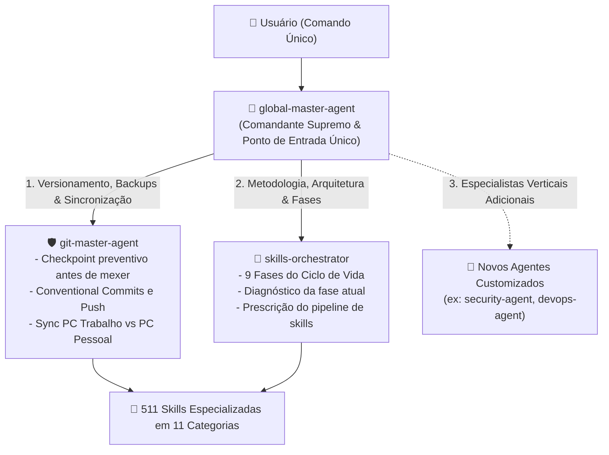

# 🤖 Custom Agents (`custom-agents/`)

> **Repositório central de Agentes Especialistas e Orquestradores para ecossistemas de Inteligência Artificial.**

Enquanto as **skills** (distribuídas nas 11 categorias deste repositório) representam as *ferramentas e capacidades atômicas* ("o que pode ser feito"), os **agentes** definidos nesta pasta representam os *operadores e líderes de engenharia* ("quem executa, planeja e coordena").

---

## 📋 Agentes Disponíveis

| Agente | Arquivo | Descrição |
| :--- | :--- | :--- |
| 👑 **`global-master-agent`** (Agente Global Supremo) | [`global-master-agent.md`](global-master-agent.md) | **Ponto único de comando e entrada.** Você só precisa chamar ele: ele orquestra nos bastidores o `skills-orchestrator` (9 fases), o `git-master-agent` (backups, commits, sync) e quaisquer futuros agentes adicionados. |
| 🎯 **`skills-orchestrator`** (Agente Mestre de Projetos) | [`skills-orchestrator.md`](skills-orchestrator.md) | Orquestrador mestre das 511 skills (541 globais). Conduz qualquer projeto técnico ou de negócio com metodologia em 9 fases (da ideação ao go-to-market), diagnosticando a fase atual e indicando a skill certa com o prompt exato. |
| 🛡️ **`git-master-agent`** (Agente Mestre de Git & GitHub) | [`git-master-agent.md`](git-master-agent.md) | Especialista em backups preventivos (`backup/checkpoint-...`), Conventional Commits seguros, bootstrap de novos projetos (README, MIT License, .gitignore), manutenção contínua de documentação e sincronização inteligente entre máquinas (PC Trabalho vs. PC Pessoal). |

---

## 🤝 Sinergia Operacional: Hierarquia de Comando

O ecossistema é organizado de forma hierárquica para eliminar esforço cognitivo do desenvolvedor:



1. **Chamada Única:** Em vez de lembrar qual agente acionar, você simplesmente conversa com o **`global-master-agent`**.
2. **Proteção Automática:** Ele aciona o `git-master-agent` para garantir checkpoints de backup e sincronização multi-máquinas antes de qualquer alteração.
3. **Execução Metódica:** Ele aciona o `skills-orchestrator` para conduzir as 9 fases e selecionar as skills ideais entre as 511 disponíveis.
4. **Entrega Blindada:** Ele aciona o `git-master-agent` para auditar secrets, rodar o `verification-loop`, fazer o commit convencional e enviar ao GitHub.

---

## 🚀 Como Instalar e Usar os Agentes

### 1. No Google Antigravity / Gemini CLI (Nativo)

O Antigravity suporta os Agentes tanto como **Skills Nativas** (recomendado para auto-descoberta) quanto como **Agentes Customizados**:

```bash
# Windows (PowerShell) - Como Skills Nativas do Antigravity (Recomendado):
New-Item -ItemType Directory -Force -Path "$HOME\.gemini\config\skills\global-master-agent"
Copy-Item custom-agents\global-master-agent.md "$HOME\.gemini\config\skills\global-master-agent\SKILL.md" -Force

New-Item -ItemType Directory -Force -Path "$HOME\.gemini\config\skills\skills-orchestrator"
Copy-Item custom-agents\skills-orchestrator.md "$HOME\.gemini\config\skills\skills-orchestrator\SKILL.md" -Force

New-Item -ItemType Directory -Force -Path "$HOME\.gemini\config\skills\git-master-agent"
Copy-Item custom-agents\git-master-agent.md "$HOME\.gemini\config\skills\git-master-agent\SKILL.md" -Force

# Como Agentes Customizados no Gemini:
Copy-Item custom-agents\*.md "$HOME\.gemini\config\agents\" -Force

# Linux / macOS:
mkdir -p ~/.gemini/config/skills/global-master-agent ~/.gemini/config/skills/skills-orchestrator ~/.gemini/config/skills/git-master-agent
cp custom-agents/global-master-agent.md ~/.gemini/config/skills/global-master-agent/SKILL.md
cp custom-agents/skills-orchestrator.md ~/.gemini/config/skills/skills-orchestrator/SKILL.md
cp custom-agents/git-master-agent.md ~/.gemini/config/skills/git-master-agent/SKILL.md
cp custom-agents/*.md ~/.gemini/config/agents/
```

O Antigravity detecta as skills/agentes automaticamente. Para ativá-los em qualquer sessão:
```markdown
# 👑 RECOMENDADO: Ative apenas o Agente Supremo (ele cuida de tudo):
"Ative o global-master-agent para conduzir meu projeto [NOME DO PROJETO]"
"Ative o global-master-agent e implemente a funcionalidade [X]"

# Ou ative os agentes específicos se preferir controle manual:
"Ative o skills-orchestrator para planejar e guiar meu projeto"
"Ative o git-master-agent para salvar minhas alterações com backup e commit seguro"
```

---

### 2. No Claude Code

Copie a definição para o diretório de configuração do Claude ou use como persona de projeto:

```bash
# Global
cp custom-agents/skills-orchestrator.md ~/.claude/agents/

# Ou no projeto local
cp custom-agents/skills-orchestrator.md .claude/agents/
```

---

### 3. No Cursor / VS Code / Copilot CLI

Você pode importar o conteúdo do agente no seu `.cursorrules` ou prompt de sistema:
1. Abra o arquivo [`skills-orchestrator.md`](skills-orchestrator.md).
2. Copie o conteúdo abaixo do cabeçalho YAML.
3. Cole nas instruções de sistema (System Prompt / Custom Instructions) do seu assistente.

---

## 🛠️ Como Criar Novos Agentes nesta Pasta

Para adicionar um novo agente especialista (ex: `frontend-expert.md`, `security-auditor.md`, `devops-architect.md`):

1. Crie um arquivo `.md` com o frontmatter padrão:
   ```yaml
   ---
   name: meu-novo-agente
   description: "Breve resumo do propósito do agente e quando ativá-lo."
   ---
   ```
2. Defina o papel (*Persona*), a missão, as diretrizes de pensamento e quais skills ele deve acionar prioritariamente.
3. Adicione o novo agente à tabela deste `README.md`.
